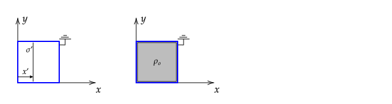
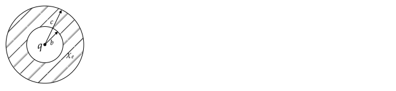
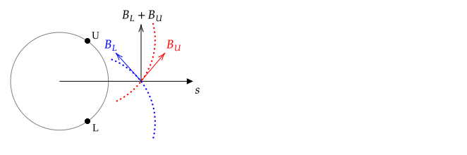

# HW 1.

Due on Feb. 2nd at 4:30 pm. Please turn in a physical copy unless you are absent, in which case you may send me an electronic copy.

## Notation and Delta Function

For a volume charge density $\rho$, the electric field at $\mathbf{r}$ is given by

$$\mathbf{E}(\mathbf{r})=\frac{1}{4\pi\epsilon_o}\int\frac{\hat{\textbf{\char"0509}}}{\char"0509^2}\rho(\mathbf{r}')\thinspace d\tau'$$

where $\textbf{\char"0509}=\mathbf{r}-\mathbf{r}'$ and $\mathbf{r}'$ is the location of a charge.

1. For a point charge $Q$ at the origin, $\rho(\mathbf{r})=Q\delta(x)\delta(y)\delta(z)$. Evaluate the above integral using cartesian coordinates and unit vectors and this $\rho$.
2. For a point charge $Q$ at $\mathbf{r}'$, $\rho(\mathbf{r})=Q\delta(x-x')\delta(y-y')\delta(z-z')$. Evaluate the above integral using cartesian coordinates and unit vectors and this $\rho$.

**Solution**

**1\.**

$$\begin{align*}\mathbf{E}(\mathbf{r}) = & \frac{1}{4\pi\epsilon_o}\int\int\frac{(x-x')\xhat+(y-y')\yhat}{\sqrt{(x-x')^2 + (y-y')^2}^3}Q\delta(x')\delta(y')\thinspace dx'dy' \\\\
= & \frac{Q}{4\pi\epsilon_o}\int\delta(y')dy'\int\frac{(x-x')\xhat+(y-y')\yhat}{\sqrt{(x-x')^2 + (y-y')^2}^3}\delta(x')\thinspace dx'\\\\
= & \frac{Q}{4\pi\epsilon_o}\int\delta(y')dy'\frac{(x-0)\xhat+(y-y')\yhat}{\sqrt{(x-0)^2 + (y-y')^2}^3}\\\\
= & \frac{Q}{4\pi\epsilon_o}\frac{(x-0)\xhat+(y-0)\yhat}{\sqrt{(x-0)^2 + (y-0)^2}^3}\\\\
= & \frac{Q}{4\pi\epsilon_o}\frac{x\xhat+y\yhat}{\sqrt{x^2 + y^2}^3}
\end{align*}
$$

The generalization to the 3-D problem given is straightforward.

**2\.** Here $x', y'$, and $z'$ are fixed points in space. Normally when given a charge density, we replace $x, y, z$ with $x',y',z'$. If we did that here, we would have $\rho(\mathbf{r}')=Q\delta(0)\delta(0)\delta(0)$, which does not depend on primed coordinates. To work around this issue, change the integration variables to be double primes. As before, in two dimensions,

$$
\begin{align*}\mathbf{E}(\mathbf{r}) = & \frac{1}{4\pi\epsilon_o}\int\int\frac{(x-x'')\xhat+(y-y'')\yhat}{\sqrt{(x-x'')^2 + (y-y'')^2}^3}Q\delta(x''-x')\delta(y''-y')\thinspace dx''dy'' \\\\
= & \frac{Q}{4\pi\epsilon_o}\int\delta(y''-y')dy''\int\frac{(x-x'')\xhat+(y-y'')\yhat}{\sqrt{(x-x'')^2 + (y-y'')^2}^3}\delta(x''-x')\thinspace dx''\\\\
\end{align*}
$$

In the integral above, the $x'$ is a constant with respect to integration (in the same way that in $\int\delta(x-a)dx$, $a$ is a constant) and so we replace $x''$ with this constant value.

$$
\begin{align*}\mathbf{E}(\mathbf{r}) = & \frac{Q}{4\pi\epsilon_o}\int\delta(y''-y')dy''\frac{(x-x')\xhat+(y-y'')\yhat}{\sqrt{(x-x')^2 + (y-y'')^2}^3}\\\\
=& \frac{Q}{4\pi\epsilon_o}\frac{(x-x')\xhat+(y-y')\yhat}{\sqrt{(x-x')^2 + (y-y')^2}^3}
\end{align*}
$$

In class, I used an alternative approach where I replaced $x',y',z'$ with $a_x, a_y, a_z$ and integrated over $x',y',z'$ so that I needed to evaluate

$$
\begin{align*}\mathbf{E}(\mathbf{r}) = & \frac{1}{4\pi\epsilon_o}\int\int\frac{(x-x')\xhat+(y-y')\yhat}{\sqrt{(x-x')^2 + (y-y')^2}^3}Q\delta(x'-a_x)\delta(y'-a_y)\thinspace dx'dy'
\end{align*}
$$

The result of integration is

$$
\mathbf{E}(\mathbf{r}) = \frac{Q}{4\pi\epsilon_o}\frac{(x-a_x)\xhat+(y-a_y)\yhat}{\sqrt{(x-a_x)^2 + (y-a_y)^2}^3}
$$

To finish the problem, I replaced $a_x,a_y,a_z$ with the variables given in the problem of $x',y',z'$ to get the same answer as when integration was done over double primed variables.

## Delta Function I

1. Suppose $I = \int_{-2}^{2}g(x)dx$. Find $\int_{-1}^{1}g(2x)dx$ and $\int_{-1}^{1}g(-2x)dx$ in terms of $I$. Show graphically why the result makes sense
using $g(x)=x^2$.

2. Show that $\int \delta(bx)f(x)dx = \frac{f(0)}{|b|}$. (That is, show that $\delta(bx)=\delta(x)/|b|$).

**Solution**

**1\.**

$\displaystyle \int_{-1}^{1}g(2x)dx=\int_{-1}^{1}g(-2x)dx=I/2$

**2\.** The generalization of the previous result is if $I = \int_{-a}^{b}g(x)dx$, then for $\alpha \gt 0$

$\displaystyle \int_{-a/\alpha}^{b/\alpha}g(\alpha x)dx=\int_{-a/\alpha}^{b/\alpha}g(-\alpha x)dx=\frac{I}{\alpha}$.

In the case that $a=b=\infty$ and a finite integral, it follows that $\int g(bx)dx=\int \frac{g(x)}{|b|}dx$, which applies to $g(x)=\delta(x)$ and thus whe have shown $\delta(bx)=\delta(x)/|b|$.

Griffiths 4th Edition example 1.15 gives an alternative solution. Another approach is to think of this as a transformation of variables problem in which the Jacobian, which involves the absolute value, is computed.

## Delta Function II

1. Find $\int \delta(a + bx)f(x)dx$ using either
   1. identity 5. on page 26 of Jackson, 3rd Edition or
   2. using the substition $u=a+bx$.

2. Prove identity 5. on Page 26 of Jackson 3rd edition

   $\displaystyle \delta(f(x))=\sum_i\frac{\delta(x-x_i)}{\left|\frac{df}{dx}(x_i)\right|}$

   where $f(x)$ is assumed to have only simple zeros, located at $x=x_i$. Do this by either
   1. explaing the omitted explanations in [Dennery and Krzywicki 1967, page 237](https://drive.google.com/drive/folders/0013X5HELBJvBlCsQGFauVVDEFczCLV0y9D) or
   2. Taylor series expanding $f(x)$ around the points $x_i$ where $g(x_i)=0$.

**Solution**

**1.1** To avoid confusion with the $f(x)$ in the given equation, re-write the identity as

$\displaystyle \delta(g(x))=\sum_i\frac{\delta(x-x_i)}{\left|\frac{dg}{dx}(x_i)\right|}$

Here $g(x)=a+bx$, which has a single zero at $x_1=-a/b$. $dg/dx=b$, so 

$\displaystyle \delta(g(x))=\frac{\delta(x-x_1)}{|\frac{dg}{dx}(x_1)|}=\frac{\delta(x-x_1)}{|b|}=\frac{\delta(x+a/b)}{|b|}$

and so

$\displaystyle \int \delta(a + bx)f(x)dx=\int dx \frac{\delta(x+a/b)}{|b|} f(x)=\frac{f(-a/b)}{|b|}$

**1.2** With the substitution,

$\displaystyle \int \delta(u)\frac{f((u-b)/a)}{b}du=\frac{f(-b/a)}{b}$

for positive $b$ and $f(-b/a)/(-b)$ for negative $b$, so the integral is $f(-b/a)/|b|$ as before.

## Divergence Theorem

1. Find the electric field $\mathbf{E}$ due to a non-conducting sphere with a uniform volume charge density $\rho_o$ and radius $b$ that is centered on the origin.
2. Show by direct calculation that

   $$\oint_{\mathcal{S}}\mathbf{E}\bfcdot d\mathbf{a} = \int_{\mathcal{V}} \boldsymbol{\nabla} \cdot \mathbf{E}\thinspace d^3x$$

   when the volume of integration $\mathcal{V}$ is a sphere centered on the origin with

   1. radius $b/2$
   2. radius $2b$

**Solution**

As mentioned in class, this is somewhat of a simple problem but was given to motivate the use of the Dirac delta function. What I said in class is briefly summarized at the end.

**1\.** The electric field is

$$\mathbf{E}(r \le b) = \frac{\rho_o}{3\epsilon_o}r\thinspace \mathbf{\hat{r}}=\frac{q}{4\pi\epsilon_o}\frac{r}{b^3}\mathbf{\hat{r}}$$

$$\mathbf{E}(r \ge b) = \frac{\rho_o}{3\epsilon_o}\frac{b^3}{r^2}\thinspace \mathbf{\hat{r}}=\frac{q}{4\pi\epsilon_o}\frac{1}{r^2}\mathbf{\hat{r}}$$

where $q=\rho_o\thinspace 4\pi b^3/3$ was used.

**2\.** In the following,

$$A.\qquad\boldsymbol{\nabla}\cdot (f(r)\thinspace \hat{\mathbf{r}})=\frac{1}{r^2}\frac{\partial}{\partial r}\left(r^2f(r)\right)$$

is used. This follows from the identity for the divergence in spherical coordinates.

----

For $r\le b$ and $\mathcal{S}$ a spherical surface of radius $r$:

$$\oint_{\mathcal{S}}\mathbf{E}(r\le b)\bfcdot \hat{\mathbf{n}}\thinspace da =  \int_0^{2\pi}\int_0^\pi\left(\frac{\rho_o}{3\epsilon_o}r\thinspace \hat{\mathbf{r}}\right)\bfcdot\hat{\mathbf{r}}\thinspace r^2\sin\theta\thinspace d\theta\thinspace d\phi=\frac{\rho_o}{\epsilon_o}\frac{4\pi r^3}{3}=\frac{q}{\epsilon_o}$$

The divergence of $\mathbf{E}$ is, using $A.$,

$$\boldsymbol{\nabla}\cdot \mathbf{E}(r\le b)= \boldsymbol{\nabla}\cdot \left(\frac{\rho_o}{3\epsilon_o}r\thinspace \hat{\mathbf{r}}\right) = \frac{1}{r^2}\frac{\partial}{\partial r}\left(r^2\left(\frac{\rho_o}{3\epsilon_o}r\right)\right)= \frac{\rho_o}{\epsilon_o}$$

as expected from Gauss' law in differential form ($\boldsymbol{\nabla}\cdot \mathbf{E}=\rho/\epsilon_o$ with $\rho=\rho_o$). Therefore, for $r\le b$:

$$\int_{\mathcal{V}} \boldsymbol{\nabla} \cdot \mathbf{E}\thinspace d^3x=\int_{\mathcal{V}} \frac{\rho_o}{\epsilon_o}\thinspace d^3x=\frac{\rho_o}{\epsilon_o}\frac{4\pi r^3}{3}=\frac{q}{\epsilon_o}$$

Conclusion: for $r\le b$,

$$\oint_{\mathcal{S}}\mathbf{E}\cdot \hat{\mathbf{n}}\thinspace da = \int_{\mathcal{V}} \boldsymbol{\nabla} \cdot \mathbf{E}\thinspace d^3x$$

----

For $r\gt b$ and $\mathcal{S}$ a spherical surface of radius $r$:

$$\oint_{\mathcal{S}}\mathbf{E}(r\ge b)\cdot \hat{\mathbf{n}}\thinspace da =  \int_0^{2\pi}\int_0^\pi\left(\frac{\rho_o}{3\epsilon_o}\frac{b^3}{r^2}\thinspace \hat{\mathbf{r}}\right)\cdot\hat{\mathbf{r}}\thinspace r^2\sin\theta\thinspace d\theta\thinspace d\phi = \int_0^{2\pi}\int_0^\pi\left(\frac{\rho_o}{3\epsilon_o}b^3\right)\sin\theta\thinspace d\theta\thinspace d\phi=\frac{\rho_o}{\epsilon_o}\frac{4\pi b^3}{3}=\frac{q}{\epsilon_o}$$

The divergence is

$$\boldsymbol{\nabla}\cdot \mathbf{E}(r\ge b)=\frac{\rho_o b^3}{3\epsilon_o} \boldsymbol{\nabla}\cdot \frac{\hat{\mathbf{r}}}{r^2} = \frac{1}{r^2}\frac{\partial}{\partial r}\left(r^2\left(\frac{\rho_o b^3}{3\epsilon_o}\frac{1}{r^2}\right)\right)=\frac{\rho_o b^3}{3\epsilon_o}\frac{1}{r^2}\frac{\partial}{\partial r}\left(1\right)=0$$

also as expected from Gauss' law in differential form ($\boldsymbol{\nabla}\cdot \mathbf{E}=\rho/\epsilon_o$ with $\rho=0$). Important: the last equality in the above equation is only true when $r\ne 0$; when $r=0$, the result is $0/0$. This issue is considered later in this solution.

One must split the volume integral into two integrals, one for $r\le b$ and the other for $r\gt b$ to account for the divergence being different in the two regions. As shown earlier, in the region $r\gt b$, the divergence is zero. 

$$
\begin{array}{ll}
\displaystyle\int\_{\mathcal{V}} \boldsymbol{\nabla} \cdot \mathbf{E}\thinspace d^3x& = & 
\displaystyle\int\_{\mathcal{V\_{r\le b}}} \boldsymbol{\nabla} \cdot \mathbf{E}(r\le b)\thinspace d^3x & + &  \displaystyle\int\_{\mathcal{V\_{r\ge b}}} \boldsymbol{\nabla} \cdot \mathbf{E}(r\ge b)\thinspace d^3x\\\\
& = &  \displaystyle\int_{\mathcal{V\_{r\le b}}} \frac{\rho_o}{\epsilon_o}\thinspace d^3x & + &  \displaystyle\int_{\mathcal{V\_{r\ge b}}}0\thinspace d^3x\\\\
& = & \frac{\rho_o}{\epsilon_o}\frac{4\pi b^3}{3} & + & 0\\\\
& = & \frac{q}{\epsilon_o}
\end{array}
$$

Conclusion: for $r\gt b$,

$$\oint_{\mathcal{S}}\mathbf{E}\cdot \hat{\mathbf{n}}\thinspace da = \int_{\mathcal{V}} \boldsymbol{\nabla} \cdot \mathbf{E}\thinspace d^3x$$

----

_Motivation for this problem_

I gave this problem as a lead-in/follow-up for my discussion of the motivation for the delta function. For a point charge, the integrand of

$$\int_{\mathcal{V}} \boldsymbol{\nabla} \cdot \mathbf{E}_p\thinspace d^3x$$

with

$$\mathbf{E}_p=\frac{q}{4\pi\epsilon_o}\frac{\hat{\mathbf{r}}}{r^2}$$

is zero everywhere except at the origin ($r=0$) where it is indeterminate in the form of $0/0$ because

$$
\displaystyle \boldsymbol{\nabla}\cdot \mathbf{E}_p = \frac{q}{4\pi\epsilon_o} \boldsymbol{\nabla}\cdot \frac{\hat{\mathbf{r}}}{r^2} = \frac{q}{4\pi\epsilon_o}\frac{1}{r^2}\frac{\partial}{\partial r}\left(1\right) = \begin{cases}
0/0 & \text{if }r = 0 \\ 
0   & \text{if }r\ne 0
\end{cases}
$$

However,

$$\oint_{\mathcal{S}}\mathbf{E}_p\cdot \hat{\mathbf{n}}\thinspace da =\frac{q}{\epsilon_o}$$

does not have an indeterminacy. Therefore, the divergence theorem

$$\int_{\mathcal{V}} \boldsymbol{\nabla} \cdot \mathbf{E}\_p\thinspace d^3x=\oint_{\mathcal{S}}\mathbf{E}_p\cdot \hat{\mathbf{n}}\thinspace da$$

applied to $\mathbf{E}$ for a point charge gives

$$\text{indeterminate integral}=\frac{q}{\epsilon_o}$$

In this problem, it has been shown that if a point charge $q$ is modeled as having a uniform density for $r\le b$ and having zero density for $r\gt b$, then the indeterminacy problem can be avoided and

$$\int_{\mathcal{V}} \boldsymbol{\nabla} \cdot \mathbf{E}\thinspace d^3x = \oint_{\mathcal{S}}\mathbf{E}\cdot \hat{\mathbf{n}}\thinspace da$$

for all $r$ and for arbitrarily small (but non-zero) $b$ (but see also 'other notes' below). That is, the divergence theorem gives the correct answer for a solid ball of charge that is arbitrarily small but not zero.

Although the divergence theorem does not apply for $\mathbf{E}_p$, to avoid having to think about a solid ball with arbitrarily small but non zero radius is to use it with the convention that

$$\boldsymbol{\nabla}\cdot \mathbf{E}_p=\frac{q}{4\pi\epsilon_o}\boldsymbol{\nabla}\cdot \frac{\hat{\mathbf{r}}}{r^2}=\frac{q}{\epsilon_o}\delta(\mathbf{\mathbf{r}})$$

where the function $\delta(\mathbf{\mathbf{r}})$ is zero everywhere except at $\mathbf{r}=\mathbf{0}$ and integrates to 1 when the volume of integration includes $\mathbf{r}=\mathbf{0}$.

$$\int_{\mathcal{V}} \boldsymbol{\nabla} \cdot \mathbf{E}\thinspace d^3x=\int_{\mathcal{V}}\frac{q}{4\pi\epsilon_o}\boldsymbol{\nabla}\cdot \frac{\hat{\mathbf{r}}}{r^2}\thinspace d^3x=\int_{\mathcal{V}}\frac{q}{\epsilon_o}\delta(\mathbf{\mathbf{r}})\thinspace d^3x=\frac{q}{\epsilon_o}$$

That is,

$$\boldsymbol{\nabla}\cdot \frac{\hat{\mathbf{r}}}{r^2}=4\pi\delta(\mathbf{\mathbf{r}})$$

When you see the delta function used in an integration, you should think back to this problem and realize that the delta function is being used instead of modeling the electric field as a point charge $q$ as having a uniform density for $r\lt b$ and zero density for $r\gt b$.

Griffiths takes a different approach to motivating the introduction of the delta function. He notes that the indeterminate integral of the divergence

$$\int_{\mathcal{V}} \boldsymbol{\nabla} \cdot \mathbf{E}_p\thinspace d^3x=\text{indeterminate integral}$$

must be equal to $q/\epsilon_o$ because of the divergence theorem (which technically does not apply because of the singularity in $\mathbf{E}$ at $r=0$):

$$\oint_{\mathcal{S}}\mathbf{E}_p\cdot \hat{\mathbf{n}}\thinspace da = \frac{q}{\epsilon_o}\quad\Rightarrow\quad\int_{\mathcal{V}} \boldsymbol{\nabla} \cdot \mathbf{E}_p\thinspace d^3x=\frac{q}{\epsilon_o}$$

He then notes that $\hat{\mathbf{r}}/r^2$ has the property that its divergence $\boldsymbol{\nabla}\cdot\frac{\hat{\mathbf{r}}}{r^2}$

1. is zero everywhere except at the origin (where it is interminate)
2. integrates to a constant ($4\pi$) over any volume $\mathcal{V}$ that includes $r=0$ (based on the assumption that the divergence theorem applies and resolves the indeterminacy)

That is, although

$$\int_{\mathcal{V}} \boldsymbol{\nabla} \cdot \mathbf{E}_p\thinspace d^3x$$

has an indeterminate integrand at $r=0$, the divergence theorem must be true, and so this integral must be equal to the surface integral, which is $\frac{q}{\epsilon_o}$. Therefore,

$$\boldsymbol{\nabla}\cdot \mathbf{E}_p=\frac{q}{\epsilon_o}\delta(\mathbf{\mathbf{r}})$$

where the function $\delta(\mathbf{r})$ is defined to be zero unless $r=0$ and integrates over a volume that includes $\mathbf{r}=\mathbf{0}$ to 1. This explanation is somewhat awkward because it asserts that the divergence theorem must be correct even though the field $\mathbf{E}_p$ does not satisfy the requirements for the divergence theorem to apply. (The requirements for the divergence theorem to apply are that the components of the vector field and their derivatives are continuous.)

In summary, the integral

$$\int_{\mathcal{V}} f(\mathbf{r})\boldsymbol{\nabla} \cdot \mathbf{E}\thinspace d^3x$$

is indeterminant when $\mathbf{E}\sim \hat{\mathbf{r}}/r^2$ and $\mathcal{V}$ includes $r=0$. If we model a point charge as having a uniform density for $r\le b$, and zero density for $r\gt b$, where $b\ne 0$ is smaller than any length scale in the problem, the indeterminacy is removed. Instead of two integrations, one for $r \le b$ and the other for $r\gt b$, we can simply replace $\boldsymbol{\nabla}\cdot \mathbf{E}_p$ with $(q/\epsilon_o)\delta(\mathbf{\mathbf{r}})$; the result of any integration will be the same.

----

A second motivation for using the delta function is that we often want to do an integral of the form

$$\int_{\mathcal{V}} f(\mathbf{r})\boldsymbol{\nabla} \cdot \mathbf{E}_p\thinspace d^3x$$

(Recall that $f(\mathbf{r})$ means $f(x,y,z)$). As before, integral is indeterminate because $\boldsymbol{\nabla} \cdot (\hat{\mathbf{r}}/r^2)$ is 0/0 at $r=0$. To work around this problem, we can again model the point charge as having a uniform density for $r\le b$ and zero density for $r\gt b$. Then 

$$\int_{\mathcal{V}} f(\mathbf{r})\boldsymbol{\nabla} \cdot \mathbf{E}\thinspace d^3x=\int\_{\mathcal{V_{r\le b}}} f(\mathbf{r})\boldsymbol{\nabla} \cdot \mathbf{E}\_b\thinspace d^3x+\int_{\mathcal{V_{r\gt b}}} f(\mathbf{r})\boldsymbol{\nabla} \cdot \mathbf{E}_b\thinspace d^3x$$

The second integral is identically zero because $\boldsymbol{\nabla}\cdot\mathbf{E}_b=0$ for $r\gt b$. If $f(\mathbf{r})$ can be expanded as a Taylor series

$$f(\mathbf{r})\simeq f(\mathbf{0}) + \mathbf{r}\cdot\left[\boldsymbol{\nabla}f\thinspace \right]_{\mathbf{r}=0}\;+\;...$$

then

$$
\begin{array}{ll}
\displaystyle\int\_{\mathcal{V\_{r\le b}}} f(\mathbf{r})\boldsymbol{\nabla} \cdot \mathbf{E}\thinspace d^3x & = & \displaystyle\int\_{\mathcal{V\_{r\le b}}} \left(f(\mathbf{0})+\mathbf{r}\cdot\left[\boldsymbol{\nabla}f\thinspace \right]\_{\mathbf{r}=0}\thickspace+\thickspace ...\right)\boldsymbol{\nabla} \cdot \mathbf{E}\thinspace d^3x\\
& = & \displaystyle\int\_{\mathcal{V\_{r\le b}}} f(\mathbf{0})\boldsymbol{\nabla} \cdot \mathbf{E}\thinspace d^3x+\displaystyle\int\_{\mathcal{V\_{r\le b}}} (\mathbf{r}\cdot\left[\boldsymbol{\nabla}f\thinspace \right]\_{\mathbf{r}=0}\thickspace+\thickspace...)\boldsymbol{\nabla} \cdot \mathbf{E}\thinspace d^3x\\
& = & f(\mathbf{0})\displaystyle\int\_{\mathcal{V\_{r\le b}}} \boldsymbol{\nabla} \cdot \mathbf{E}\thinspace d^3x+\displaystyle\int\_{\mathcal{V\_{r\le b}}} \left(\mathbf{r}\cdot\left[\boldsymbol{\nabla}f\thinspace \right]\_{\mathbf{r}=0}\thickspace+\thickspace ...\right)\boldsymbol{\nabla} \cdot \mathbf{E}\thinspace d^3x\\
& = & \frac{q}{\epsilon\_o}f(\mathbf{0})\thickspace+\thickspace\frac{q}{\epsilon\_o}\displaystyle\int\_{\mathcal{V\_{r\le b}}} \left(\mathbf{r}\cdot\left[\boldsymbol{\nabla}f\thinspace \right]\_{\mathbf{r}=0}\thickspace+\thickspace ...\right)d^3x\\
\end{array}
$$

The second and higher-order terms in the last equation approach zero as $b\rightarrow 0$.  To see this, note that for small enough $b$,

$$\frac{q}{\epsilon_o}\displaystyle\int_{\mathcal{V_{r\le b}}} f(\mathbf{r})\thinspace d^3x\rightarrow \frac{4\pi}{3}b^3\left<f(\mathbf{0})\right>$$

where the $\left<\right>$ is the average in $\mathcal{V}$ in a sphere of radius $b$. Therefore,

$$\frac{q}{\epsilon_o}\displaystyle\int_{\mathcal{V_{r\le b}}} \mathbf{r}\cdot\left[\boldsymbol{\nabla}f\thinspace \right]_{\mathbf{r}=0}\thinspace d^3x\xrightarrow[b\rightarrow 0]{} \frac{q}{\epsilon_o}\frac{4\pi}{3}b^3\left<\mathbf{r}\cdot\left[\boldsymbol{\nabla}f\thinspace \right]_{\mathbf{r}=0}\right>\xrightarrow[b\rightarrow 0]{}  0$$

The same argument applies to the higher-order terms in the Taylor series expansion.

Prior to the introduction of the delta function by Dirac in the 1930s, the above argument was used when an integral of the form

$$\displaystyle\int_{\mathcal{V}} f(\mathbf{r})\boldsymbol{\nabla} \cdot \mathbf{E}\thinspace d^3x$$

was encountered and $\mathbf{E}$ was that for a point charge and $\mathcal{V}$ that included the location of the point charge.

With the introduction of the Dirac delta, one can simply use $\boldsymbol{\nabla}\cdot \mathbf{E}=\frac{q}{\epsilon_o}\delta(\mathbf{\mathbf{r}})$ to get the same result without needing to think about the above steps:

$$
\displaystyle \int_{\mathcal{V}} f(\mathbf{r})\boldsymbol{\nabla} \cdot \mathbf{E}\thinspace d^3x = \int_{\mathcal{V}} f(\mathbf{r})\frac{q}{\epsilon_o}\delta(\mathbf{\mathbf{r}})\thinspace d^3x = \begin{cases}
f(\mathbf{0})\frac{q}{\epsilon_o} & \text{if }\mathcal{V}\text{ includes } r = 0 \\ 
0 & \text{otherwise}
\end{cases}
$$

That is, using the delta function for the divergence of $\mathbf{E}$ due to a point charge will give us the same answer as if we had modeled the point charge as having a uniform density for $r\le b$, zero density for $r\gt b$, Taylor series expanded $f(\mathbf{r})$, and then let $b\rightarrow 0$. 

----

_Other notes_

In the above, I showed that the divergence theorem gave the correct result for $\mathbf{E}$ and any $r$ by direct calculation. However, the divergence theorem

$$\oint_{\mathcal{S}}\mathbf{E}\cdot \hat{\mathbf{n}}\thinspace da = \int_{\mathcal{V}} \boldsymbol{\nabla} \cdot \mathbf{E}\thinspace d^3x$$

requires that within $\mathcal{V}$, the components of $\mathbf{E}$ and their derivatives are continuous. In $\mathbf{E}$, $E_r$ is continuous, but $\partial E_r/\partial r$ is not. So it appears that direct calculation for $r\gt b$ gave a result that was consistent with the divergence theorem even though the assumptions required to apply the divergence theorem are not satisfied. To see why this occurred, use the divergence theorem in the two parts of $\mathcal{V}$ where the divergence theorem applies for $\mathbf{E}$. 

First, consider the application of the divergence theorem for the volume between $r=0$ and $r=b$.

$$\int_{\mathcal{V_{r \le b}}} \boldsymbol{\nabla} \cdot \mathbf{E}\thinspace d^3x = \int_\mathcal{S_{r=b}} \mathbf{E}\cdot \hat{\mathbf{n}}\thinspace da $$

The outward normal to $\mathcal{S_{r=b}}$ for $\mathcal{V_{r \le b}}$ is $+\hat{\mathbf{r}}$, so

$$I.\quad \int_{\mathcal{V_{r \le b}}} \boldsymbol{\nabla} \cdot \mathbf{E}\thinspace d^3x =\int_\mathcal{S_{r=b}} \mathbf{E}\cdot \hat{\mathbf{r}}\thinspace da$$

Next, consider the application of the divergence theorem for the volume between $r=b$ and $r=2b$ (the result will apply to any $r\gt b$). In this case, there is an inner and outer surface and so the surface integral has two parts.

$$\int_{\mathcal{V_{b \le r \le 2b}}} \boldsymbol{\nabla} \cdot \mathbf{E}\thinspace d^3x= \oint_\mathcal{S_{r=b}} \mathbf{E}\cdot \hat{\mathbf{n}}\thinspace da + \oint_\mathcal{S_{r=2b}} \mathbf{E}\cdot \hat{\mathbf{n}}\thinspace da$$

The outward normal to $\mathcal{S_{r=b}}$ for this volume is $-\hat{\mathbf{r}}$ and the outward normal to $\mathcal{S_{r=2b}}$ is $+\hat{\mathbf{r}}$, so

$$II.\quad \int_{\mathcal{V_{b \le r \le 2b}}} \boldsymbol{\nabla} \cdot \mathbf{E}\thinspace d^3x=-\oint_\mathcal{S_{r=b}} \mathbf{E}\cdot \hat{\mathbf{r}}\thinspace da + \oint_\mathcal{S_{r=2b}} \mathbf{E}\cdot \hat{\mathbf{r}}\thinspace da$$

Using $I.$ and $II.$ with the volume integral expressed in two parts

$$\int_{\mathcal{V_{r \le 2b}}} \boldsymbol{\nabla} \cdot \mathbf{E}\thinspace d^3x=\int_{\mathcal{V_{r \le b}}} \boldsymbol{\nabla} \cdot \mathbf{E}\thinspace d^3x + \int_{\mathcal{V_{\thinspace b \le r \le 2b}}} \boldsymbol{\nabla} \cdot \mathbf{E}\thinspace d^3x $$

gives

$$\int_{\mathcal{V_{r \le 2b}}} \boldsymbol{\nabla} \cdot \mathbf{E}\thinspace d^3x = \int_{\mathcal{S_{r=2b}}}\mathbf{E}\cdot \hat{\mathbf{n}}\thinspace da$$

(The surface integrals at $r=b$ cancel because their normal directions are in opposite directions.)

\newpage

## Related Problems

You do not need to turn these problems in. If you turn in these problems, I'll provide feedback.

These are problems that either I discussed in class or are related to the topic covered in class. I place them here for your reference. Some of the problems listed may not have been covered in class but may serve as exam practice problems.

###

Evaluate

$\displaystyle\lim_{n \to \infty}\Bigg[\int xD_n(x-1)dx\Bigg]$

using

$\displaystyle
D_n(x) = \begin{cases}
   n &\text{if } |x| \lt \frac{1}{2n} \\
   0 &\text{ otherwise}
\end{cases}
$

Repeat this problem using $D_n = \sqrt{\frac{n}{\pi}}e^{-nx^2}$

###

Evaluate

$\displaystyle\lim_{n \to \infty}\Bigg[\int f(x)D_n(x)dx\Bigg]$

using

$\displaystyle
D_n(x) = \begin{cases}
   n &\text{if } |x| \lt \frac{1}{2n} \\
   0 &\text{ otherwise}
\end{cases}
$

by writing $f(x)$ as a Taylor series expansion around $x=0$.

###

A straight 1-D rod of mass $M$ with a uniform mass density and length $a/n$ ($n=1, 2, ...$) is aligned with the $x$--axis and centered on $x=a$. Find the center of mass by evaluating

$\displaystyle \overline{x}\_n = \frac{1}{M}\int_{\text{rod}} x\lambda_n(x) dx$

###

Find the moment of inertia about the $y$--axis of the rod in the previous problem in terms of $a$, $n$, and $M$ by evaluating

$\displaystyle I\_n = \int_{\text{rod}} x^2\lambda_n(x)dx$

Explain why the value of $I_n$ for $n\to \infty$ makes sense.

###

A spherical shell has a net charge $Q$ uniformly distributed on its surface.

Find $\rho$ in terms of the delta function.

### Divergence Theorem

Show by direct calculation that

$$\oint_{\mathcal{S}}\mathbf{A}\bfcdot d\mathbf{a} = \int_{\mathcal{V}} \boldsymbol{\nabla} \cdot \mathbf{A}\thinspace d^3x$$

is satisfied when $\mathbf{A}=A_x(x)\xhat$ and $\mathcal{V}$ is an origin--centered cube of side length $b$ with its sides parallel to the coordinate planes.
   
### Divergence Theorem

Solve II-27 and II-28 of [Schey, 2005](https://drive.google.com/drive/folders/001s8T-MO_G7YfPuAiHesVK3yFNy82noAsg?usp=sharing).

\newpage

# HW 2.

## Representing $\rho$ Using $\delta$ and $\Theta$

The step (or Heavyside step) function, $\Theta$, is defined by

$$
\Theta(x) = \begin{cases} 1 & x > 0\\ 0 & x \le 0\end{cases}
$$

$\Theta$ can be used to to express a charge density in a compact mathematical form. For example, instead of stating "a uniformly charged sphere centered on the origin, with total charge $Q$, and radius $b$", we can write $\rho(x,y,z)=\frac{Q}{(4/3)\pi b^3}\Theta(b-r)$. When this density is integrated over all space, the result is $Q$:

$\displaystyle\int\rho(\mathbf{x})\thinspace d^3x=\frac{Q}{(4/3)\pi b^3}\int_{0}^{2\pi}d\phi\int_{0}^{\pi}\sin\theta d\theta\int_{0}^{\infty}\Theta(b-r)r^2dr
$

Because $\Theta(b-r)=0$ for $r\ge b$ and $\Theta(b-r)=1$ for $r\lt b$, the limits on the $r$ integral can be modfied and the $\Theta$ function removed:

$\displaystyle\int\rho(\mathbf{x})\thinspace d^3x=\frac{Q}{(4/3)\pi b^3}\int_{0}^{2\pi}d\phi\int_{0}^{\pi}\sin\theta d\theta\int_{0}^{b}r^2dr
$

The integrals above evaluate to the volume of a sphere of radius $b$ so that 

$\displaystyle\int\rho(\mathbf{x})\thinspace d^3x=Q$

%$\displaystyle\phantom{\int\rho(\mathbf{x})\thinspace d^3x}=\frac{Q}{b^3}\int_{-b}^{b}dz\int_{-b}^{b}dy\int_{-b}^{b}dx
%$

%$\displaystyle\phantom{\int\rho(\mathbf{x})\thinspace d^3x}=\frac{Q}{b^3}b^3$

1. Write the piecewise function $
f(x) = \begin{cases} 1 & |x| \lt b\\ 0 & |x| \ge b\end{cases}$ using one or more $\Theta$ functions.
1. Find the volume charge density $\rho$ in cylindrical coordinates in terms of $\delta$ and/or $\Theta$ for an infinitely long cylinder of radius $b$ with a charge density per unit length of $\lambda_o$ uniformly distributed on its surface. Assume that the cylinder's centerline is along the $z$-axis.
2. Repeat 2. assuming the cylinder is finite and extends from $z=-h/2$ to $z=h/2$.

**Solution**

1. As mentioned in class, an easy way to solve this is to write $f(x)$ as the sum of two step functions. One shifted to the left by $b$, corresponding to $\Theta(x+b)$; the other shifted to the right and inverted, corresponding to $\Theta(x-b)$. Thus,

   $f(x) = \Theta(x+b) - \Theta(x-b)$.
   
   Other solutions:

   $f(x) = \Theta(b-|x|)$
   
   $f(x)=\Theta(b^2-x^2)=\Theta[(b-x)(b+x)]$
   
   $f(x) = \Theta(b+x) - \Theta(x-b)$

   It may be interesting to use $d\Theta/dx=\delta(x)$ develop an identity for $\Theta(f(x))$ similar to identity 5. on page 26 of Jackson 4th Edition.

   Checks:
   * when $x=0$, $f(x) = \Theta(b) - \Theta(-b) = 1-0 = 1$
   * when $x=2b$, $f(x) = \Theta(3b) - \Theta(b) = 1-1 = 0$
   * when $x=-2b$, $f(x) = \Theta(-b) - \Theta(-3b) = 0-0 = 0$

2. We want a charge distribution that is localized at a cylindrical radial distance $b$. $\rho(s) = C\delta(s-b)$ has this feature, where $C$ is a constant. We also need the integral of this charge density over all space to equal the total charge on the cylinder, which is $Q=\lambda_o h$ assuming that the length of the cylinder is $h$. Thus, we need to find $C$ such that

   $\displaystyle Q=\lambda_o h = \int \rho(\mathbf{x})d^3x$
   
   $\displaystyle Q=\lambda_o h = \int_{-h/2}^{h/2}\int_{0}^{2\pi}\int_{0}^\infty C\delta(s-b) sdsd\phi dz$   

   $\displaystyle Q=\lambda_o h = 2\pi hC\int_{0}^\infty \delta(s-b) sds=2\pi h C b \quad\Rightarrow\quad C=\lambda_o/2\pi b$

  and so
  
  $\displaystyle \rho(\mathbf{x}) = \frac{\lambda_o}{2\pi b}\delta(s-b)$

  Equivalently, we can write

  $\displaystyle \rho(\mathbf{x}) = \frac{\lambda_o}{2\pi s}\delta(s-b)$

  because $\delta(s-b)/s=\delta(s-b)/b$, which follows from the fact that the delta function is only non-zero at $s=b$.
  
3. Here we apply the result from part 1. with the replacement of $b$ in that problem with $h/2$:

    $\displaystyle \rho(\mathbf{x}) = \frac{\lambda_o}{2\pi b}\delta(s-b)[\Theta(x+h/2) - \Theta(x-h/2)]$

## Green's Reciprocity Theorem

For discrete charges, Green's Reciprocity Theorem for $N$ charges is

$$\sum_{i=1}^{N}\Phi\_i q'\_i=\sum_{i=1}^{N}\Phi'\_i q\_i$$

Consider charges $q_1,q_2$, and $q_3$ at locations $x_1,x_2$, and $x_3$, respectively, on the $x$-axis. At these locations, the potentials are $\Phi_1,\Phi_2,$ and $\Phi_3$, respectively.

If a new system of charges $q'_1,q'_2$, and $q'_3$ is created by placing them at the same locations $x_1,x_2$, and $x_3$, respectively, the potentials at these locations are $\Phi'_1,\Phi'_2,$ and $\Phi'_3$, respectively.

Show that 

$$\sum_{i=1}^{3}\Phi\_i q'\_i=\sum_{i=1}^{3}\Phi'\_i q\_i$$

**Solution**

The physical interpretation of Green's Reciprocity theorem is that the work required to put charges an unprimed set of charges at $x_1,x_2,x_3$ under the influence of only the electric field of a primed set of charges $x_1,x_2,x_3$ must be the same as the work required to put a primed set of charges at $x_1,x_2,x_3$ under the influence of only the electric field of an unprimed set of charges at $x_1,x_2,x_3$.

Using

$\displaystyle\Phi_i=\sum_{\substack{j=1\\j\ne i}}^N \frac{q_j}{|x_j-x_i|}=\sum_{\substack{j=1\\j\ne i}}^N \frac{q_j}{d_{ji}}$

gives, for $N=3$, the left-hand side terms in $\sum\_{i=1}^{3}\Phi\_i q'\_i=\sum\_{i=1}^{3}\Phi'\_i q\_i$

$
\begin{array}{rc}
\Phi\_1q'\_1 & = & 0 & + &  \frac{q\_2q'\_1}{d\_{21}} & + & \frac{q\_3q'\_1}{d\_{31}}  \\ \\
\Phi\_2q'\_2 & = & \frac{q\_1q'\_2}{d\_{12}} & + & 0 & + & \frac{q\_3q'\_2}{d\_{32}} \\ \\
\Phi\_3q'\_3 & = & \frac{q\_1q'\_3}{d\_{13}} & + & \frac{q\_2q'\_3}{d\_{23}} & + & 0 &
\end{array}
$

The right-hand side terms in $\sum_{i=1}^{3}\Phi\_i q'\_i=\sum\_{i=1}^{3}\Phi'\_i q\_i$ can be expanded as

$
\begin{array}{rc}
\Phi'\_1q\_1 & = & 0 & + &  \frac{q'\_2q\_1}{d\_{21}} & + & \frac{q'\_3q\_1}{d\_{31}}  \\ \\
\Phi'\_2q\_2 & = & \frac{q'\_1q\_2}{d\_{12}} & + & 0 & + & \frac{q\_2q'\_3}{d\_{32}} \\ \\
\Phi'\_3q\_3 & = & \frac{q'\_1q\_3}{d\_{13}} & + & \frac{q'\_2q\_3}{d\_{23}} & + & 0 &
\end{array}
$

In the above, the left-- and right--hand sides of the equation to prove were written in the form of a matrix. In this form, one can see that the matrices are transposes of each other. If we sum all elements in a matrix, the result is the same if we sum all elements of that matrix transposed.

More generally, one can use

$\displaystyle \sum_{i=1}^{N} q\_i\Phi'\_i = \sum_{i=1}^{N} q\_i \sum_{\substack{j=1\\j\ne i}}^N \frac{q'\_j}{d\_{ij}}=\sum_{i=1}^{N}\sum\_{\substack{j=1\\j\ne i}}^N \frac{ q'\_j q_i}{d\_{ij}}$

Repeating with the primed and unprimed swapped and starting with a dummy index of $j$ instead of $i$, we have

$\displaystyle \sum_{j=1}^{N} q'\_j\Phi\_j = \sum_{j=1}^{N} q'\_j \sum_{\substack{i=1\\i\ne j}}^N \frac{q\_i}{d\_{ji}}=\sum_{j=1}^{N}\sum\_{\substack{i=1\\i\ne j}}^N \frac{ q'\_j q_i}{d\_{ij}}$

Where in the last step, $d_{ji}=d_{ij}$ was used.

One can think of $q'\_j q_i/d\_{ij}$ as elements in a matrix. The equations

$\displaystyle\sum_{i=1}^{N}\sum\_{\substack{j=1\\j\ne i}}^N \frac{ q'\_j q_i}{d\_{ij}}$ and $\displaystyle \sum_{j=1}^{N}\sum\_{\substack{i=1\\i\ne j}}^N \frac{ q'\_j q_i}{d\_{ij}}$

both result in the sum of all elements of a matrix excluding the diagonals. The only difference is the order in which the elements of the matrix are summed. For a continuous charge distribution, we would use the fact that the order of integration could be changed to arrive at the result $\int dq \Phi'(x) d^3x = \int dq' \Phi(x') d^3x'$.

## Green's Reciprocity Use

1. In class, I partially did problem 1.13 of Jackson 3rd Edition (I only found the net charge on the upper of the plate). Find the net charge on the lower plate. Justify your steps at the level of detail given in class. (I stated an easy way of finding the net charge induced on the lower plate, but I want you to do it the long way, which requires steps similar to the ones used in class.)
2. A point charge at a distance $r$ from the origin is between two grounded spherical conducting shells of radius $b$ and $c$ that are centered on the origin. Find the net charge induced on the surfaces at $b$ and $c$.

For discussion during the next class: In my solution to part 1., I used the continous form of reciprocity. Could I have solved it using the discrete form?

**Solution**

**1\.** Let the unprimed system have a conducting plate in $z=0$ plane held at $\Phi=0$ and a conducting plate in the $z=d$ plane held at at $\Phi=V_o$.

Let the unprimed system have a conducting plate in the $z=0$ plane held at at $\Phi'=0$, a conducting plate in the $z=d$ plane held at $\Phi'=0$, and a point charge $q'$ at $(x,y,z)=(x_o,0,0)$.

One can use the equation from problem 1.11 of Jackson or start with

$\displaystyle\int_{all\thinspace space}\rho'\Phi\thinspace d^3x = \int_{all\thinspace space}\rho\Phi'\thinspace d^3x$

and split the charge density into surface and volume charge densities $\sigma$ and $\rho_v$, where the subscript $v$ means charge not on the conducting surfaces $\mathcal{S}$:

$\displaystyle\int_{all\thinspace space}\rho_v'\Phi\thinspace d^3x+\int_{\mathcal{S}}\sigma'\Phi\thinspace da = \int_{all\thinspace space }\rho_v\Phi'\thinspace d^3x+\int_{\mathcal{S}}\sigma\Phi'\thinspace da$

The first term on RHS is zero because $\rho_v=0$ (there are no charges in the unprimed system between the plates). The second term on the RHS is zero becuase $\Phi'=0$ on conducting surfaces.

The first term on the LHS reduces to $q'\Phi(x_o)$ becuase $\rho_v'=q'\delta(x-x_o)\delta(y)\delta(z)$ (the notation $\rho_v'=q'\delta(\mathbf{x}-\mathbf{x_o}')$ is also acceptable; this gives $\Phi(\mathbf{x_o})$, which is the same things as $\Phi(x_o)$ notationally). 
The potential between the plates in the unprimed system is

$\displaystyle\Phi(x)=V_o\frac{x}{d}$

and so the first term on the LHS is $q'V_ox_o/d$.

The second term on LHS is composed of integrals over the top and bottom surfaces (assuming all of the charges in the primed system are on the plates or at $x_o$; this is discussed below). Given that $\Phi=0$ on bottom surface, we are left with an integral over upper surface ($u$) for which $\Phi=V_o$.

$$\int_{\mathcal\thinspace u}\sigma'V_o\thinspace da=V_o\int_{\mathcal\thinspace u}\sigma'\thinspace da=V_oq'_u$$

The equation 

$\displaystyle\int_{all\thinspace space}\rho_v'\Phi\thinspace d^3x+\int_{\mathcal{S}}\sigma'\Phi\thinspace da = \int_{all\thinspace space }\rho_v\Phi'\thinspace d^3x+\int_{\mathcal{S}}\sigma\Phi'\thinspace da$

thus reduces to 

$\displaystyle q'V_ox_o/d + V_oq'_u = 0 \Rightarrow \boxed{q'_u=-q\frac{x_o}{d}}$

One can reverse the potentials on the unprimed system to arrive at the charge $q'_l$ on the lower primed surface, which is

$\boxed{q'_l=q'\left(\frac{x_o}{d}-1\right)}$

Note also that the assumption that the total charge in the universe is zero

$q'_u+q'_l+q=0$

could have also been used to find $q'_l$ given $q'_u$. 

----

Note: In the solution, I assumed all free charges were on the upper and lower surfaces and there were no charges on far-away surfaces; this statement is justified post hoc by uniqueness and because computing $q'_u$ and $q'_l$ in this way gave $q'_u+q'_l+q=0$. To avoid this assumption, one would need to use equation 1.35 of Jackson with the volume being the volume between the plates. Curiously, in problem 1.11, Jackson suggests using equation 1.35 to come up with what he calls Green's reciprocation theorem, seemingly so it could be applied in problem 1.12. However, the equation in problem 1.11 does not directly apply because the surface of the volume between the plates is not all conductor (only the top and bottom parts of the volume are conductors, the sides of this volume are not). One is left with having to use equation 1.35 and the argument that because the problem is 1-dimensional, the derivatives of the potential with respect to the normal on the side surfaces of the volume are zero.

----

**2\.** The procedure here is nearly identical to part 1. The potential between the sphere in the unprimed system when the potential at $r=b$ is $V_o$ and the potential at $r=c$ is zero is

$\displaystyle\Phi(r)=V_o\frac{b}{c-b}\left(\frac{c}{r}-1\right)$

which can be found by solving the boundary value problem

$\Phi(c)=0\quad \Phi(b)=V_o$

$\displaystyle\nabla^2\Phi = \frac{1}{r^2}\frac{d^2 (r^2\Phi)}{dr^2}= 0 \quad \Rightarrow \quad \Phi = A + B/r$

to find $A$ and $B$ or by assuming a charge $Q$ on the outer sphere and $-Q$ on the inner sphere and using Gauss' law to find $E_r$ and then $V(c)-V(b)=-\int_b^cE_r\thinspace dr$ (the $Q$ will cancel). The final result is

$\displaystyle q'_{r=b}=-V_o\frac{q'b}{c-b}\left(\frac{c}{r_o}-1\right)$

$\displaystyle q'_{r=c}=+V_o\frac{q'c}{c-b}\left(\frac{b}{r_o}-1\right)$

## Green's Identity Derivation 

In one of the steps required to derive his identities (discussed in 1.8 of Jackson, 3rd Edition), Green said: "Consider the divergence of a scalar function $f$ multiplied by a vector function $\mathbf{A}$".

1. Show that

    $$\mathbf{\nabla}\bfcdot (f\mathbf{A}) = f\thinspace \mathbf{\nabla}\bfcdot \mathbf{A} + \mathbf{A}\bfcdot(\mathbf{\nabla}f)$$

    (this is equation 1.32 of Jackson)
2. Show that

   $$\int_{\mathcal{V}} f\thinspace\mathbf{\nabla}\bfcdot \mathbf{A}\thinspace d^3x = -\int_{\mathcal{V}}\mathbf{A}\bfcdot(\mathbf{\nabla}f)\thinspace d^3x+\oint_{\mathcal{S}} f\mathbf{A}\bfcdot\hat{\mathbf{n}}\thinspace da$$

  where $\mathcal{V}$ is the volume enclosed by the surface $\mathcal{S}$, $\hat{\mathbf{n}}$ is the normal to a differential area element $da$ on $\mathcal{S}$, and $d^3x$ is a differential volume element. (This is needed in the following problem.)

3. Verify the result in 2. by using an $f$, $\mathbf{A}$ and $\mathcal{V}$ of your choosing.

**Solution**

**1\.** This can be shown by writing $\boldsymbol{\nabla}$ and $\mathbf{A}$ in cartesian coordinates.

**2\.** The divergence theorem

$\displaystyle\oint_{\mathcal{S}}\mathbf{U}\cdot d\mathbf{a}=\int_{\mathcal{V}}\boldsymbol{\nabla}\cdot \mathbf{U}\thinspace d^3x$

using $\mathbf{U}=f\mathbf{A}$ on the LHS and $\mathbf{U}=f(\mathbf{\nabla}\cdot \mathbf{A}) + \mathbf{A}\cdot(\mathbf{\nabla}f)$ the the RHS gives

$\displaystyle\oint_{\mathcal{S}}f\mathbf{A}\cdot d\mathbf{a}=\int_{\mathcal{V}}\Big[\boldsymbol{\nabla}\cdot f(\mathbf{\nabla}\cdot \mathbf{A}) + \mathbf{A}\cdot(\mathbf{\nabla}f)\big]\thinspace d^3x$

and rearrangement gives

$\displaystyle\int_{\mathcal{V}} f(\mathbf{\nabla}\cdot \mathbf{A})\thinspace d^3x = -\int_{\mathcal{V}}\mathbf{A}\cdot(\mathbf{\nabla}f)\thinspace d^3x+\oint_{\mathcal{S}} f\mathbf{A}\cdot\hat{\mathbf{n}}\thinspace da$

Note that when $\mathbf{A}=A_x(x)\hat{\mathbf{x}}$, $f=f(x)$, and $\mathcal{V}$ is a cube, this reduces to the integration by parts formula.

## Alternative Derivation of Reciprocity for Continuous $\rho$

Consider the integral

$$I = \int_{\mathcal V} \mathbf{E}\bfcdot\mathbf{E}'d^3x$$

1. Use $\mathbf{E}=-\mathbf{\nabla}\Phi$ and the result derived in the previous problem to re-write this equation in terms of a volume integral + a surface integral.

2. Repeat 1. using $\mathbf{E}'=-\mathbf{\nabla}\Phi'$

3. Show how the results from 1. and 2. can be used to show

$$\int_{all\space space}\Phi'\rho\thinspace d^3x = \int_{all\space space}\Phi\rho'\thinspace d^3x$$

which was a result derived in class last week using the discrete form of Green's reciprocity theorem.

**Solution**

%From HW #2, derived using a vector identity + the divergence theorem (Several students did not cite this result from HW #2. As a general rule, if a step is not obvious, the justification or a citation to an equation in a book needs to be provided; otherwise it can appear as if you are omitting justification because you don't know what it is.):

The identity from the previous problem is

$$\int_{\mathcal{V}} f(\mathbf{\nabla}\cdot \mathbf{A})\thinspace d^3x = -\int_{\mathcal{V}}\mathbf{A}\cdot(\mathbf{\nabla}f)\thinspace d^3x+\oint_{\mathcal{S}} f\mathbf{A}\cdot\hat{\mathbf{n}}\thinspace da$$

or, switching locations of the volume integrals,

$$\int_{\mathcal{V}}\mathbf{A}\cdot(\mathbf{\nabla}f)\thinspace d^3x= -\int_{\mathcal{V}} f(\mathbf{\nabla}\cdot \mathbf{A})\thinspace d^3x+\oint_{\mathcal{S}} f\mathbf{A}\cdot\hat{\mathbf{n}}\thinspace da$$

Using $f=\Phi'$ and $\mathbf{A}=\mathbf{E}$ in the identity and $\mathbf{E}'=\boldsymbol{\nabla} \Phi'$ gives

$$I=\int_{\mathcal{V}}\mathbf{E}\cdot(\mathbf{\nabla}\Phi')\thinspace d^3x= -\int_{\mathcal{V}} \Phi'(\mathbf{\nabla}\cdot \mathbf{E})\thinspace d^3x+\oint_{\mathcal{S}} \Phi'\mathbf{E}\cdot\hat{\mathbf{n}}\thinspace da$$

Using $f=\Phi$ and $\mathbf{A}=\mathbf{E}'$ in the identity and $\mathbf{E}=\boldsymbol{\nabla} \Phi$ gives

$$I=\int_{\mathcal{V}}\mathbf{E}'\cdot(\mathbf{\nabla}\Phi)\thinspace d^3x= -\int_{\mathcal{V}} \Phi(\mathbf{\nabla}\cdot \mathbf{E}')\thinspace d^3x+\oint_{\mathcal{S}} \Phi\mathbf{E}'\cdot\hat{\mathbf{n}}\thinspace da$$

(The two equations for $I$ must be equal because the integrands on the left--hand side integrals are the same because $\mathbf{E}\bfcdot\mathbf{\nabla}\Phi'= \mathbf{E}\bfcdot\mathbf{E}'=\mathbf{E}'\bfcdot\mathbf{E}=\mathbf{E}'\bfcdot\mathbf{\nabla}\Phi$.)

Equating the two equations for $I$ gives

$$-\int_{\mathcal{V}} \Phi'(\mathbf{\nabla}\cdot \mathbf{E})\thinspace d^3x+\oint_{\mathcal{S}} \Phi'\mathbf{E}\cdot\hat{\mathbf{n}}\thinspace da=-\int_{\mathcal{V}} \Phi(\mathbf{\nabla}\cdot \mathbf{E}')\thinspace d^3x+\oint_{\mathcal{S}} \Phi\mathbf{E}'\cdot\hat{\mathbf{n}}\thinspace da$$

If the volume is all space, the area of $\mathcal{S}$ becomes infinite. If all of the charges that make up $\rho$ and $\rho'$ are confined to be in a sphere centered at the origin with a finite radius, then as the radius of $\mathcal{S}\rightarrow\infty$, $\mathbf{E}\rightarrow \hat{\mathbf{r}}/r^2$ and $\Phi\rightarrow 1/r$ and similar for $\mathbf{E}'$ and $\Phi'$.  (You needed to provide some sort of justification similar to this in you solution - saying the potential and field approaches zero is not sufficient because the surface becomes infinite and you are left with $\infty\cdot 0$). So for $\mathcal{S}$ being a spherical surface with large $r$

$$\oint_{\mathcal{S}} \Phi\mathbf{E}'\cdot\hat{\mathbf{n}}\thinspace da\simeq\int_0^{2\pi}\int_0^{\pi}\frac{QQ'}{r^3}\thinspace r^2\sin\theta\thinspace d\theta\thinspace d\phi=4\pi \frac{QQ'} r$$

Where $Q$ and $Q'$ are the total charges in the unprimed and primed system respectively. As a result of this argument, the surface integrals can be dropped and $\mathcal{V}$ can be replaced with $all\text{ } space$ and we are left with

$$\int_{{all\space space}} \Phi'(\mathbf{\nabla}\cdot \mathbf{E})\thinspace d^3x = \int_{{all\space space}} \Phi(\mathbf{\nabla}\cdot \mathbf{E}')\thinspace d^3x$$

Finally, using $\boldsymbol{\nabla}\bfcdot\mathbf{E} = -\nabla^2\Phi=\rho/\epsilon_o$ and $\boldsymbol{\nabla}\bfcdot\mathbf{E}' = -\nabla^2\Phi'=\rho'/\epsilon_o$ gives

$$\int_{all\space space}\Phi'\rho\thinspace d^3x = \int_{all\space space}\Phi\rho'\thinspace d^3x$$

## Related Problems

You do not need to turn these problems in. If you turn in these problems, I'll provide feedback.

These are problems that either I discussed in class or are related to the topic covered in class. I place them here for your reference. Some of the problems listed may not have been covered in class but may serve as exam practice problems.

### Divergence

Find $\int_{\mathcal{V}} \boldsymbol{\nabla} \cdot \mathbf{E}\thinspace d^3x$, where $\mathbf{E}$ is the electric field due to a point charge $q$ at $\mathbf{x}'$ and $\mathcal{V}$ is a sphere centered on the origin with radius $b \gt |\mathbf{x}'|$.

### Point Charge Outside of Conducting Sphere

A point charge is at a distance $r$ from the center of a conducting sphere of radius $b \lt r$. Use reciprocity to find the potential on the surface of the sphere.

### Delta and $\Theta$

1. Find the volume charge density $\rho$ in cylindrical coordinates in terms of $\delta$ and/or $\Theta$ for a uniformly charged disk of radius $b$ with charge density $\sigma_o$ that lies in the $x-y$ plane and is centered on the origin. Use $s$ for the radial coordinate in cylindrical coordinates.
2. Use identity 5. on page 26 of Jackson to convert this to spherical coordinates. Use $r$ for the radial coordinate in spherical coordinates.

\newpage

# HW 3

## 1-D Cartesian Green Function

Two infinite and grounded conducting sheets are in the $x=0$ and $x=w$ plane. In the $x=x'$ plane, there is an infinite non-conducting sheet with surface charge density $\sigma'$.

1. Find the potential, $\psi_l(x)$, on the left ($0\le x\le x'$) and to the right ($x'\le x\le w$), $\psi_r(x)$, of the non-conducting sheet using any method (Gauss's law or the boundary value method can be used; you should be able to do it using both methods, but you need to only show your work using one method).

2. Write the potential $\psi(x)$ for $0\le x\le w$ as a single function using $\psi_l$ and $\psi_r$ and the Heavyside step function $\Theta$. (In the future this $\psi$ (with $\sigma'/\epsilon_o$ set to 1), will be called a Green function, which is the motivation for the title of this problem.)

3. Show that $\nabla^2\psi(x) = -\frac{\sigma'}{\epsilon_o}\delta(x-x')$. You will need to use the fact that $d\Theta(x)/dx=\delta(x)$, and $d\Theta(-x)/dx=-\delta(x)$. Also compute $\nabla'^2\psi(x)$, where the prime means to take derivatives with respect to primed variables. (This may seem odd because $x'$ was defined to be a constant; here you are being asked to treat it as a variable. You should get an answer that is proportional to $\delta(x-x')$).

As discussed in class, the motivation for solving this problem is that its potential, $\psi$, can be used in Green's second identity (eqation 1.35), which is a form of reciprocity, to solve the most general problem for this geometry. The most general problem is to find the potential $\Phi(x)$ when $\rho=\rho(x)$ between $x=a$ and $x=b$, the left plane is grounded, and the right plane is at potential $V_o$. Instead of using $\psi$ found above to solve the most general problem, first use it to solve an easier problem:

4. Use Equation 1.35 and $\psi(x)$ to find the potential $\Phi(x)$ when $\rho(x)=0$ between the conductors and $\Phi(0)=0$ and $\Phi(w)=V_o$. Include a sketch or a sentence where you define $\mathcal{V}$ and $\mathcal{S}$ when you use Equation 1.35. There will be a subtilty with notation here -- if you use Equation 1.35 as written, you'll end up with $\Phi(x')$ and not the desired $\Phi(x)$.

%5. Suppose the conducting planes are grounded and a non-conducting slab with charge density $\rho_o$ exists between them. Use the above equation to find $\Psi(\mathbf{x})$ between the conducting planes. 

**Solution**

**1\.** One can answer this question by assuming a surface charge of $\sigma_l$ and $\sigma_r$ is induced on the plates at $x=0$ and $x=w$. Then use the formula $\sigma/2\epsilon_o$ for the electric field of the sheets of charge at $\sigma_l$ at $x=0$, $\sigma'$ at $x=x'$, and $\sigma_r$ at $x=w$ to get the total field $E_l$ and $E_r$.  The two unknowns, $\sigma_l$ and $\sigma_r$, can be found by using the fact that the electric field in either of the conductors is zero - this yields $\sigma' = -(\sigma_l+\sigma_r)$, which is expected because the net charge in the universe is zero. The second equation needed to find $\sigma_l$ and $\sigma_r$ in terms of $\sigma'$ is

$\displaystyle\psi(w)-\psi(0) = 0 = -\int_0^w E\thinspace dx=-\int_0^{x'}E_ldx-\int_{x'}^wE_rdx$

Alternatively, one can use the fact that $\nabla^2 \psi(x)=0$ has solutions of the form $\psi=A+Bx$, the two boundary conditions and the continuity and jump conditions at $x=x'$.

$\psi_l=A_l+B_lx\qquad\psi_r=A_r+B_rx$

Boundary conditions:

$\psi_l(0)=0\Rightarrow A_l=0$

$\psi_r(w)=0=A_r+B_rw\Rightarrow A_r=-B_rw$

This leaves

$\psi_l=B_lx$ and $\psi_r=B_r(x-w)$

Continuity:

$\psi_l(x')=\psi_r(x')\Rightarrow B_lx'=B_r(x'-w)$

Jump:

The jump condition follows from Gauss's law with a Gaussian cylinder with one end cap to the left of $x'$ and the other to the right. It also follows from integrating $\nabla^2\psi=d(d\psi/dx)/dx=-\sigma'\delta(x-x')/\epsilon_o$ once with respect to $x$.
The condition is

$\displaystyle E_r-E_l=\frac{\sigma'}{\epsilon_o}$

or

$\displaystyle\left[-\frac{\partial \psi_r}{\partial x}+\frac{\partial \psi_l}{\partial x}\right]_{x=x'}=\frac{\sigma'}{\epsilon_o}$

$\displaystyle-B_r+B_l=\frac{\sigma'}{\epsilon_o}\Rightarrow B_l=B_r+\frac{\sigma'}{\epsilon_o}$

The three equations left are

$A_r=-B_rw\qquad B_lx'=B_r(x'-w)\qquad B_l=B_r+\frac{\sigma'}{\epsilon_o}$

Solving gives

$\displaystyle B_l=-\frac{\sigma'}{\epsilon_o}\left(\frac{x'}{w}-1\right)$ and $B_r=-\frac{\sigma'}{\epsilon_o}\frac{x'}{w}$

So the final solution is

$\boxed{\displaystyle\psi_l=\frac{\sigma'}{\epsilon_o}\left(1-\frac{x'}{w}\right)x\quad\quad\displaystyle\psi_r=\frac{\sigma'}{\epsilon_o}\left(1-\frac{x}{w}\right)x'}$

Note that swapping $x$ and $x'$ in $\psi_l$ gives the equation for $\psi_r$, and vice-versa. That is, $\psi_l(x',x)=\psi_r(x,x')$.

**2\.**

$\boxed{\psi=\psi_l(x)\Theta(x'-x)+\psi_r(x)\Theta(x-x')}$

Checks: 
* When $x\lt x'$, $\Theta(x'-x)=1$ and $\Theta(x-x')=0$, giving $\psi=\psi_l$.
* When $x\gt x'$, $\Theta(x'-x)=0$ and $\Theta(x-x')=1$, giving $\psi=\psi_r$.

**3\.**

$\begin{array}{ll}
\displaystyle\frac{d\psi}{dx} & = \displaystyle\thickspace \psi_l(x)\frac{d}{dx}\Theta(x'-x) + \Theta(x'-x)\frac{d\psi_l(x)}{dx} \\\\
& \displaystyle+\thickspace\psi_r(x)\frac{d}{dx}\Theta(x-x')+\Theta(x-x')\frac{d\psi_r(x)}{dx}
\end{array}
$

If one plots $\psi(x)$, you will see that its derivative has a jump downwards at $x=x'$ of $\sigma'/\epsilon_o$ and so we expect the terms in $d\psi/dx$ with the derivative of the Heavyside step function, which is the delta function, to be zero. So the two terms involving derivatives of $\Theta$ will be addressed first.

The first term can be rewritten using

$\displaystyle\frac{d}{dx}\Theta(x'-x)=-\delta(x'-x)=-\delta(x-x')$

The first equality follows from the identity given in the problem statement: $d\Theta(-x)/dx=-\delta(x)$. The second equality is a standard delta function identity.

The second term is

$\displaystyle\frac{d}{dx}\Theta(x-x')=\delta(x-x')$

The following two equalities follow from the fact that $\delta(x-x')$ is zero except at $x=x'$:

$\psi_l(x)\delta(x-x')=\psi_l(x')\delta(x-x')$

$\psi_r(x)\delta(x-x')=\psi_r(x')\delta(x-x')$

Given that $\psi_r(x')=\psi_l(x')$, the two terms in $d\psi/dx$ involving derivatives of $\Theta$ cancel, leaving

$\displaystyle\frac{d\psi}{dx} = \Theta(x'-x)\frac{d\psi_l(x)}{dx} +\Theta(x-x')\frac{d\psi_r(x)}{dx}$

Straightforward calculation and use of the same identities as above gives

$\displaystyle\frac{d^2\psi}{dx^2}=-\frac{\sigma'}{\epsilon_o}\delta(x-x')$

This matches expectations. For a sheet of charge in the $x=x'$ plane, the volume charge density is

$\rho=\sigma'\delta(x-x')$

and Poisson's equation is $\displaystyle\nabla^2\psi=-\frac{\rho}{\epsilon_o}$

(Recall that the units of $\delta(x)$ are inverse length. This follows from part of the definition of the delta function: $\int\delta(x)dx=1$).

4\. Equation 1.35 with $\phi$ replaced with $\Phi$ is

$$\int_{\mathcal{V}} \left(\Phi\nabla^2\psi -\psi\nabla^2\Phi\right)d^3x=\oint_{\mathcal{S}}\left(\Phi\frac{\partial \psi}{\partial n}-\psi\frac{\partial \Phi}{\partial n}\right) da$$

Let $\mathcal{V}$ be the volume spanned by $x=[0,w]$, $y=[0,b]$, and $z=[0,b]$, where $b$ is arbitrary. This volume has six surfaces and so the surface integral will have six parts.

In the volume integral, the term with $\nabla^2\Phi=0$ because there is no charge in the volume of the $\Phi$ system. Subtitution of $\nabla^2\psi=-(\sigma'/\epsilon_o)\delta(x-x')$ gives

$\displaystyle (\sigma'/\epsilon_o)\int_{\mathcal{V}} \Phi\delta(x-x')d^3x=\oint_{\mathcal{S}}\left(\Phi\frac{\partial \psi}{\partial n}-\psi\frac{\partial \Phi}{\partial n}\right) da$

Integration over $x$ gives

$\displaystyle -\frac{\sigma'}{\epsilon_o}\Phi(x')\int dydz=\oint_{\mathcal{S}}\left(\Phi\frac{\partial \psi}{\partial n}-\psi\frac{\partial \Phi}{\partial n}\right) da$

Of the six sides of the surface, $\Phi=0$ on all except the one in the $x=w$ plane for which the outward normal is $n=x$. So

$\displaystyle\oint_{\mathcal{S}}\Phi\frac{\partial \psi}{\partial n}da=\int V_o\left[\frac{\partial \psi_r}{\partial x}\right]_{x=w}dydz=V_o\int \left[-\frac{\sigma'}{\epsilon_o}\frac{x'}{w}\right]dydz=-V_o \frac{\sigma'}{\epsilon_o}\frac{x'}{w}\int dydz$

where $\psi_r=\frac{\sigma'}{\epsilon_o}\left(1-\frac{x}{w}\right)x'$ found in part 1. was used.

One could assert that we expect $\Phi$ to depend only on $x$, so $\frac{\partial \Phi}{\partial n}=0$ on the other four faces, for which $n=-y,y,-z,z$. Alternatively, one can use symmetry make the same conclusion:

----

The sides of $\mathcal{V}$ that are in the $x=0$ and $x=w$ plane have $\psi=0$, so two of the surface integrals of $\oint \psi\frac{\partial \Phi}{\partial n} da$ are zero. 

On the surface in the $y=0$ plane, $n = -y$, so we need to evaluate

$-\displaystyle \int_0^w\int_0^b \Psi(x,0,z)\frac{\partial \Phi}{\partial z}\Bigg|_{y=0}dxdz$

On the surface in the $y=b$ plane, $n = y$, so we need to evaluate

$\displaystyle \int_0^w\int_0^b \psi(x,b,z)\frac{\partial \Phi}{\partial z}\Bigg|_{y=b}dxdz$

Because the geometry is invariant with respect to $y$, the two partial derivatives are equal and the sum of these two surface integrals is zero. An idential argument can be made for the surfaces at $z=0$ and $z=b$.

----

All of the parts of the volume and surface integrals have not been evaluated and so equation 1.35 reduces to

$\displaystyle -\frac{\sigma'}{\epsilon_o}\Phi(x')\int dydz = -V_o \frac{\sigma'}{\epsilon_o}\frac{x'}{w}\int dydz$

or

$\displaystyle \Phi(x')=V_o\frac{x'}{w}$

In the problem statement $\Phi(x)$ was requested. In the above equation, we have $\Phi$ as a function of $x'$, which was a constant in the $\psi$ problem. Given that both $x'$ $0$ and $w$, we can find any value of $\Phi$ in this range by solving a problem with $x'$ set to that value. Thus, we can equivantly replace $x'$ with $x$ and so we have shown  

$\displaystyle \Phi(x)=V_o\frac{x}{w}$

## 1-D Spherical Green Function

Two conducting and grounded spherical shells of radius $b$ and $c$ are centered on the origin, and $c\gt b$.

A nonconducting spherical shell is centered on the origin and has a charge density of $\sigma'$ and radius $r'$, with $b \lt r' \lt c$.

1. Find $\psi_i(r)$, the potential between the inner conducting shell and the charged shell and $\psi_o(r)$, the potential between the charged shell and the outer conducting shell. (Read the subscript $i$ as "inner" and $o$ as "outer".)
2. Find the surface charge densities on the inner and outer conductor.
3. Verify that Gauss's law is satisfied for a Gaussian sphere centered on the origin and with a radius that is between the charged shell and the outer conducting shell.
2. Write the potential $\psi(r)$ for $b\le r\le c$ as a single function using $\psi_i$ and $\psi_o$ and the Heavyside step function $\Theta$.

**Solution**

**1\.** Instead of starting with $\psi_i=A_i+B_i/r$ and $\psi_o=A_o+B_o/r$, we immediately write

$\displaystyle\psi_i=C_i\left(\frac{1}{r}-\frac{1}{b}\right)$ and $\displaystyle\psi_o=C_o\left(\frac{1}{r}-\frac{1}{c}\right)$

because we know the potential must have a $1/r$ dependence and the above two equations satisfy $\psi_i(b)=0$ and $\psi_o(c)=0$. What is left then is to use the conditions $\psi_i(r')=\psi_o(r')$ and $E_o(r')-E_i(r')=\sigma'/\epsilon_o$ to find the two unknows $C_i$ and $C_o$. The result is

$\displaystyle\psi_i=-\frac{\sigma'r'^2}{\epsilon_o}\left(\frac{1}{\frac{1}{b}-\frac{1}{c}}\right)\left(\frac{1}{r'}-\frac{1}{c}\right)\left(\frac{1}{r}-\frac{1}{b}\right)$

$\displaystyle\psi_o=-\frac{\sigma'r'^2}{\epsilon_o}\left(\frac{1}{\frac{1}{b}-\frac{1}{c}}\right)\left(\frac{1}{r'}-\frac{1}{b}\right)\left(\frac{1}{r}-\frac{1}{c}\right)$
 
Written in terms of the total charge $q'$ on the shell with charge density $\sigma'$ at $r=r'$, this is

$\displaystyle\psi_i=-\frac{q'}{4\pi\epsilon_o}\left(\frac{1}{\frac{1}{b}-\frac{1}{c}}\right)\left(\frac{1}{r'}-\frac{1}{c}\right)\left(\frac{1}{r}-\frac{1}{b}\right)$

$\displaystyle\psi_o=-\frac{q'}{4\pi\epsilon_o}\left(\frac{1}{\frac{1}{b}-\frac{1}{c}}\right)\left(\frac{1}{r'}-\frac{1}{b}\right)\left(\frac{1}{r}-\frac{1}{c}\right)$

As before, there is symmetry with respect to swapping the spatial coordinate $r$ with a parameter $r'$: $\psi_i(r,r')=\psi_o(r',r)$ (note that this is only after writing the potentials in terms of the charge on the shell at $r=r'$).

**2\.** From Gauss's law, near the surface of a conductor $\sigma=-\epsilon_o d\psi/dn$, where $n$ is in the direction perpendicular to the conductor and outwards. For the inner conductor, $n=r$; for the outer, $n=-r$. (Note that in Green's second identity, the convention is that $n$ is in the direction perpendicular to $\mathcal{V}$ and outwards.) Evaluation givves

$\displaystyle\sigma_i=-\frac{q'}{4\pi}\left(\frac{1}{\frac{1}{b}-\frac{1}{c}}\right)\left(\frac{1}{r'}-\frac{1}{c}\right)\left[\frac{1}{b^2}\right]$

$\displaystyle\sigma_o=+\frac{q'}{4\pi}\left(\frac{1}{\frac{1}{b}-\frac{1}{c}}\right)\left(\frac{1}{r'}-\frac{1}{b}\right)\left[\frac{1}{c^2}\right]$

The charge induced on the inner and outer surface is

$\displaystyle q_i=-q'\left(\frac{1}{\frac{1}{b}-\frac{1}{c}}\right)\left(\frac{1}{r'}-\frac{1}{c}\right)$

$\displaystyle q_o=+q'\left(\frac{1}{\frac{1}{b}-\frac{1}{c}}\right)\left(\frac{1}{r'}-\frac{1}{b}\right)$

Checks:

1\. As $r'\rightarrow b$, $q_i\rightarrow -q'$ and $q_o\rightarrow 0$.

2\. As $r'\rightarrow c$, $q_i\rightarrow 0$ and $q_o\rightarrow -q'$.

3\. In [HW #2.3.2](#green-s-reciprocity-use), we found the charge induced when a point charge was at $r'$. We can use that answer and superposition to find the total charge induced if point charges are distributed uniformly on a sphere. This should match the total charge induced found in this problem. From #2.3.2, the answers were (with $r_o$ replaced with $r'$):

$\displaystyle q'_{r=b}=-\frac{q'b}{c-b}\left(\frac{c}{r'}-1\right)=-q'\left(\frac{1}{\frac{1}{b}-\frac{1}{c}}\right)\left(\frac{1}{r'}-\frac{1}{c}\right)$

$\displaystyle q'_{r=c}=+\frac{q'c}{c-b}\left(\frac{b}{r_o}-1\right)=+q'\left(\frac{1}{\frac{1}{b}-\frac{1}{c}}\right)\left(\frac{1}{r'}-\frac{1}{b}\right)$

The "superposition" argument requires a bit more justification. Consider two separate problems. In one problem there is $dq'$ at $(r',\theta',\phi')$; call the potential for this single $dq$ problem $\psi'(r,\theta,\phi;r',\theta',\phi')$. This potential will satisfy

$\nabla^2\psi'(r,\theta,\phi;r',\theta',\phi')=-dq'\delta(\mathbf{r}-\mathbf{r}')$ with $\psi'=0$ at $r=b$ and $\psi'=0$ at $r=c$

In another problem, there is $dq''$ at $(r',\theta'',\phi'')$; call the potential for this single $dq''$ problem $\psi(r,\theta,\phi;r'',\theta'',\phi'')$. This potential will satisy

$\nabla^2\psi''(r,\theta,\phi;r'',\theta'',\phi'')=-dq'\delta(\mathbf{r}-\mathbf{r}'')$ with $\psi''=0$ at $r=b$ and $\psi''=0$ at $r=c$

The sum $\psi' + \psi''$ satisfies

$\nabla^2(\psi'+\psi'')=-dq'\delta(\mathbf{r}-\mathbf{r}')-dq'\delta(\mathbf{r}-\mathbf{r}'')$ with $\psi'+\psi''=0$ at $r=b$ and $\psi'+\psi''=0$ at $r=c$

This argument can be extended for an arbitrary number of differential charges on a sphere of radius $r'$.

We can conclude that the sum of the potentials for isolated charges at any position on a surface of radius $r'$ and $r''$ satsifies Poisson's equation and the boundary conditions, which is the same condictions that we require for the combined charge problem. The charge density obeys superposition: $\sigma/epsilon_o = -d\psi/dn =  -(d\psi'/dn + d\psi''/dn)$ so that the charge densities on the conductors for two charge case is the sum of the charge densities for from each individual case.

Another way of justifying superposition is to note that for the isolated $dq'$ problem, the net force on the charges induced on the conductors is zero. If $dq''$ is introduced the net force on all of the induced charges will still be zero.

## Jackson Equation 1.42

Before stating Equation 1.42, Jackson (3rd edition) notes that with Equation 1.35 and 1.39, it is simple to obtain a generalization of Equation 1.36.

Show the "simple" steps need to arrive at Equation 1.42.

Be very careful with notation. You'll need to think a bit about the justification and validity of swapping $x$ and $x'$ and/or changing the dummy variable used in integration. When you do either of these, provide a justification so that I know you are not applying the "answer operator".

**Solution**

In [HW 3.1](#1-d-spherical-green-function), the use of Green's second identity resulted in a potential that depended on the primed variable because integration was performed over an unprimed area or volume. In that problem, an argument was given for why the prime variable could be simply replaced with the unprimed variable. In principle, one could always use the approach used in  [HW 3.1](#1-d-spherical-green-function) to find $\Phi(\mathbf{x}')$ and then make an argument for why $\Phi(\mathbf{x})$ is the equation for $\Phi(\mathbf{x}')$ with the prime removed. In this problem, we follow Jackson's logic for Equation 1.42 for which the result of integration is $\Phi(\mathbf{x})$, which depends on the unprimed variable.

Equation 1.35 is

$\displaystyle\int_V \left(\phi\nabla^2\psi -\psi\nabla^2\phi\right)d^3x=\oint_S\left(\phi\frac{\partial \psi}{\partial n}-\psi\frac{\partial \phi}{\partial n}\right) da$

Using, $\phi=\Phi(\mathbf{x})$, $\displaystyle\psi=G(\mathbf{x},\mathbf{x}')$, and $\displaystyle\nabla^2\Phi=-\frac{\rho}{\epsilon_o}$ gives

$\displaystyle\int_{\mathcal{V}} \left(\Phi(\mathbf{x})\nabla^2G(\mathbf{x},\mathbf{x}') + G(\mathbf{x},\mathbf{x}')\frac{\rho(\mathbf{x})}{\epsilon_o}\right)d^3x=\oint_{\mathcal{S}}\left(\Phi(\mathbf{x})\frac{\partial G(\mathbf{x},\mathbf{x}')}{\partial n}-G(\mathbf{x},\mathbf{x}')\frac{\partial \Phi(\mathbf{x})}{\partial n}\right) da$

We want the result after integration to depend on $\mathbf{x}$, so change the integration variable to be primed. The derivatives must also be changed to be primed and $G(\mathbf{x},\mathbf{x}')$ must be replaced with $G(\mathbf{x}',\mathbf{x})$.

$\displaystyle\int_{\mathcal{V}} \left(\Phi(\mathbf{x}')\nabla'^2G(\mathbf{x}',\mathbf{x}) + G(\mathbf{x}',\mathbf{x})\frac{\rho(\mathbf{x}')}{\epsilon_o}\right)d^3x'=\oint_{\mathcal{S}}\left(\Phi(\mathbf{x}')\frac{\partial G(\mathbf{x}',\mathbf{x})}{\partial n'}-G(\mathbf{x}',\mathbf{x})\frac{\partial \Phi(\mathbf{x}')}{\partial n'}\right) da'$

Equation 1.39 is

$\displaystyle\nabla'^2G(\mathbf{x},\mathbf{x}')=-4\pi\delta(\mathbf{x}-\mathbf{x}')$

where the prime means the partial derivatives are taken with respect to primed coordinates. In the above integral, we have $\nabla'^2G(\mathbf{x}',\mathbf{x})$. For now, assume that  $\nabla'^2G(\mathbf{x}',\mathbf{x}) = \nabla'^2G(\mathbf{x},\mathbf{x}')$. The first then term evaluates to

$\displaystyle\int_{\mathcal{V}}\Phi(\mathbf{x}')\left(-4\pi\delta(\mathbf{x}-\mathbf{x}')\right)d^3x'=-4\pi\Phi(\mathbf{x})$

with this and rearrangement, we can write

$\displaystyle \Phi(\mathbf{x}) = \frac{1}{4\pi\epsilon_o}\int_{\mathcal{V}}G(\mathbf{x}',\mathbf{x})\rho(\mathbf{x}')d^3x'+\frac{1}{4\pi}\oint_S\left(G(\mathbf{x}',\mathbf{x})\frac{\partial \Phi(\mathbf{x}')}{\partial n'}-\Phi(\mathbf{x}')\frac{\partial G(\mathbf{x}',\mathbf{x})}{\partial n'}\right) da'$

To get equation 1.42, one must justify

$G(\mathbf{x},\mathbf{x}')=G(\mathbf{x}',\mathbf{x})$

For a general function, say, $g(x,y) = xy^2$, $g(x,y) = xy^2\ne g(y,x) = yx^2$. Showing $G(\mathbf{x},\mathbf{x}')=G(\mathbf{x}',\mathbf{x})$ in general is non-trivial and Jackson problem 1.14 gives a suggestion for the proof as does the second paragrapha of page 40. A footnote on page 40 gives a reference of the proof for 1.14(b). So ideally one would have cited the statement on page 40 of Jackson to justify the use of $G(\mathbf{x},\mathbf{x}')=G(\mathbf{x}',\mathbf{x})$.

\newpage

# HW 4

## Green function for infinite dome

In class, I showed how to find the potential $\psi$ due to a point charge inside of a grounded, conducting, and closed dome when the radius of the dome is infinite. The potential was found using the method of images. (A dome is a hemisphere plus a cap.) 

Use this $\psi$ and equation 1.35 of Jackson (or equation 1.42; $\psi$ is proportional to a Green function) to find the potential $\Phi$ for the following problem:

An conducting dome has its base in the $x-y$ plane and the radius of the dome is infinite. There are no charges inside of the dome. The boundary of the dome is grounded except for the region between $x^2 + y^2 < b$, which is held at a potential of $V_o$.

1. Find the potential $\Phi(z)$ inside of the dome (the integral required to find $\Phi(x,y,z)$ requires an approximation of the integrand or numerical integration and will be considered in the future).
2. Find the potential $\Phi(z)$ inside of the dome when $b/z \ll 1$. Do this by Taylor series expanding $\Phi(z)$ for small $b/z$. Does the answer make sense?
3. Sketch the electric field lines inside of the dome.

Note that a related problem (but with a different Green function) considered in 2.6 of Jackson.

**Solution**

**1\.** The potential that satisfies the boundary conditions in the limit that that that the radius of the dome is much larger than $r'$ is

$\displaystyle\psi = \frac{kq}{\sqrt{(x-x')^2+(y-y')^2+(z-z')^2}}-\frac{kq}{\sqrt{(x-x')^2+(y-y')^2+(z+z')^2}}$

This equation was derived using the method of images in class and is the same equation that solves the problem for a point charge at $\mathbf{x}'$ above an infinite grounded plane in the $x$-$y$ plane. $\psi$ satisfies the boundary conditions that when $z=0$, $\psi(x,y,0)=0$ and when $r'\gg r$, $\psi=0$ (showing the latter requires re--writing the denominators in terms of $r'$ and $r$).

Given that we are only interested in the potential along the $z$--axis, we can set $x'=y'=0$. (In 2.6 of Jackson, he does this after the integral required to find $\Phi(x,y,z)$ is found.) We then have

$\displaystyle\psi = \frac{kq}{\sqrt{x^2+y^2+(z-z')^2}}-\frac{kq}{\sqrt{x^2+y^2+(z+z')^2}}$

Green's second identity (Equation 1.35) with $\Phi$ in place of $\phi$ is

$\displaystyle\int_\mathcal{V} \left(\Phi\nabla^2\psi -\psi\nabla^2\Phi\right)d^3x=\oint_\mathcal{S}\left(\Phi\frac{\partial \psi}{\partial n}-\psi\frac{\partial \Phi}{\partial n}\right) da$

In this problem $\mathcal{V}$ is the volume of the dome and $\mathcal{S}$ has two surfaces -- a large disk in the $x$--$y$ plane and the curved part of the dome.

The Laplacian of $\psi$ can be written down by inspection. The charge density is that for point charges at $(x,y,z)=(0,y,\pm z')$, so

$\displaystyle\nabla^2\psi=-\frac{q}{\epsilon_o}\big[\delta(x)\delta(y)\delta(z-z')+\delta(x)\delta(y)\delta(z+z')\big]$

$\displaystyle\int_\mathcal{V} \Phi\nabla^2\psi d^3x=-\frac{q}{\epsilon_o}\int_\mathcal{V} \Phi\big[\delta(x)\delta(y)\delta(z-z')+\delta(x)\delta(y)\delta(z+z')\big]d^3x$

$\delta(z+z')$ is zero in $\mathcal{V}$ because $z$ and $z'$ are positive in $\mathcal{V}$. The integral simplifies to  

$\displaystyle\int_\mathcal{V} \Phi\nabla^2\psi d^3x=-\frac{q}{\epsilon_o}\int_\mathcal{V} \Phi \delta(x)\delta(y)\delta(z-z')d^3x=-\frac{q}{\epsilon_o}\Phi(0,0,z')=\frac{q}{\epsilon_o}\Phi(z')$.

Inside $\mathcal{V}$, we were given that there are no charges, so $\nabla^2\Phi=0$. Therefore, the left-hand side of Equation 1.35 reduces to $-(q/\epsilon_o)\Phi(z')$.

On $\mathcal{S}$, $\psi=0$, so the second surface integral is zero. We are left with

$\displaystyle -\frac{q}{\epsilon_o}\Phi(z')=\oint_\mathcal{S}\Phi\frac{\partial \psi}{\partial n} da$

The surface is composed of the two parts -- the curved part and its base. On the curved part, $\Phi=0$ was given. On the base, $\Phi=0$ for $x^2+y^2\lt b^2$ and $\Phi=V_o$ otherwise. As a result, the surface integral reduces to

$\displaystyle -\frac{q}{\epsilon_o}\Phi(z')=\int_\mathcal{x^2+y^2\lt b^2}V_o\frac{\partial \psi}{\partial n} da$.

In cylindrical coordinates, we have

$\displaystyle -\frac{q}{\epsilon_o}\Phi(z')=V_o\int_{0}^{2\pi}\int_0^b\frac{\partial \psi}{\partial n} sdsd\phi$

The outward normal to $\mathcal{V}$ is -$z$, so

$\displaystyle -\frac{q}{\epsilon_o}\Phi(z')=-V_o\int_{0}^{2\pi}\int_0^b\frac{\partial \psi}{\partial z} sdsd\phi$

What remains is to evaluate the partial derivative (and recall that ${\partial \psi}/{\partial z}$ in the integral means ${\partial \psi}/{\partial z}|_{\text{on }\mathcal{S}}$). In this problem, "$\text{on }\mathcal{S}$" corresponds to $z=0$.)

$\displaystyle\frac{\partial \psi}{\partial z}\Bigg|_{z=0}=2kq\frac{z'}{\sqrt{s^2+z'^2}^3}$

Evaluation of the integral gives

$\displaystyle -\frac{q}{\epsilon_o}\Phi(z')=-4\pi kqV_o\left[\frac{z'}{|z'|}-\frac{z'}{\sqrt{b^2+z'^2}}\right]$

Cancelling constants and using $z'/|z'|=1$ for $z'\gt 0$ gives

$\displaystyle \Phi(z')=V_o\left[1-\frac{z'}{\sqrt{b^2+z'^2}}\right]$

Using the same arguments used in [HW 3.1](#1-d-cartesian-green-function), we can replace $z'$ with $z$, leaving

$\displaystyle \Phi(z)=V_o\left[1-\frac{z}{\sqrt{b^2+z^2}}\right]$

**2\.** The solution can also be written (for $z>0$) as

$\displaystyle \Phi(z)=V_o\left[1-\frac{1}{\sqrt{1+\frac{b^2}{z^2}}}\right]$

Using [the binomial expansion](https://rweigel.github.io/phys305/binomial_expansion.html), 

$\displaystyle \Phi(z)=V_o\left[1-\left(1-\frac{1}{2}\left(\frac{b}{z}\right)^2 + ... \right)\right]$

To lowest order in $b/z$, 

$\displaystyle \Phi(z) \simeq \frac{V_o}{2}\left(\frac{b}{z}\right)^2 \qquad z\gg b$

For large $z$, the (positive) charge on the disk appears as a point charge at the origin. As a result, we may expect that the potential will fall off as $1/z$. Here the potential falls off more slowly. The reason is that there is also a contribution from the negative charges in the plane for $s\gt b$. As a result, for large $z$, the system appears to have zero charge at the origin and so there is no $1/z$ term. (The interpretation of the power series expansion of potential will be covered in more detail later.)

**3\.** This was discussed in class. In general, it is easiest to draw equipotential lines starting with one near the boundary. Then, draw electric field lines that are perpendicular to the equipotential lines.

## 2--D Cartesian Boundary Value Problem

Review Griffiths 3.3.1 (3rd and 4th edition). You should be able to quickly derive the potential for Figure 3.20 (3rd and 4th edition) when any one of the sides is at $V_o$ and the other three are grounded. See also [my PHYS 305 notes](https://rweigel.github.io/phys305/boundary_value_problems.html).

Suppose the sides of Figure 3.20 of Griffiths 3rd or 4th edition are held at $V_l$, $V_r$, $V_t$, and $V_b$, where $l=$left, $r=$right, $t=$top, and $b=$bottom. Find the potential inside the rectangular pipe.

Hints:

1. The total potential will be the the sum of the potentials from four different problems (1)
 $V_l$ non--zero and all other sides zero, (2) $V_r$ non--zero and all other sides zero, etc. I will ask you to explain why in class.
2. You can build the solution to three of the four problems described in the first hint using a transformation of coordinate system and the solution to one of the problems.

**Solution**

_Note: Diagram and solution below assumes width is $b$ and height is $a$. Diagram in Griffiths has width of $2b$ and height of $2a$._

The potential inside of the long (in $z$ direction) duct with cross-section is shown in the following figure

is

$I.\qquad\displaystyle V(x,y)=\frac{4V_o}{\pi}\sum_{n=1,3,...}^\infty\left(\frac{\sinh[n\pi (b-x)/a]}{n\sinh(n\pi b/a)}\right)\sin(n\pi y/a)$

The geometry for the $V_l$ case is

The choice of coordinate system for $I.$ was arbitrary and we can translate the duct used for $I.$ to the left by $b/2$ and down by $a/2$ so that the position of the duct is the same as that in Figure 3.20 of Griffiths.

This is effected by replacing $x$ with $x+b/2$ and $y$ with $y+a/2$ in $I.$:

$\qquad\displaystyle \psi_l(x,y)=\frac{4V_l}{\pi}\sum_{n=1,3,...}^\infty\left(\frac{\sinh[n\pi (b/2-x)/a]}{n\sinh(n\pi b/a)}\right)\sin(n\pi (y/a-1/2))$

Check: When $y=\pm a/2$, $\psi_l=0$ and when $x=b/2$, $\psi_l=0$.

To find $\psi_r$, replace $x$ with $-x$ and $V_l$ with $V_r$ in the equation for $\psi_l$:

$\qquad\displaystyle \psi_r(x,y)=\frac{4V_r}{\pi}\sum_{n=1,3,...}^\infty\left(\frac{\sinh[n\pi (b/2+x)/a]}{n\sinh(n\pi b/a)}\right)\sin(n\pi (y/a-1/2))$

Check: When $y=\pm a/2$, $\psi_r=0$ and when $x=-b/2$, $\psi_l=0$.

To find $\psi_t$, swap $a$ and $b$, $x$ and $y$, and $V_r$ with $V_t$  in the equation for $\psi_r$:

$\qquad\displaystyle \psi_r(x,y)=\frac{4V_t}{\pi}\sum_{n=1,3,...}^\infty\left(\frac{\sinh[n\pi (a/2+y)/b]}{n\sinh(n\pi a/b)}\right)\sin(n\pi (x/b-1/2))$

Check: When $x=\pm b/2$, $\psi_t=0$ and when $y=-a/2$, $\psi_t=0$.

To find $\psi_t$, replace $y$ with $-y$, and $V_t$ with $V_b$ in the equation for $\psi_t$:

$\qquad\displaystyle \psi_b(x,y)=\frac{4V_b}{\pi}\sum_{n=1,3,...}^\infty\left(\frac{\sinh[n\pi (a/2-y)/b]}{n\sinh(n\pi a/b)}\right)\sin(n\pi (x/b-1/2))$

Check: When $x=\pm b/2$, $\psi_t=0$ and when $y=a/2$, $\psi_t=0$.

The total potential can be written as

$\psi = \psi_l+\psi_r+\psi_t+\psi_b$

This potential satisifes Laplaces's equation and the boundary conditions for the case where all four sides are at a different potential.

## 2--D Spherical Boundary Value Problem

In 2.7 of Jackson 3rd edition, he solves for the potential outside of a sphere with hemispheres held at $\pm V$ using a Green function. In example 3.7 of Griffiths 4th edition (example 3.6 in 3rd edition), he describes how to solve for the potential outside of a sphere with a potential of $V(\theta)$ on its surface. As a result, Jackson's example is related to Griffiths' example.

Study these two examples and be prepared to answer questions (such as how they are related) about them in class.

\newpage

# HW 5

## Limit Check

The potential inside of the long (in $z$ direction) duct with cross-section is shown in the following figure

can be written as

$I.\qquad\displaystyle V(x,y)=\frac{4V_o}{\pi}\sum_{n=1,3,...}^\infty\left(\frac{\sinh[n\pi (b-x)/a]}{n\sinh(n\pi b/a)}\right)\sin(n\pi y/a)$

In Example 3.3 of Griffiths, he finds the potential for a long duct with one open face. The diagram for that example is similar to the above except there is no conductor on the right side and $b=\infty$. The solution he finds is

$II.\qquad\displaystyle V(x,y)=\frac{4V_o}{\pi}\sum_{n=1,3,...}^\infty\frac{e^{-n\pi x/a}}{n}\sin(n\pi y/a)$

1\. Show that the infinite $b$ solution ($II.$) matches the finite $b$ solution ($I.$) in the limit that $a/b \ll 1$. (You do not need to derive $I.$ or $II.$, but should be able to.)

2\. In the limit that $b/a \ll 1$, it would seem that near the center of the duct ($y=a/2$), the system appears as two infinite parallel conducting plates held at different potentials, which is a 1-D problem solved before. Show that in the limit $b/a \ll 1$, equation $I.$ reduces to the solution for an infinite conducting plate in the $x=0$ plane held at $V_o$ and a grounded infinite conducting plate in the $x=b$ plane. (You'll need to use $e^u\simeq 1 + u$ for $u\ll1$ multiple times and also the [Gregory and Leibniz formula for $\pi$](https://mathworld.wolfram.com/PiFormulas.html)).

**Solution**

**1\.** We need to show that 

$\displaystyle\frac{\sinh[n\pi (b-x)/a]}{\sinh(n\pi b/a)}$ reduces to $\displaystyle e^{-n\pi x/a}$ when $a/b\ll 1$, or, equivalently, $b/a \gg 1$

Re-writing the numerator and denominator in terms of exponentials

$\sinh[n\pi (b-x)/a]=\frac{1}{2}\left(e^{n\pi (b-x)/a}-e^{-n\pi (b-x)/a}\right)=\frac{1}{2}e^{n\pi b/a}\left(e^{-n\pi x/a}-e^{-2n\pi b/a}e^{n\pi x/a}\right)$

$\sinh(n\pi b/a)=\frac{1}{2}\left(e^{n\pi b/a}-e^{-n\pi b/a}\right)=\frac{1}{2}e^{n\pi b/a}\left(1-e^{-2n\pi b/a}\right)$

gives

$\displaystyle\frac{\sinh[n\pi (b-x)/a]}{\sinh(n\pi b/a)}=\frac{e^{-n\pi x/a}-e^{-2n\pi b/a}e^{n\pi x/a}}{1-e^{-2n\pi b/a}}$

In the numerator, the term $e^{-2n\pi b/a}e^{n\pi x/a} \rightarrow 0$ as $b/a \rightarrow \infty$ for $x=[0,b]$.

In the denominator, the term $e^{-2n\pi b/a}\rightarrow 0$ as $b/a \rightarrow \infty$.

As a reuslt, the ratio approaches $\displaystyle e^{-n\pi x/a}$ as expected.

**2\.** We need to show that near $y=a/2$, the sum in $II.$ approaches $\frac{\pi}{4}(1-x/b)$ so that $V(x,a/2)\rightarrow V_o(1-x/b)$.

In the middle of the duct, $y=a/2$ so we replace $\sin(n\pi y/a)$ with 
$\sin(n\pi/2)=(-1)^{n}$ for $n=1,3,...$. Using $\sinh x=(e^x-e^{-x})/2$ and $e^x\simeq 1-x$ for $x\ll 1$ gives

$\displaystyle\frac{\sinh[n\pi (b-x)/a]}{\sinh(n\pi b/a)}\simeq \frac{1+n\pi(b-x)/a - (1-n\pi(b-x)/a)}{1+n\pi b/a-(1-n\pi b/a)}=1-\frac{x}{b}$

We are left with

$\displaystyle V(x,y)=\frac{4V_o}{\pi}\sum_{n=1,3,...}^\infty\left(\frac{\sinh[n\pi (b-x)/a]}{n\sinh(n\pi b/a)}\right)\sin(n\pi y/a)\simeq \frac{4V_o}{\pi}\left(1-\frac{x}{b}\right)\sum_{n=1,3,...}^\infty \frac{(-1)^{n}}{n}$

From [mathworld.wolfram.com](https://mathworld.wolfram.com/PiFormulas.html),

$\frac{\pi}{4}=\sum_{k=1}^\infty \frac{(-1)^{k+1}}{2k-1}$

Using $n=2k-1$, we can re-write this as 

$\frac{\pi}{4}=\sum_{n=1,3,...}^\infty \frac{(-1)^{(n+3)/2}}{n}$

Finally, for $n=1,3,...$, $(-1)^{(n+3)/2}=1,-1,1,...=(-1)^{n}$ and so

$\frac{\pi}{4}=\sum_{n=1,3,...}^\infty \frac{(-1)^{(n+3)/2}}{n}=\sum_{n=1,3,...}^\infty \frac{(-1)^{n}}{n}$

Thus,

$\displaystyle V(x)\simeq \frac{4V_o}{\pi}\left(1-\frac{x}{b}\right)\sum_{n=1,3,...}^\infty \frac{(-1)^{n}}{n}=\frac{4V_o}{\pi}\frac{\pi}{4}\left(1-\frac{x}{b}\right)=V_o\left(1-\frac{x}{b}\right)$

## Long Rectangular Duct with Sheet of Charge 

An infinitely long, hollow, and conducting duct is parallel to the $z$-axis and has sides bounded by $0\le x \le 1$ and $0\le y\le 1$. All sides are grounded. An infinitely long non-conducting sheet of charge with surface charge density $\sigma'$ is in the $x=x'$ plane between $y=0$ and $y=1$. See the left part of the figure below.

1\. Find equations $\psi_l(x,y)$, the potential for $x\lt x'$, and $\psi_r(x,y)$, the potential for $x\gt x'$. Based on the discussion in class, we can easily write down equations for $\psi_l$ and $\psi_r$ that are zero on the conducting walls:

$\psi_l=\sum_{n=0}^{\infty}A_n\sin(n\pi y)\sinh(n\pi x)$

$\psi_r=\sum_{n=0}^{\infty}B_n\sin(n\pi y)\sinh(n\pi(x-1))$

where $n$ is an integer, matches the boundary conditions on the walls of the conductor. You need to find $A_n$ and $B_n$ such that the two conditions

$\psi_l(x',y)=\psi_r(x',y)$

and

$\displaystyle\left[-\frac{\partial \psi_r}{\partial x}+\frac{\partial \psi_l}{\partial x}\right]_{x=x'}=\frac{\sigma'}{\epsilon_o}$

are satisfied.

2\. Write a single equation for the potential $\psi(x,y)$ using $\psi_l$, $\psi_r$, and the Heavyside step function $\Theta$.

The Green function is $G=(4\pi\epsilon_o/A\sigma')\psi$, where $A=\int_0^1dy\int_{0}^L dz$ and $L$ is the length of the duct. (You may want to verify this.)

3\. Use $\psi(x,y)$ and Green's second identity (Equation 1.35 of Jackson), or equivalently, the Green function stated above and equation 1.42 of Jackson to find the potential when the duct is filled with a nonconducting material with a uniform charge density $\rho_o$ as shown in the right part of the figure above.

----

Note: In problem 2.15 of Jackson, he gives the Green function for the case where a line of charge parallel to the $z$-axis passes through $(x,y)=(x',y')$. That problem is a bit more complicated than the problem considered here. In problem 2.16, of Jackson, he states the result of using the Green function from problem 2.15 to find the potential for the configuration in part 3. above.

----

**Solution**

**1\.** Both

$\psi_l=\sum_{n=0}^{\infty}A_n\sin(n\pi y)\sinh(n\pi x)$

and

$\psi_r=\sum_{n=0}^{\infty}B_n\sin(n\pi y)\sinh(n\pi(x-1))$

satisfy $\partial^2 \psi/\partial^2 x+\partial^2 \psi/\partial^2 y=0$ and the boundary conditions

$\psi_l(0,y)=0 \quad \psi_l(x,0)=0 \quad \psi_l(x,1)=0$

$\psi_r(1,y)=0 \quad \psi_r(x,0)=0 \quad \psi_r(x,1)=0$

The equations for $\psi_l$ and $\psi_r$ could have been derived using the above six boundary equations and starting with 

$\psi_l=\sum_{n=0}^{\infty}\sin(n\pi y)\Big[A_n\sinh(n\pi x)+a_n\cosh(n\pi x)\Big]$

$\psi_r=\sum_{n=0}^{\infty}\sin(n\pi y)\Big[B_n\sinh(n\pi x)+b_n\cosh(n\pi x)\Big]$

or most generally

$\psi_l=\sum_{n=0}^{\infty}\Big[A^l_n\sin(n\pi y)+B^l_n\cos(n\pi y)\Big]\Big[C^l_n\sinh(n\pi x)+D^l_n\cosh(n\pi x)\Big]$

$\psi_r=\sum_{n=0}^{\infty}\Big[A^r_n\sin(n\pi y)+B^r_n\cos(n\pi y)\Big]\Big[C^r_n\sinh(n\pi x)+D^r_n\cosh(n\pi x)\Big]$

However, the result will be the same. In problems such as these, it is often easier to reason out what the form of the solution will be rather than starting from the most general equation. In this case, we need the $\sin$ solution in the $y$ direction because it can have zeros at two locations. The $\sinh(n\pi(x-1))$ term is justified because we know that $A\sinh x$ and $B\cosh x$ can be combined into a $C\sinh (x + \delta)$ with a "phase" shift $\delta$.

The continuity condition

$\psi_l(x',y)=\psi_r(x',y)$

gives

$\sum_{n=0}^{\infty}A_n\sin(n\pi y)\sinh(n\pi x') = \sum_{n=0}^{\infty}B_n\sin(n\pi y)\sinh(n\pi(x'-1))$

It follows that

$\displaystyle B_n = \frac{\sinh(n\pi x')}{\sinh(n\pi(x'-1))}A_n$

The jump condition

$\displaystyle\left[-\frac{\partial \psi_r}{\partial x}+\frac{\partial \psi_l}{\partial x}\right]_{x=x'}=\frac{\sigma'}{\epsilon_o}$

gives

$\displaystyle\sum_{n=0}^{\infty}(n\pi)\sin(n\pi y)\Big[- B_n\cosh(n\pi(x'-1))+A_n\cosh(n\pi x')\Big]=\frac{\sigma'}{\epsilon_o}$

The term in square brackets

$-B_n\cosh(n\pi(x'-1)) + A_n\cosh(n\pi x')$

rewritten using the continuity relationship $B_n = A_n\sinh(n\pi x')/\sinh(n\pi(x'-1))$ is

$\displaystyle A_n\left[\cosh(n\pi x')-\frac{\sinh(n\pi x')\cosh(n\pi(x'-1))}{\sinh(n\pi(x'-1))}\right]$

or

$\displaystyle A_n\frac{\sinh(n\pi(x'-1))\cosh(n\pi x')-\sinh(n\pi x')\cosh(n\pi(x'-1))]}{\sinh(n\pi(x'-1))}$

The numerator simplifies to $\sinh(-n\pi)=-\sinh(n\pi)$. This can be seen by expanding the hyperbolic functions as exponentials or using the identity

$\sinh(\alpha-\beta)=\sinh(\alpha)\cosh(\beta)-\sinh(\beta)\cosh(\alpha)$

with $\alpha = n\pi (x' - 1)$ and $\beta = n\pi x'$.

The continuity condition equation thus simplifies to

$\displaystyle\sum_{n=1}^{\infty} A_n \sin(n\pi y)\left[\frac{n\pi\sinh(n\pi)}{\sinh(n\pi(x'-1))}\right]=-\frac{\sigma'}{\epsilon_o}$

Multiplication of this by $\sin(l\pi y) dy$ and integration from $y=0$ to $1$ and using

$\displaystyle\int_0^1\sin(l\pi y)\sin(n\pi y) dy=0\qquad\mbox{ for }l\ne n$

$\displaystyle\int_0^1\sin(l\pi y)\sin(n\pi y) dy=\frac{1}{2}\qquad\mbox{ for }l=n$

$\displaystyle\int_0^1\sin(l\pi y) dy=\frac{2}{l\pi}\quad\mbox{ for }l=1, 3, 5, ...$

gives (after changing the dummy index from $l$ to $n$),

$\displaystyle A_n = - \frac{4\sigma'}{n^2\pi^2\epsilon_o}\frac{\sinh(n\pi(x'-1))}{\sinh(n\pi)}$

$\displaystyle B_n = - \frac{4\sigma'}{n^2\pi^2\epsilon_o}\frac{\sinh(n\pi x')}{\sinh(n\pi)}$

for $n=1, 3, 5, ...$ and $A_n=B_l=0$ for $n = 2, 4, ...$.

$\boxed{\displaystyle \psi_l(x,x') = -\sum_{n=1,3,...}^{\infty} \frac{4\sigma'}{n^2\pi^2\epsilon_o}\frac{1}{\sinh(n\pi)}\sinh(n\pi(x'-1))\sinh(n\pi x)\sin(n\pi y)}$

$\boxed{\displaystyle \psi_r(x,x')= -\sum_{n=1,3,...}^{\infty} \frac{4\sigma'}{n^2\pi^2\epsilon_o}\frac{1}{\sinh(n\pi)}\sinh(n\pi x')\sinh(n\pi (x-1))\sin(n\pi y)}$

or, using $-\sinh(x)=\sinh(x)$ and defining $x_{\lt}$ to the the smaller of $x$ and $x'$ and $x_{\gt}$ to the the larger of $x$ and $x'$,

$\displaystyle\psi(x,x') =  \sum_{n=1,3,...}^{\infty} \frac{4\sigma'}{n^2\pi^2\epsilon_o}\frac{1}{\sinh(n\pi)}\sinh(n\pi(1-x_{\gt}))\sinh(n\pi x_{\lt})\sin(n\pi y)$

or, in terms of $\Theta$,

$\displaystyle\psi(x,x') = \psi_l\Theta(x'-x)+\psi_r\Theta(x-x')$

----

**2\.** Using $G(x)=(4\pi\epsilon_o/A\sigma')\psi(x)$ gives

$\displaystyle G(x,x') = \frac{4\pi\epsilon_o}{A\sigma'}\Big[\psi_l(x,x')\Theta(x'-x)+\psi_r(x,x')\Theta(x-x')\Big]$

----

**3\.** The surface integral in equation 1.44 of Jackson is zero (why?) leaving 

$\displaystyle\Phi(\mathbf{x}) = \frac{1}{4\pi\epsilon_o}\int_{\mathcal V} G(\mathbf{x},\mathbf{x}') \rho(\mathbf{x}')d^3x'$

$G$ does not depend on $y'$ or $z'$ and $\rho=\rho_o=const$, so integration over $y$ and $z$ gives

$\displaystyle\Phi(x) = \frac{\rho_oA}{4\pi\epsilon_o}\int_0^1 G(x,x') \thinspace dx'$

where $A$ is as defined in the problem statement. Using $G$ from part 2. gives

$\displaystyle\Phi(x) = \frac{\rho_o}{\sigma'}\int_0^1  \Big[\psi_l(x,x')\Theta(x'-x)+\psi_r(x,x')\Theta(x-x')\Big]\thinspace dx'$

The step function modifies the limits of integration, so

$\displaystyle\Phi(x) = \frac{\rho_o}{\sigma'}\int_x^1  \psi_l(x,x')\thinspace dx'+\frac{\rho_o}{\sigma'}\int_0^x  \psi_r(x,x')\thinspace dx'$

The interpretation of this equation is that to find the potential at $x$,  sum over the potential due to differential sheets at different $x'$. The first integral is the potential just to the left of all differential sheets to the right of $x$. The second integral is the potential just to the right of all differential sheets to the left. This is the equation you would probably write down in order to compute the potential due to a slab if you did not know about Green functions -- the total potential is simply the sum of potentials due to all differential sheets.

The first integral requires the integration

$\displaystyle\int_x^1\sinh(n\pi(x'-1))\thinspace dx'=\frac{\cosh(0)-\cosh(n\pi(x-1))}{n\pi}$

The second integral requires the integration

$\displaystyle\int_0^x\sinh(n\pi x')\thinspace dx'=\frac{\cosh(n\pi x)-\cosh(0)}{n\pi}$

Using these, evaluation of the integrals gives

$\displaystyle\Phi(x) =-\frac{4}{\epsilon_o\pi^3}\sum_{n=1,3,5,...}^{\infty}  \frac{\sinh(n\pi y)}{n^3\sinh(n\pi)}\thickspace\Large{\times}
$

$\Big[\sinh(n\pi x)(1-\cosh[n\pi (x-1)])+\sinh[n\pi(x-1)](\cosh(n\pi x)-1))\Big]
$

Using again $\sinh(\alpha-\beta)=\sinh(\alpha)\cosh(\beta)-\sinh(\beta)\cosh(\alpha)$

with $\alpha=n\pi(x-1)$ and $\beta=n\pi$

$\displaystyle\Phi(x) = -\frac{4}{\epsilon_o\pi^3}\sum_{n=1,3,5,...}^{\infty} \frac{\sinh(n\pi y)}{n^3\sinh(n\pi)}\Big[-\sin(n\pi)+\sinh(n\pi x)+\sinh[n\pi(x-1)]\Big]$

To combine $\sinh(n\pi x)+\sinh[n\pi(x-1)$ into one term, note that when expanded in terms of exponentials the following sum has four terms

$\sinh(u)+\sinh(u-1) = \frac{1}{2}\left(e^u-e^{-u}+e^{u-1}+e^{-(u-1)}\right)$

The following product has four terms

$\cosh\alpha\sinh\beta = \frac{1}{4}\left(e^{\alpha+\beta}-e^{-(\alpha+\beta)}+e^{\alpha-\beta}-e^{-(\alpha-\beta)}\right)$

Setting $\alpha + \beta = u$ and $\alpha-\beta=u-1$

gives $\alpha = u-1/2$ and $\beta=1/2$. Thus

$\displaystyle\sinh(n\pi x)+\sinh[n\pi(x-1)] = 2\cosh[n\pi(x-1/2)]\sinh(n\pi/2)$

and

$\displaystyle\frac{-\sin(n\pi)+\sinh(n\pi x)+\sinh[n\pi(x-1)]}{\sinh(n\pi)}=\Big[-1+\frac{\sinh(n\pi/2)}{\sinh(n\pi)}2\cosh[n\pi(x-1/2)]\Big]$

Finally, using

$\displaystyle\sin(2x)=2\cosh(x)\sinh(x) \Rightarrow \sinh(x)=2\cosh(x/2)\sinh(x/2)$

gives 

$\displaystyle\frac{\sinh(x/2)}{\sinh(x)}=\frac{1}{2\cosh(x/2)}$

and the final result of

$\displaystyle\Phi = \frac{4}{\pi^3\epsilon_o}\sum_{n=1,3,...}^{\infty}\frac{\sin(n\pi y)}{n^3}\left[1-\frac{\cosh[n\pi(x-1/2)]}{\cosh(n\pi/2)}\right]$

Defining $m = (n-1)/2$ gives the result of problem 2.16 of Jackson.

## 2-D Cylindrical Boundary Value Problem

A non-conducting and infinitely long cylindrical shell of radius $b$ has a surface charge density of $\sigma=\sigma_2\sin\thinspace2\phi$. 

1. Find $\psi(s,\phi)$ using the boundary value method. Note that the general solution to Laplace's equation in cylindrical coordinates for a problem with no $z$ dependence is

   $\psi=A_o+\sum_{n=1}^\infty (A_n\cos n\phi+B_n\sin n\phi) s^n+a_o\ln s+\sum_{n=1}^\infty (a_n\cos n\phi+b_n \sin n\phi)s^{-n}$

2. Repeat 1. assuming $\sigma=\sigma_o + \sigma_2\sin\thinspace2\phi$. In this case, the $\ln s$ term cannot be dropped for the $s>b$ solution; $a_o$ is determined from the requirement that for large $s$, the potential should be that for a line of charge with linear density $\lambda$ that is the average of $\sigma$ over $\phi$.

%In class, I did the a problem for $\sigma=\sigma_o\cos\thinspace\phi$. In justifying dropping the $\rho^n$ and $\ln\rho$ terms, I mentioned that this was justified because the potential should go to zero as $\rho\rightarrow \infty$. What I neglected to mention is that this is because for large $\rho$, the system appears as a line of charge with linear charge density, $\lambda$, and $\lambda=0$ for the given $\sigma$. This can be seen by computing the linear charge density $\lambda = \int_0^{2\pi} \sigma b d\phi$.

**Solution**

I'll solve part 2., which reduces to part 1. if $\sigma_o=0$. I will also solve this the long way. After solving this problem the long way, you should be able to identify short--cuts, one of which is find the potnential due to a long and uniformly charged cylinder and adding the result to the answer of part 1.

We can conclude that the $ s ^n$ terms are zero for the potential outside of the cylinder because at large $ s $ the cylinder will be approximately that for a line of charge, for which potential will be proportional to $\overline{\lambda}\ln s $ for large $ s $, where $\overline{\lambda}$ is the azimuthally averaged surface charge density: $\overline{\lambda}=\int_0^{2\pi}\sigma b d\phi$. That is, for large $ s $, the potential should be the same as that when all of the charge on the cylinder is collapsed onto a line, for which the potential is $\psi=const-(\overline{\lambda}/2\pi\epsilon_o)\ln s $, giving $a_o=-\overline{\lambda}/2\pi\epsilon_o$ and $A_o=const$. The constant $A_o$ is determined by defining a reference potential $V_r$ at a reference point $s_r$. For example, if $\psi( s _r)=V_r$, then $V_r=A_o-\overline{\lambda}\ln s _r/2\pi\epsilon_o$ and the terms $A_o+a_o\ln s $ combine to form

$A_o+a_o\ln s =V_r-(\overline{\lambda}/2\pi\epsilon_o)\ln( s / s _r)$

----
**Note** For a line of charge, we can't choose a reference potential to be zero at infinity. This is related to the problem that arises if one attempts to use $V=\frac{1}{4\pi\epsilon_o}\int {dq}/{|\mathbf{r}-\mathbf{r'}|}$ to compute the potential for an infinite line of charge. The derivation of this integral assumes that the potential is zero at large $\mathbf{r}$. Using Gauss' law, one can show that this is not the case -- $E_{ s }=\frac{\lambda}{2\pi\epsilon_o}\frac{1}{ s }$ and so $\psi =  \psi_o  - \frac{\lambda}{2\pi\epsilon_o}\ln s $, where $ \psi^o $ is a constant. We can't choose $\psi( s =\infty)=0$ because it gives $ \psi_o =-\infty$. So to compute the potential for an infinite line of charge, one must either use the integral equation for the electric field or Gauss' law. See also 2.3.4 of Griffiths where he notes that the integral diverges for a charge distribution that extends to infinity.

----

Outside the cylinder, the general form is then

$ \psi^o =A_o'+a_o\ln s +\sum_{n=1}^\infty (a_n\cos n\phi+b_n\sin n\phi) s ^{-n}$

I've kept the $\ln s $ term. In the following, I'll show how the values of $A_o'$ and $a_o$ given above follow from an alternative argument than the one given above. 

Inside the cylinder, the potential should be finite and so the $\ln s $ and $ s ^{-n}$ terms are dropped. (If the cylinder had a constant charge density, we would expect the potential to be constant inside of the cylinder and would keep only the $A_o$ term.)

Inside the cylinder, the general form is then

$\displaystyle\psi^i=A_o+\sum_{n=1}^\infty (A_n\cos n\phi+B_n\sin n\phi) s ^n$

The two boundary conditions are

$\psi^o (b,\phi)= \psi^i(b,\phi)$ and $\displaystyle \left[\partial  \psi^o /\partial  s -\partial  \psi^i/\partial  s \right]_{ s =b}=-\sigma/\epsilon_o$

(Make sure that you know how to derive the second boundary condition.)

The boundary condition $\psi^o (b,\phi)= \psi^i(b,\phi)$ gives

$\displaystyle A_o'+a_o\ln b+\sum_{n=1}^\infty (a_n\cos n\phi+b_n\sin n\phi)b^{-n}=A_o+\sum_{n=1}^\infty (A_n\cos n\phi+B_n\sin n\phi)b^n$

This equation gives

$A_o'+ a_o\ln b = A_o$

and

$\displaystyle A_n=a^{-2n}a_n\quad\quad B_n=a^{-2n}b_n\quad\quad n\ge 1$

from "matching terms", which means integrating both sides by either $\cos n'\phi\thinspace d\phi$ or $\sin n'\phi\thinspace d\phi$, with $n'$ being an integer greater than zero, and integrating from $\phi=0$ to $2\pi$ and using 

$\displaystyle\int_0^{2\pi}\cos n\thinspace d\phi = 0;\qquad\displaystyle\int_0^{2\pi}\sin n\thinspace d\phi = 0;\qquad\displaystyle\int_0^{2\pi}\cos n'\phi\sin n\phi\thinspace d\phi = 0$

$\displaystyle\int_0^{2\pi}\cos n'\phi\cos n\phi\thinspace d\phi = 0\text{ if } n'\ne n\text{ and } \pi \text{ if } n'=n$

$\displaystyle\int_0^{2\pi}\sin n'\phi\sin n\phi\thinspace d\phi = 0\text{ if } n'\ne n\text{ and } \pi \text{ if } n'=n$

Notice that in cylindrical problems we integrate over $\phi$, so the limits of integration are from $0$ to $2\pi$. In contrast, in spherical problems with a $\theta$ dependence, we integrate from $0$ to $\pi$.

To determine the relationship between the coefficients quoted above, it is often easier to write out the first few terms in the sums

$A_o'+a_o\ln b+\sum_{n=1}^\infty (a_n\cos n\phi+b_n\cos n\phi)b^{-n}=A_o+\sum_{n=1}^\infty (A_n\cos n\phi+B_n\cos n\phi)b^n$

in alignment as

$$
\begin{align*}
&& A_o'+a_o\ln b &&+ && (a_1\cos \phi+b_1\sin \phi)b^{-1} &&+ && (a_2\cos 2\phi+b_2\sin 2\phi)b^{-2}  && +&& ... && \\
= && A_o && + && (A_1\cos \phi+B_1\sin \phi)b^{1} &&+ && (A_2\cos 2\phi+B_2\sin 2\phi)b^{2} && +&& ... &&
\end{align*}
$$

and then read off the matching terms

$A_o'+a_o\ln b = A_o$

$a_1/b = A_1b\quad b_1/b = B_1b$

$a_2/b^2 = a_2b^2\quad b_2/b^2 = B_2b^2$

$a_3/b^3 = a_3b^2\quad b_3/b^3 = B_3b^2$

$...$

in order to conclude the general result stated earlier of

$A_o'+ a_o\ln b = A_o$

$A_n=a^{-2n}a_n\quad\quad B_n=a^{-2n}b_n\quad\quad n\ge 1$

The boundary condition

$\displaystyle\left[\partial  \psi^o /\partial  s -\partial  \psi^i/\partial  s \right]_{ s =b}=-\sigma/\epsilon_o$

gives

$$
\begin{align*}
&& a_o/b &&  - &&(a_1\cos \phi+b_1\sin \phi)b^{-2} &&-&&2(a_2\cos 2\phi+b_2\sin 2\phi)b^{-3} &&+ &&... \\
&&           && - && (A_1\cos \phi+B_1\sin \phi) &&-&& 2(A_2\cos 2\phi+B_2\sin 2\phi)b^{1} &&+&& ... &&\\
=&& -(\sigma_o/\epsilon_o)&& && && && -(\sigma_2/\epsilon_o)\sin\thinspace2\phi
\end{align*}
$$

This gives

$a_o/b=-\sigma_1/\epsilon_o$

$-a_1/b^2-A_1=0\quad -b_1/b^2-B_1=0$

$-2a_2/b^3-2A_2b = 0\quad -2b_2/b^3-2B_2b = -\sigma_2/\epsilon_o$

$-3a_3/b^4-3A_3b^2 = 0\quad -3b_3/b^4-3B_3b^2 = 0$

$...$

The equation $a_o=-b\sigma_o/\epsilon_o$ from the second boundary condition combines with $A_o'+a_o\ln b = A_o$ from the first boundary condition to give

$A_o=A_o'-(b\sigma_o/\epsilon_o)\ln b$

The equation $a_1/b = A_1b$ from the first boundary condition combines with $-a_1/b^2-A_1=0$ from the second boundary condition to give

$2A_1=0$

which is only possible if $A_1=0$.  Similarily, all terms except $b_2$ and $B_2$ are zero.

The equation $b_2/b^2 = B_2b^2$ from the first boundary condition and $-2b_2/b^3-2B_2b = -\sigma_o/\epsilon_o$ combine to give

$B_2=+\sigma_2/4b\qquad\qquad b_2=b^3\sigma_2/4$

The final result is

$\displaystyle\psi^i=A_o'-(b\sigma_o/\epsilon_o)\ln b+\frac{\sigma_2}{4\epsilon_0}\frac{ s ^2}{b}\sin 2\phi$

$\displaystyle\psi^o =A_o'-(b\sigma_o/\epsilon_o)\ln  s +\frac{\sigma_2}{4\epsilon_0}\frac{b^3}{ s ^2}\sin 2\phi$

If the reference potential is chosen to be zero at $ s =0$, then $A_o'=(b\sigma_1/\epsilon_o)\ln b$ and

$\boxed{\displaystyle\psi^i=\frac{\sigma_2}{4\epsilon_0}\frac{ s ^2}{b}\sin 2\phi}$

$\boxed{\displaystyle\psi^o =(b\sigma_o/\epsilon_o)\ln (b/ s )+\frac{\sigma_2}{4\epsilon_0}\frac{b^3}{ s ^2}\sin 2\phi}$

(In this problem, the reference potential was not given intentionally. Ideally you recognized that a reference potential was needed to fully specify the solution. Also note that we cannot specify a constant reference potential at any other $s$ because the potential depends on $\phi$.)

*Note*: Inspection of this answer suggests a faster way of solving the general problem of

$\sigma_o + \sigma_1\sin \phi + \sigma_2\sin 2\phi + ...$

or more generally,

$\sigma_o + \sigma_{1s}\sin \phi + \sigma_{1c}\cos\phi + \sigma_{2s}\sin 2\phi + \sigma_{2c}\cos 2\phi + ...$

First find the potential due to $\sigma_o$. Then, write $\psi^i$ and $\psi^o$ not as an infinite sum, but rather as a sum that involves only terms of $\sin n\phi$ and $\cos n\phi$ that appear in $\sigma$.

*Check*: Earlier it was argued that for large $ s $, $\psi^o $ should approach

$\psi^o ( s \rightarrow\infty,\phi) \rightarrow const-(\overline{\lambda}/2\pi\epsilon_o)\ln s $

where 

$\overline{\lambda}=\int_0^{2\pi}\sigma b d\phi$

Using $\sigma=\sigma_o + \sigma_2\sin\thinspace2\phi$ gives $\overline{\lambda}=2\pi b\sigma_o$ and so the computed value of $ \psi^o $ of

$\displaystyle\psi^o =(b\sigma_o/\epsilon_o)\ln (b/ s )+\frac{\sigma_2}{4\epsilon_0}\frac{b^3}{ s ^2}\sin 2\phi=(b\sigma_o/\epsilon_o)\ln b-(b\sigma_o/\epsilon_o)\ln  s +\frac{\sigma_2}{4\epsilon_0}\frac{b^3}{ s ^2}\sin 2\phi$

matches the limit

$\psi^o ( s \rightarrow\infty,\phi) \rightarrow const-(\overline{\lambda}/2\pi\epsilon_o)\ln s =const-(b\sigma_o/\epsilon_o)\ln s$

\newpage

# HW 6

## Long Tube with Line of Charge

1. Do problem [HW problem 5.2.1](#long-rectangular-tube-with-sheet-of-charge) with the modification that $\sigma'=\lambda'\delta(y-y')$ and show that how it can be used to arrive at the result quoted in problem 2.15(b) of Jackson.
1. Use your answer to part 1. and reciprocity to find the potential inside the tube when $\rho=0$ inside the tube, the side at $x=1$ is held at a potential of $V_o$, and the other three sides are grounded. (This is an analog to [HW #3.1.4](#1-d-cartesian-green-function) where we solved a problem that was easy to solve without reciprocity using reciprocity).

**Solution**

**1\.** The steps used to derive

$$B_n = \frac{\sinh(n\pi x')}{\sinh(n\pi(x'-1))}A_n$$

and

$$\sum_{n=1}^{\infty} A_n \sin(n\pi y)\left[\frac{n\pi\sinh(n\pi)}{\sinh(n\pi(x'-1))}\right]=-\frac{\sigma'}{\epsilon_o}$$

were given in [HW problem 5.2.1](#long-rectangular-tube-with-sheet-of-charge) and these equations are the starting point here.

For this problem, replace $\sigma'$ with $\sigma'=\lambda'\delta(y-y')$ in the above equation.

$$\sum_{n=1}^{\infty} A_n \sin(n\pi y)\left[\frac{n\pi\sinh(n\pi)}{\sinh(n\pi(x'-1))}\right]=-\frac{\lambda'\delta(y-y')}{\epsilon_o}$$

Multiplication of both sides by $\sin(l\pi y) dy$ and integration from $y=0$ to $1$ and using

$$\int_0^1\sin(l\pi y)\sin(n\pi y) dy=0\qquad\mbox{ for }l\ne n$$

$$\int_0^1\sin(l\pi y)\sin(n\pi y) dy=\frac{1}{2}\qquad\mbox{ for }l=n$$

$$\int_0^1\sin(l\pi y) \delta(y-y') dy=\sin(l\pi y')$$

gives, after changing the dummy index from $l$ to $n$,

$$A_n = - \frac{2\lambda'}{n\pi\epsilon_o}\frac{\sinh(n\pi(x'-1))}{\sinh(n\pi)}\sin(n\pi y')$$

$$B_n = - \frac{2\lambda'}{n\pi \epsilon_o}\frac{\sinh(n\pi x')}{\sinh(n\pi)}\sin(n\pi y')$$

for $n=1, 2, 3 , ...$. Note that $n$ is not constrained to be odd as it was in [HW problem 5.2.1](#long-rectangular-tube-with-sheet-of-charge). The new result is

$$\psi_l = -\sum_{n=1}^{\infty} \frac{2\lambda'}{n\pi\epsilon_o}\frac{1}{\sinh(n\pi)}\sinh[n\pi(x'-1)]\sinh(n\pi x)\sin(n\pi y)\sin(n\pi y')$$

$$\psi_r= -\sum_{n=1}^{\infty} \frac{2\lambda'}{n\pi\epsilon_o}\frac{1}{\sinh(n\pi)}\sinh(n\pi x')\sinh[n\pi (x-1)]\sin(n\pi y)\sin(n\pi y')$$

or, using $-\sinh(x)=\sinh(-x)$ and defining $x_{\lt}$ to the the smaller of $x$ and $x'$ and $x_{\gt}$ to the the larger of $x$ and $x'$,

$$\psi =  \sum_{n=1}^{\infty} \frac{2\lambda'}{n\pi\epsilon_o}\frac{1}{\sinh(n\pi)}\sinh[n\pi(1-x_{\gt})]\sinh(n\pi x_{\lt})\sin(n\pi y)\sin(n\pi y')$$

Using $G=(4\pi\epsilon_o/L_z\lambda')\psi$ gives

$$G =  8\sum_{n=1}^{\infty} \frac{1}{n}\frac{1}{\sinh(n\pi)}\sinh[n\pi(1-x_{\gt})]\sinh(n\pi x_{\lt})\sin(n\pi y)\sin(n\pi y')$$

This is the same equation as problem 2.15 of Jackson except that the $x$ and $y$ variables are swapped. Given the fact that the problem is unchanged if the coordinates on the diagram for [HW problem 5.2.1](#long-rectangular-tube-with-sheet-of-charge) are swapped, we are free to change replace $x$ with $y$ and vice-versa in our equation above and so we conclude that it follows from this geometrical symmetry that

$$G =  8\sum_{n=1}^{\infty} \frac{1}{n}\frac{1}{\sinh(n\pi)}\sinh[n\pi(1-y_{\gt})]\sinh(n\pi y_{\lt})\sin(n\pi x)\sin(n\pi x')$$

Alternatively, the equivalence can be proved using an identity such as equation 3.169 of Jackson.

**2\.** First, obtain an answer using the standard boundary value method. The potential

$$\Phi = \sum_{n=1}^{\infty}A_n\sin(n\pi y)\sinh(n\pi x)$$

satisfies the three boundary conditions for which the potential on the boundary is zero.

To determine $A_n$, multiply both sides by $\sin(l\pi y)dy$ and integrate from $y=0$ to $y=1$. This gives

$\displaystyle A_n=\frac{4V_o}{n\pi}\frac{1}{\sinh(n\pi)}\quad n=1,3,...\qquad \text{and}\quad A_n=0\quad n=2,4,...$

and so the answer we expect is

$$\Phi = \sum_{n=1,3,...}^{\infty}\frac{4V_o}{n\pi}\frac{1}{\sinh(n\pi)}\sinh(n\pi x)\sin(n\pi y)$$

----

To solve this problem using $G$, we need to compute

$$\Phi(x,y) = -\frac{1}{4\pi}\oint_\mathcal{S} \Phi(x,x',y,'y) \frac{\partial G}{\partial n'}\bigg|_{\mathcal{S}} da'$$

(You should be able to explain what happened to the other terms in 1.42 of Jackson, which the above is based on and also the justification for the following equation.)

%<code>!!!</code>The surface $\mathcal{S}$ is the surface of the volume $\mathcal{V}$, which is the volume inside the tube. $\mathcal{S}$ has a cross-sectional area of 1x1 and a length of $L_z$. On the two open ends of the tube, $n'=\pm z'$ and $\partial G/\partial z'=0$. On three of the sides of the volume, $\Phi=0$. This leaves the side at $x=1$, which has an outward normal of $n=x$.

For this problem, the required integration is

$$\Phi(x,y) = -\frac{1}{4\pi}\int_0^1\int_0^{L_z} \Phi(x,x'=1,y,y') \frac{\partial G}{\partial x'}\bigg|_{x'=1} dy'dz'$$

Using $\Phi(x,1,y,y')=V_o$ and the fact that integration over $z'$ gives $L_z$, we have

$$\Phi(x,y) = -\frac{V_oL_z}{4\pi}\int_0^1\frac{\partial G}{\partial x'}\bigg|_{x'=1} dy'$$

Using the relationship

$$G=\frac{4\pi\epsilon_o}{L_z\lambda'}\psi$$

this is

$$\Phi(x,y) = -\frac{V_oL_z}{4\pi}\frac{4\pi\epsilon_o}{L_z\lambda'}\int_0^1\frac{\partial \psi}{\partial x'}\bigg|_{x'=1} dy'$$

Using $\psi = \psi_l\Theta(x'-x)+\psi_r\Theta(x-x')$,

$$\frac{\partial \psi}{\partial x'}\Bigg|_{x'=1}= \Theta(1-x)\frac{\partial \psi_l}{\partial x'}\bigg|_{x'=1}+\Theta(x-1)\frac{\partial \psi_r}{\partial x'}\bigg|_{x'=1}$$

(The two other terms in $\partial \psi/\partial x'$ involving the derivative of $\Theta$ cancel; this was considered in a previous HW problem.) The second term in this equation is zero because the volume extends from $x=0$ to $x=1$ for which $\Theta(x-1)=0$. Also, in this range of $x$, $\Theta(1-x) = 1$. This leaves

$$\frac{\partial \psi}{\partial x'}\bigg|_{x'=1}= \frac{\partial \psi_l}{\partial x'}\bigg|_{x'=1}$$

Using

$$\psi_l = -\sum_{n=1}^{\infty} \frac{2\lambda'}{n\pi\epsilon_o}\frac{1}{\sinh(n\pi)}\sinh[n\pi(x'-1)]\sinh(n\pi x)\sin(n\pi y)\sin(n\pi y')$$

gives

$$\frac{\partial \psi}{\partial x'}\Bigg|\_{x'=1}= -\sum_{n=1}^{\infty} \frac{2\lambda'}{\epsilon_o}\frac{1}{\sinh(n\pi)}\cosh(0)\sinh(n\pi 
x)\sin(n\pi y)\sin(n\pi y')$$

and the integral

$$\Phi(x,y) = -\frac{V_oL_z}{4\pi}\frac{4\pi\epsilon_o}{L_z\lambda'}\int_0^1\frac{\partial \psi}{\partial x'}\bigg|_{x'=1} dy'$$

can be rewritten as

$$\Phi(x,y) = \sum_{n=1}^{\infty}\frac{2V_o}{\sinh(n\pi)}\sinh(n\pi x)\sin(n\pi y)\int_0^1 \sin(n\pi y')  dy'$$

The integral is zero for $n=2, 4, ...$ and $2/n\pi$ for $n=1,3,...$. The final result is then

$$\Phi(x,y) = \sum_{n=1,3,...}^{\infty}\frac{4V_o}{n\pi}\frac{1}{\sinh(n\pi)}\sinh(n\pi x)\sin(n\pi y)$$

which is the same as the result found earlier.

## Azimuthal Symmetry

1\. Find $\Phi(r,\theta)$ for problem [HW 4.1](#green-function-for-infinite-dome) in terms of an infinite sum involving the Legendre polynomials. 

2\. Find the surface charge density on the part of the dome in the $x$--$y$ plane.

**Notes**

Try to work out $\sigma$ using only the first few terms in the expansion. This will require only straightforward derivatives and the use of the table of Legendre polynomials.

Given that the exam is coming up, I'll make getting the general equation extra credit. As a hint, use the middle equation of 3.29 of Jackson, which is $dP\_{l+1}(u)/du = u dP\_l(u)/du + (l+1)P\_l(u)$ to compute the derivatives of the Legendre polynomial. Given that we are always evaluating at $u=0$ (corresponding to $\theta=\pi/2$), you need to use $dP_{l+1}(u)/du|\_{u=0} = (l+1)P\_l(0)$. This will give you a general equation for the derivative evaluated at $u=0$ ... but you'll need to know $P\_l(0)$. You can get that using the first equation of 3.29 of Jackson: $(l+1)P\_{l+1}(u) - (2l + 1)uP_l(u) + l P\_{l-1}(u)$ with $u=0$. Extra extra credit if you plot the result.

**Comments**

Many students attempted to solve this using reciprocity. The potential $\psi$ for a point charge above a grounded plane can be written in terms of the Legendre polynomials (the terms will be proportional to $[P_l(\cos\theta)-P_l(-\cos\theta)]/r^{l+1}$ ... one could use the azimuthal symmetry trick to show this). To use reciprocity, one needs to evaluate 

$$\oint \Phi{\boldsymbol \nabla}\psi\bfcdot d\mathbf{a}$$

where $\Phi$ is the desired potential. The surface is the entire dome, over which $\Phi$ is zero except for $s\lt b$. As a result, one needs to integrate

$$\int_0^{2\pi}\int_0^b V_o \frac{\partial \psi}{\partial z}\bigg|_{z=0} s ds d\phi$$

It is possible to use this approach, but most students wrote down the wrong integral that needed to be evaluated.

**Solution**

**1\.** Letting $V_o=1$ so that potential is units of $V_o$, the exact solution on the $z$--axis is

$$\Phi(z)=1-\frac{z}{\sqrt{b^2+z^2}}$$

which can be written as

$$\Phi(z)=1-\frac{z}{|z|}\frac{1}{\sqrt{1+\displaystyle\frac{b^2}{z^2}}}$$

or

$$\Phi(z)=1-\frac{z}{|b|}\frac{1}{\sqrt{1+\displaystyle\frac{z^2}{b^2}}}$$

I've kept the absolute values because in some problems, it matters. Here it does not because $b$ is by definition positive, and we are considering the solution for $z\gt 0$. We can thus write the exact solution as either

$$\Phi^o(z)=1-\frac{1}{\sqrt{1+\displaystyle\frac{b^2}{z^2}}}$$

or

$$\Phi^i(z)=1-\frac{z}{b}\frac{1}{\sqrt{1+\displaystyle\frac{z^2}{b^2}}}$$

Where the superscript indicates the equation will be used for either the outer ( $o$; $z\gt b$) or inner ($i$; $z\lt b$) solution.

[The binomial expansion](https://rweigel.github.io/phys305/binomial_expansion.html) has the form

$$\frac{1}{(1+\delta)^n} = 1 - n\delta + \frac{n(n+1)}{2!}\delta^2- \frac{n(n+1)(n+2)}{3!}\delta^3...$$

For $n=1/2$, we have

$$\frac{1}{(1+\delta)^n} = 1 - \frac{1}{2}\delta + \frac{\frac{1}{2}\frac{3}{2}}{2}\delta^2- \frac{\frac{1}{2}\frac{3}{2}\frac{5}{2}}{3\cdot 2}\delta^3...$$

Using $\delta=b/z$ gives

$$\frac{1}{(1+\delta)^n} = 1 - \frac{1}{2}\frac{b^2}{z^2} + \frac{\frac{1}{2}\frac{3}{2}}{2}\frac{b^4}{z^4}- \frac{\frac{1}{2}\frac{3}{2}\frac{5}{2}}{3\cdot 2}\frac{b^6}{z^6}...$$

Using this in the $b/z$ expansion for $\Phi^o$ gives

$$\Phi^o(z)=1-\frac{1}{\sqrt{1+\frac{b^2}{z^2}}}= \frac{1}{2}\frac{b^2}{z^2} - \frac{\frac{1}{2}\frac{3}{2}}{2}\frac{b^4}{z^4}+ \frac{\frac{1}{2}\frac{3}{2}\frac{5}{2}}{3\cdot 2}\frac{b^6}{z^6}+...$$

or

$\displaystyle\Phi^o(z)=\sum_{l=2,4,...}\frac{C_l}{z^l}\qquad$ with $\qquad\displaystyle C_l=(-1)^{(l/2+1)} \frac{(l-1) !!}{(l/2)!}\frac{b^l}{2^{l/2}}$

where the double factorial is similar to the usual factorial with every other term omitted: $n!!\equiv 1\cdot 3\cdot 5\cdot ... n$ for $n$ odd and $n!!\equiv 2 \cdot 4\cdot 6\cdot ... n$ for $n$ even.

We know that the potential for a charge distribution with azimuthal symmetry can be written in the form

$$\psi(r,\theta)=\sum_{l=0}^{\infty}\left(A_lr^l + B_lr^{-l-1}\right)P_l(\cos\theta)$$

This equation must match a power series expansion of the potential along the $+z$-axis, which corresponds to $\theta=0$ and $r=z$.

$$\psi(z)=\sum_{l=0}^{\infty}\left(A_lz^l + B_lz^{-l-1}\right)P_l(1)$$

or, equivalently,

$$\psi(z)=A_oP_0(1)+A_1P_1(1)z+...+\frac{B_oP_0(1)}{z}+\frac{B_1P_1(1)}{z^2}+...$$

The values of $P_l(1)$ can be determined from the first recursion relationship of 3.29 of Jackson:

$(l+1)P_{l+1}-(2l+1)xP_l+lP_{l-1}=0$

with $x=\cos 0 = 1$, this is

$(l+1)P_{l+1}(1)=(2l+1)P_l(1)-lP_{l-1}(1)$

The first few values can be computed manually

$l=1\qquad P_2(1)=(3P_1(1)-P_0(1))/2=1$

$l=2\qquad P_3(1)=(5P_2(1)-2P_1(1))/3=1$

$l=3\qquad P_4(1)=(7P_3(1)-3P_2(1))/4=1$

Based on the above, we expect that $P_l(1)=1$ for all $l$. (But this is not a proof.) 

%----
%
%Proof: Shifting the index by $-1$ in $(l+1)P_{l+1}(1)=(2l+1)P_l(1)-lP_{l-1}(1)$ gives
%
%$P_n(1) = \big[(2n-1)P_{n-1}(1)-(n-1)P_{n-2}(1)\big]/n$
%
%If any two consecutive $P_{n}(1)$s are both $1$, then the next $P_n(1)$ is 1. By inspection,
%$P_0(1)=1$ and $P_1(1)=1$, so it follows that $P_2(1)=1$. Given that $P_1(1)=1$ and $P_2(1)=1$, %it follows that $P_3(1)=1$, etc.
%
%----

For this to match the $z\gt b$ expansion

$$\Phi^o(z)= \frac{1}{2}\frac{b^2}{z^2} - \frac{\frac{1}{2}\frac{3}{2}}{2}\frac{b^4}{z^4}+ \frac{\frac{1}{2}\frac{3}{2}\frac{5}{2}}{3\cdot 2}\frac{b^6}{z^6}+...$$

we need $A_l=0$ for all $l$ and

$B_0=0$ because there is no $1/z$ term in the $z\gt b$ expansion.

$B_1=+\frac{b^2}{2}$ because the $1/z^2$ constants must match.

$B_2=0$ because there is no $1/z^3$ term in the $z\gt b$ expansion.

$\displaystyle B_3=-\frac{\frac{1}{2}\frac{3}{2}}{2}b^4$ because the $1/z^4$ constants must match.

$B_4=0$

$$B_5=+\frac{\frac{1}{2}\frac{3}{2}\frac{5}{2}}{3\cdot 2}b^6$$

etc.

In summary,

$$B_1=+\frac{b^2}{2}\qquad B_3=-\frac{\frac{1}{2}\frac{3}{2}}{2}b^4=-\frac{3}{8}b^4\qquad B_5=+\frac{\frac{1}{2}\frac{3}{2}\frac{5}{2}}{3\cdot 2}b^6=\frac{5}{16}b^6$$

and, with the $V_o$ recovered,

$$\boxed{\frac{\psi(r,\theta)}{V_o} = \frac{1}{2}\frac{b^2}{r^2}P_1(\cos\theta) - \frac{3}{8}\frac{b^4}{r^4}P_3(\cos\theta)+\frac{5}{16}\frac{b^6}{r^6}P_5(\cos\theta) + ...}$$

----

We can write the coefficients more generally. They are

$B_{l-1}=C_l\qquad l=2, 4, ...$

That is,

$$B_{l-1}=(-1)^{(l/2+1)} \frac{(l-1) !!}{(l/2)!}\frac{b^l}{2^{l/2}}\qquad l=2,4,...$$

Shifting the index by $1$ gives

$$B_{l}=(-1)^{((l+1)/2+1)} \frac{l!!}{((l+1)/2)!}\frac{b^{l+1}}{2^{(l+1)/2}}\qquad l=1,3,...$$

The above steps are what is needed to find the constants for the potential $\Phi^o$ for $z \gt b$. The steps for finding the potential $\Phi^i$ for $z \lt b$ are similar. In this case, the $B_l$ terms are all zero and only every other $A_l$ term is non--zero.

**2\.** From 1., you will have a potential for $z/b\lt 1$ of the form

$$\psi(r,\theta)=\frac{B_1P_1(\cos\theta)}{r^2}+\frac{B_3P_3(\cos\theta)}{r^4}+...$$

From Gauss's law, the surface charge density just outside of a conductor is $\sigma=\epsilon_o\mathbf{E}\bfcdot\hat{\mathbf{n}}$, where $\hat{\mathbf{n}}$ is the outward normal to the surface. Equivalently,

$\displaystyle\sigma=-\epsilon_o\frac{\partial \psi}{\partial n}$ 

where the partial derivative is evaluated at the the surface.

In this problem, $n=z$ and we need to evaluate the partial derivative at $z=0$. That is, we need to compute

$$\frac{\partial \psi}{\partial z}\Bigg|\_{z=0}=\left[\frac{\partial }{\partial z}\frac{B_1P_1(\cos\theta)}{r^2}+\frac{\partial}{\partial z}\frac{B_3P_3(\cos\theta)}{r^4}+...\right]_{z=0}$$

Given that $\cos\theta = z/r$, we can write

$$\frac{\partial \psi}{\partial z}=\left[\frac{\partial}{\partial z}\frac{B_1P_1(z/r)}{r^2}+\frac{\partial}{\partial z}\frac{B_3P_3(z/r)}{r^4}+...\right]_{z=0}$$

To simplify notation, let 

$$\frac{\partial \psi_l}{\partial z}=\frac{\partial}{\partial z}\frac{B_lP_l(z/r)}{r^{l+1}}$$

so that

$$\frac{\partial \psi}{\partial z}\bigg|\_{z=0}=\left[\frac{\partial \psi_1}{\partial z}+\frac{\partial \psi_3}{\partial z}+...\right]_{z=0}$$

For the first term, we have, using the product rule for derivatives

$$
\begin{align*}
\frac{\partial\psi_1}{\partial z}\bigg|\_{z=0} & = \frac{\partial}{\partial z}\frac{B_1P_1(z/r)}{r^2}\Bigg|\_{z=0}\\\\
&=\left[\frac{B_1}{r^2}\frac{\partial }{\partial z}P_1(z/r)+B_1P_1(z/r)\frac{\partial(1/r^2)}{\partial z}\right]\_{z=0}\\\\
&=\left[\frac{B_1}{r^2}\frac{\partial }{\partial z}P_1(z/r)\right]\_{z=0}+B_1P_1(0)\frac{\partial(1/r^2)}{\partial z}\Bigg|\_{z=0}
\end{align*}
$$

Given that $P_1(0)=0$, we are left with

$$\frac{\partial \psi_1}{\partial z}\bigg|\_{z=0}=\left[\frac{B_1}{r^2}\frac{\partial }{\partial z}P_1(z/r)\right]_{z=0}$$

At $z=0$, $r=s$ (the radial cylindrical coordinate), so

$$\frac{\partial \psi_1}{\partial z}\bigg|\_{z=0}=\frac{B_1}{s^2}\left[\frac{\partial }{\partial z}P_1(z/r)\right]_{z=0}$$

Using the chain rule for derivatives

$\displaystyle \frac{df(g(u))}{du} = \frac{df}{dg}\frac{dg}{du}$ 

with $f=P_1$ and $g=z/r$, the term in square braces can be re-written, giving

$$\frac{\partial \psi_1}{\partial z}\bigg|\_{z=0}=\frac{B_1}{s^2}\left[\frac{\partial P_1(g)}{\partial g}\frac{\partial (z/r)}{\partial z}\right]_{z=0}$$

Using

$$\frac{\partial (z/r)}{\partial z}\bigg|\_{z=0}=\left[\frac{1}{r}-\frac{z}{r^2}\right]_{z=0}=\frac{1}{s}$$

leaves

$$\frac{\partial \psi_1}{\partial z}\bigg|\_{z=0}=\frac{B_1}{s^3}\frac{\partial P_1(g)}{\partial g}\Bigg|\_{g=0}$$

Repeating the above for $\partial \psi_3/\partial z$ gives

$$\frac{\partial \psi_3}{\partial z}\bigg|\_{z=0}=\frac{B_3}{s^5}\frac{\partial P_3(g)}{\partial g}\bigg|\_{g=0}$$

In general,

$$\frac{\partial \psi_l}{\partial z}\bigg|\_{z=0}=\frac{B_l}{s^{l+2}}\frac{d P_l(g)}{d g}\bigg|\_{g=0}$$

Given that $P_1(g)=g$, $\frac{\partial P_1(g)}{\partial g}\Big|_{g=0}=1$, and so

$$\frac{\partial \psi_1}{\partial z}\bigg|\_{z=0}=\frac{B_1}{s^3}$$

Given that $P_3(g)=(5g^3-3g)/2$, $\frac{\partial P_3(g)}{\partial g}\big|_{g=0}=-\frac{3}{2}$, and so

$$\frac{\partial \psi_3}{\partial z}\bigg|\_{z=0}=-\frac{3}{2}\frac{B_3}{s^5}$$

Given that $P_5(g)={\textstyle {\tfrac {1}{8}}\left(63g^{5}-70g^{3}+15g\right)}$, $\frac{\partial P_5(g)}{\partial g}\big|_{g=0}=\frac{15}{8}$, and so

$$\frac{\partial \psi_5}{\partial z}\bigg|\_{z=0}=\frac{15}{8}\frac{B_5}{s^7}$$

To obtain a general solution, we need to know $dP_l/dx|_{x=0}$. This can be found using the second equation of 3.29 of Jackson:

$$\frac{dP_{l+1}}{dx}-x\frac{dP_{l+1}}{dx} - (l+1)P_l=0$$

When evaluated at $x=0$, this is

$$\frac{dP_{l+1}}{dx}\Big|_{x=0} =(l+1)P_l(0)$$

Using again the first recursion relationship of 3.29 of Jackson

$(l+1)P_{l+1}-(2l+1)xP_l+lP_{l-1}=0$

with $x=0$, gives

$$P_{l+1}(0)=-\frac{l}{l+1}P_{l-1}(0)$$

so

$l=1$, $P_2(0)=-\frac{1}{2}P_0(0)=-\frac{1}{2}$

$l=2$, $P_3(0)=-\frac{2}{3}P_1(0)=0$

$l=3$, $P_4(0)=-\frac{3}{4}P_2(0)=\frac{3}{4}\frac{1}{2}$

$l=4$, $P_5(0)=-\frac{4}{5}P_3(0)=0$

$l=5$, $P_6(0)=-\frac{5}{6}P_4(0)=-\frac{5}{6}\frac{3}{4}\frac{1}{2}$

or, in general

$P_l(0)=\frac{(l-1)!!}{l!!}(-1)^{l/2}\qquad l=2,4,...$

From which it follows

$$\frac{dP_{l+1}}{dx}\Big|_{x=0} = 0 \qquad l=1,3,...$$

$$\frac{dP_{l+1}}{dx}\Big|_{x=0} = (l+1)\frac{(l-1)!!}{l!!}(-1)^{l/2}=\frac{(l+1)!!}{l!!}(-1)^{l/2}\qquad l=2,4,...$$

Shifting the index by $-1$ gives

$$\frac{dP_{l}}{dx}\Big|_{x=0} = 0 \qquad l=0,2,...$$

$$\frac{dP_{l}}{dx}\Big|_{x=0} =\frac{l!!}{(l-1)!!}(-1)^{(l-1)/2}\qquad l=1,3,...$$

So the first few non--zero terms are

$$l=1\qquad \frac{dP_{1}}{dx}\Big|_{x=0}=\frac{1!!}{0!!}(-1)^0=1$$

$$l=3\qquad \frac{dP_{3}}{dx}\Big|_{x=0}=\frac{3!!}{2!!}(-1)^1=-\frac{3}{2}$$

$$l=5\qquad \frac{dP_{5}}{dx}\Big|_{x=0}=\frac{5!!}{4!!}(-1)^2=\frac{5\cdot 3\cdot 1}{4\cdot 2}=\frac{15}{8}$$

----

Check: Table 3.15 gives the first five Legendre polynomials. Manual evaluation of the derivatives gives:

$dP_0(x)/dx=0$

$dP_1(x)/dx\Big|_{x=0}=1$

$dP_2(x)/dx\Big|_{x=0}=0$

$dP_3(x)/dx\Big|_{x=0}=-\frac{3}{2}$

$dP_4(x)/dx\Big|_{x=0}=0$

From [a table](https://en.wikipedia.org/wiki/Legendre_polynomials#Rodrigues'_formula_and_other_explicit_formulas), $P_5={\textstyle {\tfrac {1}{8}}\left(63x^{5}-70x^{3}+15x\right)}$ so

$dP_5(x)/dx\Big|_{x=0}=\frac{15}{8}$

----

In summary,

$$\sigma=-\epsilon_o\frac{\partial \psi}{\partial z}\bigg|\_{z=0}$$

$$\frac{\partial \psi}{\partial z}\bigg|\_{z=0}=\left[\frac{\partial \psi_1}{\partial z}+\frac{\partial \psi_3}{\partial z}+...\right]_{z=0}$$

$$\frac{\sigma}{\epsilon_o}=-\frac{B_1}{s^3}+\frac{3}{2}\frac{B_3}{s^5}-\frac{15}{8}\frac{B_5}{s^5}$$

With the $B_l$ values found earlier, this is

$$\frac{\sigma}{\epsilon_o}=-\frac{1}{2}\frac{b^2}{s^3}-\frac{3}{16}\frac{b^4}{s^5}-\frac{105}{128}\frac{b^6}{s^7}$$

Recovering the $V_o$ and writing in non--dimensional form gives

$$\boxed{\frac{\sigma/\epsilon_o}{V_ob}=-\frac{1}{2}\frac{b^3}{s^3}-\frac{3}{8}\frac{b^5}{s^5}-\frac{105}{128}\frac{b^7}{s^7}}$$

The leading order terms is negative as expected because the charge for $z>b$ should be negative given that it is grounded and the inner circle is held at a positive potential.

The general equations found earlier are

$$\frac{\partial \psi_l}{\partial z}\bigg|\_{z=0}=\frac{B_l}{s^{l+2}}\frac{d P_l(x)}{d x}\bigg|\_{x=0}$$

where

$$B_{l}=(-1)^{((l+1)/2+1)} \frac{l!!}{((l+1)/2)!}\frac{b^{l+1}}{2^{(l+1)/2}}\qquad l=1,3,...$$

and

$$\frac{dP_{l}}{dx}\bigg|_{x=0} =\frac{l!!}{(l-1)!!}(-1)^{(l-1)/2}\qquad l=1,3,...$$

The product of the last two equations is

$$(-1)^{((l+1)/2+1)} \frac{l!!}{((l+1)/2)!}\frac{b^{l+1}}{2^{(l+1)/2}}\frac{l!!}{(l-1)!!}(-1)^{(l-1)/2}$$

or

$$\frac{1}{2^{(l+1)/2}} \frac{(l!!)^2}{((l+1)/2)!}\frac{1}{(l-1)!!}b^{l+1}\qquad l=1,3,...$$

so that 

$$\frac{\partial \psi_l}{\partial z}\bigg|\_{z=0}=\frac{1}{2^{(l+1)/2}} \frac{(l!!)^2}{((l+1)/2)!}\frac{1}{(l-1)!!}\frac{b^{l+1}}{s^{l+2}}$$

and finally

$$\frac{\sigma/\epsilon_o}{V_ob}=-\sum_{l=1,3,...}^\infty \frac{1}{2^{(l+1)/2}} \frac{(l!!)^2}{((l+1)/2)!}\frac{1}{(l-1)!!}\left(\frac{b}{s}\right)^{l+2}$$

(To convert this to a sum over all positive integers, define $l=2n+1$.)

## Sphere held at potential

In class, we started the problem of finding the potential inside and outside of a sphere of radius $b$ that is centered on the origin and is held at potential $V(b,\theta)=V_o\cos^2\theta$.

1. Find $\Phi(r,\theta)$ (unless otherwise stated, this type of statement means for all $r$).

   Most students immediately re--wrote $\cos^2\theta$ as $V_o(P_o/3 + 2P_2/3)$ prior to starting to answer part 1. by using the fact that $P_2=(3\cos^2\theta - 1)/2$ and $P_o=1$. In the general case, it will not always be obvious how to express an arbitrary boundary potential $V(\theta)$ in terms of the Legendre polynomials.

   In 3.2 of Jackson, he notes that an arbitrary function of $\theta$ (he uses $x$, which is also $\cos\theta$) may be written as

   $\displaystyle V(\theta) = \sum_{l=0}^\infty A_lP_l(\cos \theta)$

   To find the coefficients $A_l$, multiply both sides by $P_{l'}(\cos\theta)\sin\theta d\theta$ and then integrate from $0$ to $\pi$. (This is essentially what Griffiths calls "Fourier's trick" except using Legendre polynomials). By orthogonality, one then finds that

   $\displaystyle A_l=\frac{2l+1}{2}\int_0^\pi V(\theta)P_l(\cos\theta) \sin\theta d\theta$

2. Suppose $V(b,\theta)=V_o$ for $\theta=0$ to $\theta=\pi/2$ and $V(b,\theta)=-V_o$ for $\theta=\pi/2$ to $\pi$. Write $V(b,\theta)$ in the form $A_0P_0 + A_1P_1 + A_2P_2$. That is, find a second--order approximation to $V(b,\theta)$ by finding $A_0$, $A_1$, and $A_2$. (If you use a formula from Jackson or elsewhere instead of doing integration to find $A_0, A_1,$ and $A_2$, prove the formula.)

3. Find $\Phi(r,\theta)$ using the boundary value $V(b,\theta)=A_0P_0 + A_1P_1 + A_2P_2$.

4. State at least one way that you can determine if your answer to part 3. makes sense.

5. (Optional) Repeat this problem assuming that instead of being held at a potential, the sphere has a surface charge density of $\sigma(b,\theta)=\sigma_o\cos^2\theta$ or $\sigma(b,\theta)=\sigma_o$ for $\theta=0$ to $\theta=\pi/2$ and $\sigma(b,\theta)=-\sigma_o$ for $\theta=\pi/2$ to $\pi$

**Solution**

**1\.** By inspection of a table of Legendre Polynomials,

$V_o\cos^2\theta = V_o\left[\frac{1}{3}P_0(\cos\theta) + \frac{2}{3}P_2(\cos\theta)\right]$

The general solution to Laplace's equation $\nabla^2\Phi(r,\theta)=0$ is

$$\Phi(r,\theta)=\sum_{l=0}^{\infty}\left(A_lr^l + B_lr^{-l-1}\right)P_l(\cos\theta)$$

As a result of holding the sphere at a potential, charges will build up on its surface. Far away from the surface, these surface charges will appear as a point charge. As a result, the potential should approach zero as $r\rightarrow \infty$, which requires $A_l=0$. We then are left with

$$\Phi(r,\theta)=\sum_{l=0}^{\infty}B_lr^{-l-1}P_l(\cos\theta)$$

Setting $r=b$, we have

$$V_o\left[\frac{1}{3}P_0(\cos\theta) + \frac{2}{3}P_2(\cos\theta)\right]=\sum_{l=0}^{\infty}B_lb^{-l-1}P_l(\cos\theta)$$

"Matching terms" (meaning muliplying both sides by $P_{l'}(\cos\theta)\sin\theta$ and integrating from $\theta=0$ to $\pi$ and using $\int_{-1}^1P_{l'}(x)P_l(x) dx = 2\delta_{l'l}/(2l+1)$) gives

$$B_0=\frac{V_o}{3}\qquad B_2=\frac{2}{3}V_o\qquad B_l=0 \text{ otherwise}$$

----

_Alternative (but conceptually the same) approach_

In Griffiths example 3.7, the general solution for the potential outside of a sphere of radius $b$ held at $V(b,\theta)$ is given as:

$$B_l=\frac{2l+1}{2}b^{l+1}\int_0^\pi V(b,\theta)P_l(\cos\theta)\sin\theta d\theta=\frac{2l+1}{2}b^{l+1}\int_{-1}^1V(b,x)P_l(x)dx$$

where the last step used $x=\cos\theta$. Plugging in the given boundary condition for $V(b,\theta)$ gives

$$B_l=V_o\frac{2l+1}{2}b^{l+1}\int_{-1}^1\left[\frac{1}{3}P_0(x) + \frac{2}{3}P_2(x)\right]P_l(x)dx$$

For $l=0$,

$$B_0=V_o\frac{b}{2}\int_{-1}^1\left[\frac{1}{3}P_0(x) + \frac{2}{3}P_2(x)\right]P_0(x)dx$$

Using the orthogonality relationship

$$\int_{-1}^1P_{l'}(x)P_l(x) dx = \frac{2}{2l+1}\delta_{l'l}$$

gives

$$B_0=V_o\frac{b}{3}$$

For $l=2$,

$$B_2=V_o\frac{5}{2}b\int_{-1}^1\left[\frac{1}{3}P_0(x) + \frac{2}{3}P_2(x)\right]P_2(x)dx$$

and the orthogonality relationship gives

$$B_2=\frac{2}{3}V_o$$

----

$$\Phi(r,\theta) = V_o\left[\frac{1}{3}\frac{b}{r}+\frac{2}{3}\left(\frac{b}{r}\right)^3\right]$$

The $1/r$ term corresponds to the potential due to the net charge induced on the surface of the sphere. As a result, if we compute $\sigma(b,\theta)$ and integrate over $\theta$, we expect to find the net charge $q$ on the sphere is such that

$$\displaystyle kq=\frac{V_ob}{3}$$

**2\.** To find the coefficients $A_l$, multiply both sides by $P_{l'}(\cos\theta)\sin\theta d\theta$ and then integrate from $0$ to $\pi$. (This is essentially what Griffiths calls "Fourier's trick" except using Legendre polynomials). By orthogonality, one then finds that

$$A_l=\frac{2l+1}{2}\int_0^\pi V(\theta)P_l(\cos\theta) \sin\theta d\theta$$

Using $x=\cos\theta$, this is

$$A_l=\frac{2l+1}{2}\int_{-1}^1 V(x)P_l(x) dx$$

Using $V(x)=V_o$ for $x\gt 0$ and $V(x)=-V_o$ for $x\lt 0$ gives

$$A_l=\frac{2l+1}{2}\left[-V_o\int_{-1}^0 P_l(x) dx+V_o\int_{0}^1 P_l(x) dx\right]$$

Direct integration gives

$$A_0=0\qquad A_1=\frac{3}{2}V_o\qquad A_2=0$$

Therefore, keeping only the first three terms of 

$\displaystyle V(\theta) = \sum_{l=0}^\infty A_lP_l(\cos \theta)\qquad$ gives $\qquad V(\theta)=\frac{3}{2}V_o\cos\theta$

This answer makes sense -- this potential is maximum at $\theta=0$, $0$ at $\theta=\pi/2$ and minimum at $\theta=\pi$. This generally follows the pattern of the exact piecewise function that we are approximating.

(Equation 3.26 of Jackson gives a general equation for $A_l$, which can be derived using Legendre polynomial identities.)

**3\.** Following steps similar to that used in part 1.

$$\Phi(r,\theta)=V_o\frac{3}{2}\frac{b^2}{r^2}\cos\theta$$

**4\.** Given that the net charge on the sphere is expected to be zero (the potential is symmetric about $\theta=\pi/2$), we don't expect a $1/r$ term. At $r=b$, $\Phi$ matches the boundary condition $V(b,\theta)=V_o\cos\theta$. This potential is also symmetric about $\theta=\pi/2$, which is expected given the boundary condition has this symmetry.

An additional check that we can make is verify that the net charge is zero by computing $\sigma$ and integrating it over $\theta$.

\newpage

# HW 7

## Monopole Expansion

### 

A point charge $q$ is at $(x,y,z)=(0,y',0)$

1. Starting with

    $\displaystyle\frac{1}{|\mathbf{x}-\mathbf{x}'|} = \sum_{l=0}^\infty \frac{r^l_{<}}{r^{l+1}_{>}}P_l(\cos \gamma)$ 

    find the potential $\psi(r,\theta,\phi)$ for $r\gt |y'|$ to order $1/r^3$

2. Starting with

    $\displaystyle\frac{1}{|\mathbf{x}-\mathbf{x}'|} = \sum_{l=0}^\infty \sum_{m=-l}^l \frac{4\pi}{2l+1}\frac{r_\lt^{l}}{r_\gt^{l+1}}Y^*\_{lm}(\theta',\phi')Y\_{lm}(\theta,\phi)$

    find the potential $\psi(r,\theta,\phi)$ for $r\gt |y'|$ to order $1/r^2$

3. Show that your answers for 1. and 2. are equal

**Solution**

1\. There are many ways of writing $\cos\gamma$. In the following, I emphasis the dependence of $\gamma$ on $\mathbf{x}$ and $\mathbf{x}'$ by writing $\gamma(\mathbf{x},\mathbf{x}')$.

$$\cos(\gamma(\mathbf{x},\mathbf{x}')) =\frac{\mathbf{x}\cdot\mathbf{x}'}{|\mathbf{x}| |\mathbf{x'}|} = \frac{xx'+yy'+zz'}{rr'}$$

In this problem, $x'=z'=0$ and so $r'=|y'|$, leaving

$$\cos(\gamma) = \frac{y}{r}\frac{y'}{|y'|}=\text{sgn}(y')\sin\theta\sin\phi$$

Here we have $r \gt |y'|$, so $r_{\gt}=r$ and $r_{\lt}=r'=|y'|$ and so

$\displaystyle\frac{1}{|\mathbf{x}-\mathbf{x}'|} = \sum_{l=0}^\infty \frac{|y'|^l}{r^{l+1}}P_l(\cos \gamma)$

To order $1/r^3$, this is

$$\frac{1}{|\mathbf{x}-\mathbf{x}'|} = \frac{1}{r} + \frac{|y'|}{r^2}\text{sgn}(y')\sin\theta\sin\phi +\frac{1}{2}\frac{y'^2}{r^3}\left(3\sin^2\theta\sin^2\phi-1\right)$$

or

$$\frac{1}{|\mathbf{x}-\mathbf{x}'|} = \frac{1}{r} + \frac{y'}{r^2}\sin\theta\sin\phi +\frac{1}{2}\frac{y'^2}{r^3}\left(3\sin^2\theta\sin^2\phi-1\right)$$

2\. Assume that $y'\gt 0$ so that we do not need to carry around the $\text{sgn}(y')$. One could then repeat using $y'\lt 0$ (so $\phi'=-\pi/2$) to show that the same equation results. We need to evaluate the $l=0$ and $l=1$ terms of

$\displaystyle\frac{1}{|\mathbf{x}-\mathbf{x}'|} = \sum_{l=0}^\infty \sum_{m=-l}^l \frac{4\pi}{2l+1}\frac{y'^{l}}{r^{l+1}}Y^*\_{lm}(\theta',\phi')Y\_{lm}(\theta,\phi)$

$l=0$

$$\frac{4\pi}{2\cdot 0 + 1}\frac{1}{r}Y^*\_{00}(\theta',\phi')Y_{00}(\theta,\phi)=\frac{1}{r}$$

Where $Y_{00}(\theta,\phi)=\sqrt{1\over 4\pi}$ was used

$l=1$

$$\frac{4\pi}{2\cdot 1 + 1}\frac{y'}{r^2}
\left[
Y^*\_{1,-1}(\theta',\phi')Y_{1,-1}(\theta,\phi) + Y^*\_{1,0}(\theta',\phi')Y_{1,0}(\theta,\phi) +
Y^*\_{1,1}(\theta',\phi')Y_{1,1}(\theta,\phi)
\right]$$

From a table,

$$Y_{11}(\theta,\phi)=-\sqrt{3\over 8\pi} \sin\theta e^{i\phi},$$

$$Y_{10}(\theta,\phi)=\sqrt{3\over 4\pi} \cos\theta,\text{ and}$$

$$Y_{1,-1}(\theta,\phi)=Y_{11}^{*}(\theta,\phi)=-\sqrt{3\over 8\pi} \sin\theta e^{-i\phi}$$

Note that the potential must not be imaginary, so the algebra must be such that $i$ is not in the solution. Here we have $\theta'=\pi/2$, so $Y^*_{10}(\theta',\phi')=\sqrt{3\over 4\pi} \cos\theta'=0$, leaving

$$\frac{4\pi}{3}\frac{y'}{r^2}
\left[
Y^*\_{1,-1}(\theta',\phi')Y_{1,-1}(\theta,\phi) + 
Y^*\_{1,1}(\theta',\phi')Y_{1,1}(\theta,\phi)
\right]$$

Substitution of equation from the table gives

$$\frac{4\pi}{3}\frac{y'}{r^2}
\left[
\frac{3}{8\pi}\sin\theta'\sin\theta e^{i(\phi-\phi')} + 
\frac{3}{8\pi}\sin\theta'\sin\theta e^{-i(\phi-\phi')}
\right]$$

Using $\theta'=\pi/2$ and $\phi'=\pi/2$ gives

$$\frac{y'}{2}\frac{\sin\theta}{r^2}
\left[
ie^{i\phi} - ie^{-i\phi}
\right]$$

Using the Euler identity for complex exponentials gives 

$$\frac{y'}{r^2}\sin\theta\sin\phi$$

for the $l=1$ term. The sum of the $l=0$ and $l=1$ terms are thus

$$\frac{1}{|\mathbf{x}-\mathbf{x}'|} = \frac{1}{r} + \frac{y'}{r^2}\sin\theta\sin\phi$$

This could also be written in cartesian coordinates as

$$\frac{1}{|\mathbf{x}-\mathbf{x}'|} = \frac{1}{r} + \frac{y'y}{r^3}=\frac{1}{\sqrt{x^2+y^2+z^2}} + \frac{yy'}{x^2+y^2+z^2}$$

3\. Not applicable b/c the answer to 2. was simplified so it matches by inspection.

_Checks_:

1. If $y'=0$, we get $1/r$, as expected.
2. Symmetry with respect to $x\rightarrow -x$ and $z\rightarrow -z$.

###

A straight line of charge with uniform charge density $\lambda$ extends from $y=-L$ to $y=L$.

1. Starting with

    $\displaystyle\frac{1}{|\mathbf{x}-\mathbf{x}'|} = \sum_{l=0}^\infty \frac{r^l_{<}}{r^{l+1}_{>}}P_l(\cos \gamma)$

    find the potential $\psi(r,\theta,\phi)$ for $r\gt |y'|$ to order $1/r^3$

2. Starting with

    $\displaystyle\frac{1}{|\mathbf{x}-\mathbf{x}'|} = \sum_{l=0}^\infty \sum_{m=-l}^l \frac{4\pi}{2l+1}\frac{r_\lt^{l}}{r_\gt^{l+1}}Y^*\_{lm}(\theta',\phi')Y\_{lm}(\theta,\phi)$

    find the potential $\psi(r,\theta,\phi)$ for $r\gt |y'|$ to order $1/r^2$

3. Use either 1. or 2. to find $\psi(x,y,z)$ for $r\gt |y'|$ to order $1/r^2$.

**Solution**

1\. Assuming again that $y'>0$ so we do not need to carry around the $|y'|$,

$$\psi=\frac{1}{4\pi\epsilon_o}\int_{-L}^{L} \frac{\lambda dy'}{|\mathbf{x}-\mathbf{x}'|}=
\frac{\lambda}{4\pi\epsilon_o}\int_{-L}^{L}dy'\sum_{l=0}^\infty \frac{y'^l}{r^{l+1}}P_l(\cos \gamma)$$

$$\phantom{\psi}=
\frac{\lambda}{4\pi\epsilon_o}\int_{-L}^{L}dy'\left[\frac{1}{r} + \frac{y'}{r^2}P_1(\cos\gamma)+\frac{y'^2}{r^3}P_2(\cos\gamma)+...\right]$$

$\cos\gamma=\sin\theta\sin\phi$ as in the point charge case (all differential charges are on the $y$--axis) and so it can be factored out of the integral (in general, this term cannot be factored out, however; recall that in general $\gamma=\gamma(\mathbf{x},\mathbf{x}')$). Also, $r$ does not depend on $y'$, so it can be factored out of the integral. Thus,

$$\psi(r,\theta)=
\frac{\lambda}{4\pi\epsilon_o}\left[\frac{1}{r}\int_{-L}^{L}dy' +
\frac{P_1(\cos\gamma)}{r^2}\int_{-L}^{L}dy'y'
+
\frac{P_2(\cos\gamma)}{r^3}\int_{-L}^{L}dy'y'^2
+...\right]$$

Note that the 2nd, 4th, ... integrals are zero because their integrands are an odd function on the integration interval. This leaves

$$\psi(r,\theta)=
\frac{\lambda}{4\pi\epsilon_o}\left[\frac{1}{r}\int_{-L}^{L}dy' +
\frac{P_2(\cos\gamma)}{r^3}\int_{-L}^{L}dy'y'^2
+...\right]$$

or

$$\psi(r,\theta)=\frac{\lambda}{4\pi\epsilon_o}\frac{1}{r}\sum_{l=1,3,...}^\infty\frac{2}{l}\frac{L^l}{r^l}P_{l-1}(\sin\theta\sin\phi)\qquad r \gt L$$

or, using $q=2L\lambda$

$$\psi(r,\theta)=\frac{q}{4\pi\epsilon_o}\frac{1}{r^2}\sum_{l=0}^\infty\frac{1}{2l+1}\frac{L^{2l}}{r^{2l}}P_{l}(\sin\theta\sin\phi)\qquad r \gt L$$

2\. 

$$\psi=\frac{1}{4\pi\epsilon_o}\int_{-L}^{L} \frac{\lambda dy'}{|\mathbf{x}-\mathbf{x}'|}=
\frac{\lambda}{4\pi\epsilon_o}\int_{-L}^{L}dy'\sum_{l=0}^\infty \sum_{m=-l}^l \frac{4\pi}{2l+1}\frac{y'^{l}}{r^{l+1}}Y^*\_{lm}(\theta',\phi')Y\_{lm}(\theta,\phi)$$

Factoring out all terms that do not depend on primed variables gives

$$\psi=
\frac{\lambda}{\epsilon_o}\sum_{l=0}^\infty \frac{1}{2l+1}\sum_{m=-l}^l Y\_{lm}(\theta,\phi)\frac{1}{r^{l+1}}\int_{-L}^{L}dy'y'^lY^*\_{lm}(\theta',\phi')$$

$\theta'$ and $\phi'$ do not depend on $y'$ because $\theta'=\phi'=\pi/2$ for all differential charges on the line, so $Y^*\_{lm}(\theta',\phi')$ can also be factored out

$$\psi=
\frac{\lambda}{\epsilon_o}\sum_{l=0}^\infty \frac{1}{2l+1}\sum_{m=-l}^l Y\_{lm}(\theta,\phi)Y^*\_{lm}(\pi/2,\pi/2)\frac{1}{r^{l+1}}\int_{-L}^{L}dy'y'^l$$

Using the algebra from the point charge expressed using spherical harmonics will given the same result as in 1\.

3\. 

$$\psi=
\frac{\lambda}{4\pi\epsilon_o}\left[\frac{1}{r}\int_{-L}^{L}dy' +
\frac{P_1(\cos\gamma)}{r^2}\int_{-L}^{L}dy'y'
+
...\right]$$

Using $P_1(\cos\gamma)=\cos\gamma$ and $\cos\gamma=\sin\theta\sin\phi=y/r$ gives, for the first term,

$$\psi=
\frac{\lambda}{4\pi\epsilon_o}\frac{2L}{\sqrt{x^2+y^2+z^2}}$$

The net charge on the line is $2L\lambda$ and so this leading order term is as expected (far from the line, the potential should be $kq/r$, where $q$ is the charge on the line). There is no "dipole" term ($1/r^2$) because the charge distribution is symmetric about the origin (see 3.4.2 of Griffiths, which give an alternative equation for the dipole term in terms of the dipole moment expressed as an integral).

## Polarized Object

A cylinder of radius $b$ and height $2h$ is centered on the origin, has a centerline aligned with the $z$--axis, and has a "frozen--in" polarization of $\mathbf{P}=P_o\zhat$.

1. Compute $\sigma_b$ and $\rho_b$
2. Find the potential $\psi(z)$ on on the $z$--axis for $z\gt \sqrt{b^2+h^2}$
3. Find the potential $\psi(r,\theta)$ to order $1/r^4$ for $z\gt \sqrt{b^2+h^2}$.

**Solution**

1\. The bound charge associated with with polarization is $\sigma_b=\pm P_o$ on the top/bottom caps of the cylinder and $\rho_b=0$. As a result, the electric field produced by this $\mathbf{P}$ is the same as the electric field produced by two disks with $\sigma=\pm P_o$ for which several methods are available for computing $\psi$.

2\. The potential for a disk in the $x$--$y$ plane and centered on the origin is

$$V = \frac{\sigma}{2\epsilon_o}\left(\sqrt{b^2+z^2}-|z|\right)$$

(the derivation is treated in intro physics textbooks). As a check, for $|z|\gg b$, the leading term is $(\pi b^2\sigma/4\pi\epsilon_o)(|z|/z^2)$ and for $|z|\ll b$, the first--order term in the electric field is $(\sigma/2\epsilon_o)|z|/z$ (the potential in this limit is $(\sigma b/2\epsilon_o)(1-|z|/b)$).

The potential for the given case is found by replacing $z$ with $z-h$ for the top cap and $z+h$ for the bottom cap and using $\sigma=P_o$ for the top cap and $\sigma=-P_o$ for the bottom cap, so that

$$\psi(z) = \psi_+ + \psi_-$$

$$\phantom{\psi(z)} = \frac{P_o}{2\epsilon_o}\left(\sqrt{b^2+(z-h)^2}-|z-h|+\sqrt{b^2+(z+h)^2}+|z+h|)\right)$$

3\. This problem has azimuthal symmetry and so $\psi(r,\theta)$ can be found for small $b/z$ by first expresing $\psi(z)$ as a power series expansion in $1/z$. Factoring out $z$ gives

$$\psi(z) = \frac{P_o|z|}{2\epsilon_o}\left(\frac{2h}{z}+\sqrt{1+\delta_+}-\sqrt{1+\delta_-})\right)$$

where

$\displaystyle\delta_+\equiv \frac{c^2}{z^2}-\frac{2h}{z}\qquad \displaystyle \delta_-\equiv \frac{c^2}{z^2}+\frac{2h}{z}\quad$ and $\quad c^2\equiv b^2+h^2$.

There is a significant amound of algebra involed in obtaining a power series expansion. WolframAlpha [gives](https://www.wolframalpha.com/input?i2d=true&i=expand+2Divide%5Bh%2Cx%5D+%2Bsqrt%5C%2840%291%2BDivide%5BPower%5Bb%2C2%5D%2BPower%5Bh%2C2%5D%2CPower%5Bx%2C2%5D%5D-2Divide%5Bh%2Cx%5D%5C%2841%29+-+sqrt%5C%2840%291%2BDivide%5BPower%5Bb%2C2%5D%2BPower%5Bh%2C2%5D%2CPower%5Bx%2C2%5D%5D%2B2Divide%5Bh%2Cx%5D%5C%2841%29)

$$\psi(z)= \frac{P_o|z|}{2\epsilon_o}\left(\frac{b^2h}{z^3}+\frac{b^2h^3-3b^4h/4}{z^5}+...\right)$$

For $z\gt 0$, this is

$$\psi(z)= \frac{P_o}{2\epsilon_o}\left(\frac{b^2h}{z^2}+\frac{b^2h^3-3b^4h/4}{z^4}+...\right)$$

and so to order $1/r^4$, 

$$\psi(r,\theta) = \frac{P_o}{2\epsilon_o}\left(\frac{b^2h}{r^2}P_1(\cos\theta)+\frac{b^2h^3-3b^4h/4}{r^4}P_3(\cos\theta)\right)$$

----

One issue not addressed is for what $z$ (or $r$) this applies to. The expansion of $\sqrt{1+\delta_+}$ requires $\delta_+ \lt 1$, corresponding to $z \gt h + b$ and $z \lt h-b$. However, I asked for a solution valid for $z\gt \sqrt{h^2+b^2}$, which is less than $h+b$. The solution above actually valid for  $z\gt \sqrt{h^2+b^2}$ even though this does not follow from the arguments made for deriving it. A similar issue arises in 3.4.1 of Griffiths where he derives the monopole expansion. In that derivation the parameter $\epsilon$ must be less than one and the resulting equation is actually valid for $r'>r$ even though the $\epsilon = (r'/r)(r'/r-2\cos\alpha)$, where $\alpha$ can vary between $0$ and $2\pi$.

One argument that can be made for the validity of the solution given above for $z\gt \sqrt{h^2+b^2}$ instead of only $z \gt h + b$ is as follows. We know for a charge at $r'$, the solution can be expressed by an expansion of $1/|\mathbf{x}-\mathbf{x}'|$ as a sum of $C_lr'^l/r^{l+1}P_l$ terms, where $C_l$ is a constant, which is valid for $r>r'$. In the given problem, all of the charges are at $r\le \sqrt{h^2+b^2}$ and so we expect that such a solution exists. However, we found a solution in this form, and by uniqueness, it must be the only solution.

An alternative way of showing this is to use the equation for the potential of a ring centered on the origin and offset from the $x$--$y$ plane, which is given on page 104 of Jackson: 

$$\Phi(r,\theta)=\frac{q}{4\pi\epsilon_o}\sum \frac{c^l}{r^{l+1}}P_l(\cos\alpha)P_l(\cos\theta)$$

where, using the variables in this problem, $c=\sqrt{h^2+b^2}$ and $\cos\alpha=h/c$. This equation is valid for $r\gt c$ (that is, for $r \gt \sqrt{h^2+b^2}$), which was asked for in the problem statement. To find the potential for the positively charged disk, we need to integrate rings. This is done by replacing $q$ with $P_o s ds d\phi$ and $b$ in $c$ and $\cos\alpha$ with $s$. With this, we need to evaluate

$$\psi_+(r,\theta)=\frac{P_o}{2\epsilon_o}\sum_{l=0}^\infty\frac{P_l(\cos\theta)}{r^{l+1}}\int_0^b(\sqrt{h^2+s^2})^lP_l\left(\frac{h}{\sqrt{h^2+s^2}}\right)sds$$

When this is added to the potential for the negatively charged disk, the $l=0, 2, ...$ terms cancel leaving

$$\psi(r,\theta)=\frac{P_o}{\epsilon_o}\sum_{l=1,3,...}^\infty\frac{P_l(\cos\theta)}{r^{l+1}}\int_0^b(\sqrt{h^2+s^2})^lP_l\left(\frac{h}{\sqrt{h^2+s^2}}\right)sds$$

For both the $l=1$ and $l=3$ terms, the integral is straightforward and the result is the same found earlier.

## Dielectric

###

A point charge $q$ is at the origin. A thick dielectric shell with susceptibility $\chi_e$ with inner radius $b$ and outer radius $c$ is centered on the origin.

Find $\psi(r)$ using at least two different methods.

**Solution**

_Approach 1._

Gauss' law for dielectrics give $D_r = q/4\pi r^2$ in all three regions and symmetry requires $D_\theta=D_\phi=0$. Using $E_r = D_r/\epsilon = D_r/\epsilon_o(1+\chi_e)$ gives

$$
E_r = 
\begin{cases}
\displaystyle \frac{q}{4\pi\epsilon_o}\frac{1}{r^2}\quad r \gt c\\\\
\displaystyle \frac{q}{4\pi\epsilon}\frac{1}{r^2}\quad b \lt r \lt c\\\\
\displaystyle \frac{q}{4\pi\epsilon_o}\frac{1}{r^2}\quad r \lt b
\end{cases}
$$

Check: As $\chi_e\rightarrow \infty$, the electric field in the dielectric is zero and the other electric fields are as expected from Gauss' law. As $\chi_e\rightarrow 0$, the field in all regions is that for a point charge.

Using $\displaystyle\psi(r)-\psi(\infty) = -\int_\infty^r E_r(r') dr'$ and $\psi(\infty)=0$ can be used with the $E_r$ for $r\gt c$ to find $\psi(r)$ for $r\gt c$.

Then $\displaystyle\psi(r)-\psi(c) = -\int_c^r E_r(r')dr'$ can be used to find $\psi(r)$ for $b \lt r \lt c$, where $\psi(c)$ is known from the potential found for $r\gt c$.

The potential for $r\lt b$ can be found in a similar way. The result is

$$
\psi = 
\begin{cases}
\displaystyle \frac{q}{4\pi\epsilon_o}\frac{1}{r}\quad r \ge c\\\\
\displaystyle\frac{q}{4\pi\epsilon}\left[\frac{1}{r}+\frac{1}{1+\chi_e}\left(\frac{1}{r}-\frac{1}{c}\right)\right]\quad b \le r \le c\\\\
\displaystyle \frac{q}{4\pi\epsilon_o}\left[\frac{1}{r}+\frac{1}{1+\chi_e}\left(\frac{1}{b}-\frac{1}{c}\right)\right]\quad r \le b
\end{cases}
$$

The previous two checks apply. In addition, we expect continuity to apply, so the potentials should match at their boundaries.

_Approach 2._

Write $\psi = A+B/r$ in all three regions. There will be six unknowns. The six conditions are $\psi(r\rightarrow \infty)=0$, $\psi(r\rightarrow 0)=q/4\pi\epsilon_o(1/r)$, continuity at $r=b$ and $r=c$, and the jump condition at $r=b$ and $r=c$.

_Approach 3._

This approach is similar to the one used in class to introduce polarization. Assume that inside the dielectric $E_r=E_q + E_b$, where $E_b$ is the field due to bound charges. For a linear dielectric, $P_r = \epsilon_o\chi_eE_r$. We can use $P_r$ to find the $\sigma_b$ and $\rho_b$ and then use Gauss' law with $Q_{encl}=q + q_b$, where $q_b$ is the bound charge enclosed.

The enclosed bound charge for the surface of a Gaussian sphere is 

$$q_b=\sigma_b 4\pi b^2 + 4\pi\int_b^r\rho_br^2dr$$

where 

$$\rho_b=-\boldsymbol{\nabla}\bfcdot \mathbf{P}=-\frac{1}{r^2}\left(\frac{\partial}{\partial r}r^2 P_r\right)$$

and

$$4\pi\int_b^r\rho_br^2dr=\int_b^r \frac{1}{r^2}\left(\frac{d}{dr}r^2 P_r\right) r^2dr=4\pi r^2P(r)-4\pi b^2P(b).$$

The volume integral could also have been computed using the divergence theorem:

$$\int_\mathcal{V}\boldsymbol{\nabla}\bfcdot \mathbf{P}d\tau=\oint\mathbf{P}\bfcdot d\mathbf{a}=4\pi r^2P(r)-4\pi b^2P(b)$$

Finally, Gauss' law 

$$4\pi r^2 E_r = \frac{q}{\epsilon_o} + \frac{q_b}{\epsilon_o}$$

and $P_r = \epsilon_o\chi_e E_r$ gives the same electric field inside of the dielectric as found earlier. The electric field in the other regions can be found using the same steps. You should find the enclosed $q_b$ is zero inside of a Gaussian sphere of $r\gt c$ and for $r\lt b$, $q_b=0$ because the dielectric is not inside of the Gaussian sphere.

If you compute $\rho_b$ after finding $E_r$ (and hence $P_r$ is also known), you will find $\rho_b=0$.

###

A conducting shell of radius $b$ has a potential of $\psi(b)$, where $\psi(b)$ is the potential found in part 1. A conducting shell of radius $2c$ is at potential $\psi(2c)$, where $\psi(2c)$ is the potential found in part 1. A thick dielectric shell with susceptibility $\chi_e$ with inner radius $b$ and outer radius $c$ is between the two conductors.

1. Starting with $\psi_i = A_i + B_i/r$ and $\psi_o = A_o + B_o/r$, use the boundary conditions, continuity, and the jump condition to find the potential in the region between the two conductors.
2. Use your answer to 1. to find the electric field between the two conductors.

**Solution**

From uniqueness, you should end up with the same result as the previous problem.

\newpage

# HW 8

## Long Polarized Cylinder

A long solid cylinder of radius $b$ is aligned with the $z$--axis and centered on the origin. The rod is polarized such that $\mathbf{P}=2P_o\sin^2\phi\thinspace\hat{\mathbf{s}}$.

Find

1. $\psi(s,\phi)$
2. $\mathbf{E}(s,\phi)$

due to the bound surface charges only. Assume the cylinder has $\chi_e=0$. 

**Solution**

1\. See [HW 5.3](#2-d-cylindrical-boundary-value-problem). Steps are similar.

Note that the bound charge is

$$
\rho_b = -\boldsymbol{\nabla}\cdot\mathbf{P} = - {1 \over s}{\partial \left( s P_s  \right) \over \partial s} = -\frac{2P_o}{s}\cos\phi\sin\phi=-{P_o \over s}\sin 2\phi
$$

To find the contribution from the bound charge, one could find the potentials $\psi(s\gt s')$ and $\psi(s\lt s')$ due to a shell with density $\sigma'=-P_o\sin 2\phi/s'$ (see problem on earlier HW). The potential at $s$ is then the sum of the potentials due to differential shells from $0$ to $s$ and $s$ to $b$.

## Dipole in a Dielectric Sphere

A perfect dipole, $\mathbf{p}=p\hat{\mathbf{z}}$, at the origin is at the center of an origin--centered dielectric sphere of radius $b$. The dielectric constant of the sphere is $\epsilon$.

Find 1. $\psi(r,\theta)$ and 2. $\mathbf{D}(r,\theta)$, and then 3. explicitly compute $\oint \mathbf{D}\bfcdot d\mathbf{a}$ for a surface of an origin--centered sphere of radius $r\lt b$. Use correct mathematical notation.

**Solution**

The problem has azimuthal symmetry and $\nabla^2\psi(r,\theta)=0$ for the inner ($i$) region ($r\lt b$) and outer ($o$) region ($r\gt b$). As a result, in each region the potential has the form

$$\psi=\sum_{l=0}^{\infty}A_lr^lP_l(\cos\theta)+ \sum_{l=0}^{\infty}\frac{B_l}{r^{l+1}}P_l(\cos\theta)$$

Bracked superscripts in the following are referenced in another problem.

_Approach 1_

1\. If we choose the zero of potential to be zero on a sphere of infinite radius, then $\psi^o$ can not have $A_l$ terms.

As $r/b\rightarrow 0$ the system appears as an infinite dielectric with two oppositely charged point charges near the origin[a]. A single point charge in a dielectric has a field and potential with $\epsilon_o$ replaced with $\epsilon$ and a dipole potential is the sum of the potential of two point charges, so a dipole in an infinite dielectric $\epsilon_i$ will have a potential of $p\cos\theta/(4\pi\epsilon_i r^2)$. As a result, the $B_0$ term in $\psi^i$ must be zero[b].

$$
\psi^i=\frac{p}{4\pi\epsilon_i}\frac{\cos\theta}{r^2}
+
\sum_{l=2}^{\infty}\frac{B_l^i}{r^{l+1}}P_l(\cos\theta)
+
\sum_{l=0}^{\infty}A_lr^lP_l(\cos\theta)
$$

$$\psi^o=\sum_{l=0}^{\infty}\frac{B_l^o}{r^{l+1}}P_l(\cos\theta)$$

%To simplify the algebra, write the potentials in terms of the dimensionless radial distance $r'=r/b$, $\psi_o=p/4\pi \epsilon_o b^2$, $\epsilon_i'=\epsilon_i/\epsilon_o$, and dimensionless $\psi = \psi/\psi_o$.

The continuity condition $\psi^i(b,\theta)=\psi^o(b,\theta)$ gives, for $l=1$,

$$
\frac{p}{4\pi\epsilon_i}\frac{\cos\theta}{b^2}
+
A_1b\cos\theta
=
\frac{B_1^o}{b^2}\cos\theta
$$

from which it follows that[c]

$$
\frac{p}{4\pi\epsilon_i}\frac{1}{b^2}
+
A_1b
=
\frac{B_1^o}{b^2}
\qquad
\text{or}
\qquad
\boxed{
B_1^o
=
\frac{p}{4\pi\epsilon_i}
+
A_1b^3
}
$$

From $\boldsymbol{\nabla}\bfcdot\mathbf{D}=0$, at $r=b$ it follows that $(\mathbf{D}_o-\mathbf{D}_i)\bfcdot\hat{\mathbf{r}}=0$.

Equivalently, $D_r^o(b,\theta)-D_r^i(b,\theta)=0$, or, using $\mathbf{D}=\epsilon\mathbf{E}$ and $\mathbf{E}=-\boldsymbol{\nabla}\psi$ gives the jump condition

$$
\left[\epsilon_o\frac{\partial \psi_o}{\partial r}
-
\epsilon_i\frac{\partial \psi_i}{\partial r}\right]_{r=b} = 0$$

For $l=1$,

$$
-2\epsilon_o\frac{B_1^o}{b^3}\cos\theta
+
2\epsilon_i\frac{p}{4\pi\epsilon_i}\frac{\cos\theta}{b^3}
-
\epsilon_iA_1\cos\theta = 0
$$

or

$$
\boxed{
B_1^o
=
\frac{p}{4\pi\epsilon_o}
-
\frac{\epsilon_i}{2\epsilon_o}b^3 A_1
}
$$

Equating the above two boxed equations gives

$$
\boxed{
A_1
=
\frac{p}{4\pi\epsilon_i}\frac{1}{b^3}\alpha
\quad
\text{and}
\quad
B_1^o
=
\frac{p}{4\pi\epsilon_o}
\left(
1
-
\frac{\alpha}{2}
\right)
}
$$

where

$$
\quad
\alpha\equiv\frac
{
\frac{\epsilon_i}{\epsilon_o}-1
}
{
1+\frac{1}{2}\frac{\epsilon_i}{\epsilon_o}
}
=\frac{2}{3}\frac{\chi_e}{1+\frac{\chi_e}{3}}
$$

The $l\ne 1$ terms have not been addressed. They can be shown to be zero. They can also be argued to be zero: the potentials with the $A_1$ and $B_1^o$ terms given above and all other constants zero satisfy the boundary conditions and so by uniqueness we have solved for the potential.

In summary,

$$
\psi^i(r,\theta)
=
\frac{p}{4\pi\epsilon_i}\frac{\cos\theta}{r^2}
+
\alpha\frac{p}{4\pi \epsilon_i}
\frac{r}{b^3}\cos\theta
$$

$$
\psi^o(r,\theta)
=
\left(1-\frac{\alpha}{2}\right)
\frac{p}{4\pi\epsilon_o}\frac{\cos\theta}{r^2}
$$

where
$
\displaystyle
\alpha \equiv
\frac
{
1-\frac{\epsilon_i}{\epsilon_o}
}
{
1+\frac{\epsilon_i}{2\epsilon_o}
}
$

Another way of expressing the answer is

$$
\psi(r,\theta)=
\begin{cases}
\displaystyle\frac{p\cos\theta}{4\pi\epsilon_i}\left(\frac{1}{r^2}+2\frac{\epsilon_i-\epsilon_o}{\epsilon_i+2\epsilon_o}\frac{r}{b^3}\right)
\qquad & r\le b
\\\\
\displaystyle\frac{p\cos\theta}{4\pi}\frac{3}{\epsilon_i+2\epsilon_o}\frac{1}{r^2}
\qquad &r\ge b
\end{cases}
$$

Checks:

To make the problem a dipole in free space, replace $\epsilon$ with $\epsilon_o$. The result is, as expected,  $\psi(r,\theta)=\mathbf{p}\bfcdot\hat{\mathbf{r}}/(4\pi\epsilon_or^2)$, which is $p\cos\theta/(4\pi r^2)$ when $\mathbf{p}=p\zhat$. 

%To make the problem a dipole embeded in an infinite dielectric material, , replace $\epsilon$ with $\epsilon_o$. The result is, as expected,  $\psi(r,\theta)=\mathbf{p}\bfcdot\hat{\mathbf{r}}/(4\pi\epsilon_or^2)$. 

If $\chi_e$ is large (so $\epsilon_i$ is large), the dielectric becomes like a conductor. In this case, the electric field in the dielectric region can be made to be zero if positive charges cluster in a shell of vanishing radius around the negative charges in the dipole and if negative charges cluster around the positive charge in the dipole. In the limit that $\chi_e$ is large, $\psi(r,\theta)\rightarrow 0$, which is consistent with this.

_Approach 2_

Following the approach taken in [HW 8.3](hw.html#dipole-in-a-dielectric-sphere), we assert that inside and outside the dielectric, there will be a contribution from the dipole of $({p}/{4\pi\epsilon_o})({\cos\theta}/{r^2})$, which is the field of the dipole in free space. 

Outside the dielectric, we have

$$\psi^o=\psi_P^o+\frac{p}{4\pi\epsilon_o}\frac{\cos\theta}{r^2}$$

For large $r/b$, the potential due to polarization, $\psi_P^o$, must approach zero, so it will not have $A_l$ terms. So we can write

$$\psi^o_P=\sum_{l=0}^{\infty}\frac{B_l}{r^{l+1}}P_l(\cos\theta)$$

Inside, we have

$$\psi^i=\psi_P^i+\frac{p}{4\pi\epsilon_o}\frac{\cos\theta}{r^2}$$

It is tempting to state that inside the dielectric, $\psi^i_P$ must be finite. In this case, it would not have $B_l$ terms. If one does this you will get a different answer from Approach 1. The reason is the embedded dipole, which has a potential that diverges at the origin, induces a bound charge distribution with an associated potential that diverges at the origin. To get the same answer as in Approach 1, we need to allow $\psi^i_P$ to have a $B_1/r^2$ term. (This error would have been noticed upon using the $\epsilon\rightarrow \infty$ check suggeted in [HW 8.2](hw.html#dipole-in-a-dielectric-sphere).)

Thus, we need to use

$$\psi^i_P=\sum_{l=0}^{\infty}A_lr^lP_l(\cos\theta)+\frac{B_1}{r^2}\cos\theta$$

Starting with $\psi^o$ and $\psi_i$ given above and using the same boundary conditions will yield the same final result as in Approach 1[e]. Alternatively, one could use the final result of Approach 1 to identify $\psi_p^o$ and $\psi_p^i$[f].

_Approach 3_

The justification for the need of the $B_1/r^2$ terms in Approach 2 will be perhaps clearer if we modify the problem so that the dipole is in a free--space cavity of radius $\Delta$. This creates an additional region to address and more algebra, but one will see that the inner surface of the cavity produces a field of $({p}/{4\pi\epsilon_o})({\cos\theta}/{r^2})$ in the limit that $\Delta/2 \rightarrow 0$[g].

_Approach 4_

Find the field for an off--center point charge $q$ at $z=\Delta$ in a dielectric. Do this by seeking a potential in three regions. Add this potential to the potential for $-q$ at $z=-\Delta$ and then take the limit as $\Delta \rightarrow 0$.
## Point Charge and Dielectric Sphere

An origin--centered dielectric sphere with radius $b$ has a susceptibility of $\chi_e$. A point charge is at $(x,y,z)=(0,0,z_o)$, where $z_o \gt b$. Find the potential. Note that as $\chi_e\rightarrow \infty$, the solution should match that of a point charge outside of a conducting sphere.

Hint:

The potential will be due to the point charge and the bound charges induced on the sphere. You will need to consider three regions:

* Inner $r\lt b$
* Middle $b \lt r \lt z_o$
* Outer $r\gt z_o$

In the outer region, $r\gt z_o$, the potential due to the point charge can be expressed (from 3.38 of Jackson) as

$$\psi_q^> = \frac{q}{4\pi\epsilon_o}\frac{1}{|\mathbf{x}-\mathbf{x}'|} = \frac{q}{4\pi\epsilon_o}\sum_{l=0}^\infty \frac{z_o^l}{r^{l+1}}P_l(\cos \theta)$$

In the inner and middle region, the potential due to the point charge can be expressed as

$$\psi_q^< =\frac{q}{4\pi\epsilon_o}\frac{1}{|\mathbf{x}-\mathbf{x}'|} = \frac{q}{4\pi\epsilon_o}\sum_{l=0}^\infty \frac{r^l}{z_o^{l+1}}P_l(\cos \theta)$$

In all three regions, the contribution from the induced bound charges must have the form

$$\psi_b(r,\theta)=\sum_{l=0}^{\infty}\left(A_lr^l + B_lr^{-l-1}\right)P_l(\cos\theta)$$

In the inner region, the potential due to the bound charges will not have $B_l$ terms. In the middle and outer region, the potential due to the bound charges will not have $A_l$ terms.

**Solution**

One could start with

$$\psi_i(r,\theta)=\sum_{l=0}^{\infty}A^i_lr^lP_l(\cos\theta)$$

$$\psi_m(r,\theta)=\sum_{l=0}^{\infty}\left(A^m_lr^l + B^m_lr^{-l-1}\right)P_l(\cos\theta)$$

$$\psi_o(r,\theta)=\sum_{l=0}^{\infty}B^o_lr^{-l-1}P_l(\cos\theta)$$

for the inner ($i$), middle ($m$), and outer ($o$) regions and the conditions

$
\psi_i(b,\theta)=\psi_m(b,\theta)
\qquad
\psi_m(z_o,\theta)=\psi_o(z_o,\theta)
$

$
\big(\mathbf{D}_i(b,\theta)-\mathbf{D}_m(b,\theta)\big)\bfcdot \hat{\mathbf r}=0
\qquad
\big(\mathbf{D}_i(z_o,\theta)-\mathbf{D}_m(z_o,\theta)\big)\bfcdot \hat{\mathbf r}=\sigma'
$

where $\sigma'=q\delta(\theta)/(2\pi z_o^2\sin\theta)$. In this case, we need to find $A^i_l$, $A^m_l$, $B_l^m$, and $B_l^o$.

Using the hint, we one start with

$$\psi_i(r,\theta) =
\psi_q^<
+
\sum_{l=0}^{\infty}A_lr^lP_l(\cos\theta)$$

$$\psi_m(r,\theta)=
\psi_q^<
\sum_{l=0}^{\infty}B^m_lr^{-l-1}P_l(\cos\theta)
$$

$$
\psi_o(r,\theta) =
\psi_q^>
+
\sum_{l=0}^{\infty}B^o_lr^{-l-1}P_l(\cos\theta)
$$

Where now we need to find $A_l$, $B_l^m$, and $B_l^o$. In the middle region and outer region, the contribution from the dielectric must be the same and so we can conclude $B_l^m=B_l^o$.

Therefore, we only need to find $A_l$ and $B_l$ in

$$\psi_i(r,\theta) =
\frac{q}{4\pi\epsilon_o}\sum_{l=0}^\infty \frac{r^l}{z_o^{l+1}}P_l(\cos \theta)
+
\sum_{l=0}^{\infty}A_lr^lP_l(\cos\theta)
$$

$$\psi_m(r,\theta)=
\frac{q}{4\pi\epsilon_o}\sum_{l=0}^\infty \frac{r^l}{z_o^{l+1}}P_l(\cos \theta)
+
\sum_{l=0}^{\infty}B_lr^{-l-1}P_l(\cos\theta)
$$

$$
\psi_o(r,\theta) =
\frac{q}{4\pi\epsilon_o}\sum_{l=0}^\infty \frac{z_o^l}{r^{l+1}}P_l(\cos \theta)
+
\sum_{l=0}^{\infty}B_lr^{-l-1}P_l(\cos\theta)
$$

$A_l$ and $B_l$ can be found using $\psi_i(b,\theta)=\psi_m(b,\theta)$ and $\big(\mathbf{D}_i(b,\theta)-\mathbf{D}_m(b,\theta)\big)\bfcdot \hat{\mathbf r}=0$. The arguments provided obviate the need to use the boundary conditions at $r=z_o$ because they were implicitly used in simplifying the set of equations to be solved.

\newpage

# HW 9

## Force on Current Loop 

The circular loop with radius $b$ lies in the $z=d$ plane ($d\gt 0$), and the $z$ axis passes through its center. There is a current $I$ in the loop in the direction shown in the following figure.

A magnetic dipole at the origin creates a magnetic field of

$$\mathbf{B}=\frac{\mu_o}{4\pi}\frac{m_o}{r^3}\left(2\cos\theta\hat{\mathbf{r}}+\sin\theta\hat{\boldsymbol{\theta}}\right)$$

1\. Use eqn 5.12 in Jackson 3rd ed. ($\mathbf{F}=\int \mathbf{J}(\mathbf{x})\times \mathbf{B}(\mathbf{x})d^3x$) to find the force on the loop in cartesian coordinates.

2\. Find the force on the loop in cartesian coordinates using eqn 5.69 of Jackson 3rd ed. ($\mathbf{F}=\boldsymbol{\nabla}(\mathbf{m}\cdot\mathbf{B})$).

3\. Write your answer to 1. as a power series in terms of powers of $b/d$ (assume $b/d\ll 1)$ (if 1. and 2. don't match).

**Solution**

%There were several common errors. 

%1. Some reported a force that depended on $r$ and $\theta$ either explicity or implicitly because their unit vectors appeared in their answer. It does not make sense for the force on an object to depend on a coordinate. It should depend on the parameters given in the problem. In addition, the force depended on a coordinate, we would write $\mathbf{F}(\mathbf{x})=\int \mathbf{J}\times \mathbf{B}d^3x'$, which we don't - see the previous problem.
%1. When computing the gradient of a function that involved $r$, $r$ was treated as a constant. More on this in the solution.
%1. The wrong delta function representation of $\mathbf{J}$. You know that you need to get $\int \mathbf{I}\times \mathbf{B} dl$ after evaluating the delta function in the volume integral given, so this could have been used as a check that you had the correct delta function representation of $\mathbf{J}$.

1\.

Many students had questions about representing $\mathbf{J}$ with a delta function. As a guide, recall that you know that after application of the delta function

$$\mathbf{F}=\int \mathbf{J}\times \mathbf{B}\thinspace d^3x$$

should be

$$\mathbf{F}=\int \mathbf{I}\times\mathbf{B}\thinspace dl$$

where $\mathbf{B}$ is evaluated at the location of the differential elements $dl$. It is easier to find the delta representation of $\mathbf{J}$ in cylindrical coordinates, but most attempted modifying Jackson's equation 5.33 for a current loop of radius $a$ in the $x$-$y$ plane and centered on the origin:

$$J_{\phi}=I\sin\theta\thinspace\delta(\cos\theta)\frac{\delta (r-a)}{a}$$

where

$$\mathbf{J}=J_{\phi}(-\sin\phi\thinspace\hat{\mathbf{x}}+\cos\phi\thinspace\hat{\mathbf{y}})$$

By delta function identity #5 on page 26 of Jackson 3rd Edition, $J_{\phi}$ above is equivalent to 

$$J_{\phi}=I\delta(\theta-\pi/2)\frac{\delta (r-a)}{a}$$

You can (correctly) guess and that show that for this problem, replacing $\pi/2$ with $\theta_o$ and $a$ with $r_o$,  where $\tan\theta_o=b/d$ and $r_o=\sqrt{d^2+b^2}$ will result the volume integral $\int \mathbf{J}\times \mathbf{B}\thinspace d^3x$ reducing to the line integral $\int \mathbf{I}\times\mathbf{B}\thinspace dl$.

----

_Note_

Several students asked how to derive Jackson's equation or the guessed modified equation, so I'll derive it here. A student also mentioned that they found [a post on StackExchange](https://physics.stackexchange.com/questions/128732/describing-a-circular-current-loop-as-delta-functions), but that it didn't quite help. We need to find

$$\mathbf{J} = J(r,\theta)(-\sin\phi\thinspace\hat{\mathbf{x}}+\cos\phi\thinspace\hat{\mathbf{y}})$$

where $J(r,\theta)$ has the property that it is zero except for $(r,\theta)$ on the loop. $\delta(r-r_o)$ is zero except on the surface of a sphere of radius $r_o$ and $\delta(\theta-\theta_o)$ is zero except on the surface of a cone with apex angle $\theta_o$. The product of these two delta functions (corresponding to the intersection of these two surfaces) is non-zero only at positions on the loop. As in charge distribution problems, we need to find a constant $C$ in

$$J(r,\theta)=C\delta(r-r_o)\delta(\theta-\theta_o)$$

where $\tan\theta_o=b/d$ and $r_o=\sqrt{d^2+b^2}$. To determine $C$, note that integrating $J$ over all space is equivalent to multiplying the current by the length of the wire it flows through.

$$2\pi b I = \int J\thinspace d^3x=C\int \delta(r-r_o)\delta(\theta-\theta_o)\sin\theta\thinspace r^2\thinspace dr\thinspace d\theta\thinspace d\phi$$

$$2\pi b I = C2\pi\sin\theta_o r_o^2\Rightarrow C = \frac{bI}{r_o^2\sin\theta_o }$$

$$J(r,\theta)=\frac{I b}{\sin\theta_o r_o^2}\delta(r-r_o)\delta(\theta-\theta_o)=\frac{I}{r_o}\delta(r-r_o)\delta(\theta-\theta_o)$$

where $b = r_o\sin\theta_o$ was used for the last equality. When $\theta_o=\pi/2$, $r_o=b$ we recover Jackson's equation.

----

$$
\begin{align*}
\mathbf{F} & = \int \mathbf{J}\times \mathbf{B}d^3x\\
& = \int  J(r,\theta)(-\sin\phi\hat{\mathbf{x}}+\cos\phi\hat{\mathbf{y}})\times \mathbf{B}(r,\theta)r^2\sin\theta d\theta d\phi\\
& = \int  \frac{I}{r_o}\delta(r-r_o)\delta(\theta-\theta_o)(-\sin\phi \hat{\mathbf{x}}+\cos\phi\hat{\mathbf{y}})\times \mathbf{B}(r,\theta)r^2\sin\theta d\theta d\phi\\
& = \int I (-\sin\phi\hat{\mathbf{x}}+\cos\phi\hat{\mathbf{y}})\times \mathbf{B}(r_o,\theta_o) r_o\sin\theta_o d\phi\\
& = \int I (-\sin\phi\hat{\mathbf{x}}+\cos\phi\hat{\mathbf{y}})\times \mathbf{B}(r_o,\theta_o) b d\phi
\end{align*}
$$

Note that with $dl=b d\phi$ the last integral above can be written as 

$$
\mathbf{F} = \int \mathbf{I}\times \mathbf{B}(r_o,\theta_o)dl
$$

Evaluating the cross product gives (see the note below for a more straightforward approach)

$$
\begin{align*}
(-\sin\phi\thinspace\hat{\mathbf{x}}+\cos\phi\thinspace\hat{\mathbf{y}})\times \mathbf{B}(r_o,\theta_o)
&=
\hat{\boldsymbol{\phi}}\times \frac{\mu_o}{4\pi}\frac{m_o}{r^3}\left(2\cos\theta\hat{\mathbf{r}}+\sin\theta\hat{\boldsymbol{\theta}}\right)\\
&=
\frac{\mu_oI}{4\pi}\frac{m_o}{r^3}(2\cos\theta\hat{\boldsymbol{\phi}}\times\hat{\mathbf{r}}+\sin\theta\hat{\boldsymbol{\phi}}\times\hat{\boldsymbol{\theta}})\\
&=
\frac{\mu_oI}{4\pi}\frac{m_o}{r^3}(2\cos\theta\hat{\boldsymbol{\theta}}-\sin\theta\hat{\mathbf{r}})\end{align*}
$$

Non-cartesian vectors must be converted to cartesian prior to integration. Use the spherical-to-cartesian transformation matrix

$$\begin{bmatrix}{\hat{\boldsymbol{r}}} \\ {\hat{\boldsymbol{\theta }}} \\ {\hat{\boldsymbol{\phi }}}\end{bmatrix} = \begin{bmatrix}\sin \theta\cos \phi & \sin\theta \sin\phi & \cos\theta \\ \cos\theta \cos\phi & \cos\theta \sin\phi & -\sin\theta \\ -\sin\phi & \cos\phi & 0 \end{bmatrix} \begin{bmatrix}{\hat{\mathbf{x}}} \\ {\hat{\mathbf{y}}} \\{\hat{\mathbf{z}}}\end{bmatrix}$$

to write the spherical unit vectors $\hat{\boldsymbol{\theta}}$ and $\hat{\mathbf{r}}$ using cartesian unit vectors and then integrate with respect to $d\phi$. The integrals multiplied by $\xhat$ and $\yhat$ should evaluate to zero. The result is

$$\mathbf{F}=-\frac{3}{2}\frac{\mu_om_oIdb^2}{(b^2+d^2)^{5/2}}\hat{\mathbf{z}}$$

----

_Note_

One can get equivalent results by converting $\mathbf{B}$ into cartesian using the above matrix and doing the cross product with $\mathbf{J}$ written with cartesian unit vectors. The components of $B$ in cartesian coordinates, with $r=\sqrt{x^2+y^2+z^2}$, are

$$B_x=\frac{\mu_oI\pi a^2}{4\pi}\frac{3xz}{(x^2+y^2+z^2)^{5/2}}=\frac{\mu_oI\pi a^2}{4\pi}\frac{3xz}{r^5}$$

$$B_y=\frac{\mu_oI\pi a^2}{4\pi}\frac{3yz}{r^5}$$

$$B_z=\frac{\mu_oI\pi a^2}{4\pi}\frac{3z^2-r^2}{r^5}$$

----

_Checking answer_

The problem statement asked for it to be solved starting with a general equation. However, there is an easier way to get the solution.

Compute the horizontal, $B_s$, and vertical, $B_z$, magnetic field at all points on the loop. (Equations for both are given above.) Then compute the horizontal and vertical forces created by these two fields individually. 

That is, use $\mathbf{I}\times\mathbf{B}=\mathbf{I}\times (B_s\hat{\mathbf{s}} + B_z\zhat)=(\mathbf{I}\times B_s \hat{\mathbf{s}}) + (\mathbf{I}\times B_z\zhat)$ with $\mathbf{I}=-I\hat{\boldsymbol{\phi}}$ and take the cross products of the cylindrical unit vectors.

From $\mathbf{I}\times B_z\zhat$, $B_z$ results in a horizontal force of $-IdlB_z(r_o,\theta_o)\hat{\mathbf{s}}$ on each $dl$.  This horizontal force averages to zero because the total vertical force is obtained by using $dl=bd\phi$ and integrating over $\phi$ from $0$ to $2\pi$ and the integral of $\hat{\mathbf{s}}$ is zero. This should be clear from a diagram that this force tends to compress the ring as its direction is towards the center of the ring all $dl$.

From $\mathbf{I}\times B_s\zhat$, $B_s$ results in a vertical force of $-IdlB_s\hat{\mathbf{z}}$ on each $dl$.

$$\int_0^{2\pi}-IB_sbd\phi\hat{\mathbf{z}}$$

The magnitude of horizontal field is $B_s=\sqrt{B_x^2+B_y^2}$ and $B_x$ and $B_y$ given earlier. Neither depend on $\phi$. We have

$$B_s(x,y)=\sqrt{B_x^2+B_y^2}=\frac{\mu_o}{4\pi}\frac{3m_oz}{r^5}\sqrt{x^2+y^2}$$

On the loop, $z=d$, $x^2+y^2=b^2$, and $r^2=b^2+d^2$. Putting this all together gives a net force of

$$\mathbf{F}=-\frac{3}{2}\frac{\mu_om_oIdb^2}{(b^2+d^2)^{5/2}}\hat{\mathbf{z}}$$

----

2\.

$$\mathbf{m}=Ib^2\hat{\mathbf{z}}$$

$$\mathbf{m}\cdot\mathbf{B}=Ib^2B_z$$

From above,

$$B_z=\frac{\mu_oI\pi a^2}{4\pi}\frac{3z^2-r^2}{r^5}$$

The formula 

$$\mathbf{F}=\boldsymbol{\nabla}(\mathbf{m}\cdot\mathbf{B})$$

was derived by expanding $\mathbf{B}$ about around a point near a current loop and under the assumption that the change in $\mathbf{B}$ was small over the area of the loop and so the result must be evaluated at a point near the current loop, for which I use $(x,y,z)=(0,0,d)$. Jackson states that $\mathbf{B}$ is expanded about a "suitable origin" but does not elaborate on what constitutes suitableness. By default, it makes the most sense to expand about the center of the current distribution, but if the field changes more rapidly on one part of the current distribution, one may get a more accurate answer if the expansion is performed where the field changes the most. (However, if the answer strongly depends on the origin, probably this approximate formula should not be used.)

Using $\mathbf{m}=I\mathbf{a}=-I\pi b^2\zhat$,

$$\boldsymbol{\nabla}(\mathbf{m}\cdot\mathbf{B})=\boldsymbol{\nabla}\left[(-I\pi b^2\zhat)\bfcdot \mathbf{B}\right]=-I\pi b^2\boldsymbol{\nabla}B_z=-I\pi b^2\zhat\frac{\partial B_z}{\partial z}$$

It is import to not plug in values for $r$ and $z$ prior to computing the derivative (if constants are used for both, one gets a force of zero). The formula for $\mathbf{F}$ given above was derived under the assumption that the result of the gradient is evaluated at the point as opposed to the argument of the gradient being evaluated at a point. That is, one needs to substitute values for the variables after the derivatives are computed. (Think of finding the slope of $y=x^2$ at $x=2$. You don't first set $x=2$, giving $y=4$ and $dy/dx = 0$).

After computing the derivative using

$$B_z(x,y,z)=\frac{\mu_oI\pi a^2}{4\pi}\frac{3z^2-r^2}{r^5}$$

with $r=\sqrt{x^2+y^2+z^2}$ and setting $(x,y,z)=(0,0,d)$ the result is

$$\mathbf{F}=-\frac{3}{2}\frac{\mu_om_oIb^2}{d^4}\hat{\mathbf{z}}$$

If interested, try evaluating the gradient of $B_z$ about a different location, say $0,b,z_o$ -- you should get the same result to first order in a $b/d$  expansion. However, there will be a net force in the $y$-direction, which does not match the exact result. Therefore this choice of origin seems not "suitable". But to know it was not suitable, we had to know the exact result! As a result, I would argue that the approximate formula for an arbitrary current distribution is mostly useful for interpretation rather than calculation;  $\mathbf{F}=\boldsymbol{\nabla}(\mathbf{m}\cdot\mathbf{B})$ means a gradient in its argument will result in a force.

The most common error students made was setting $r=\sqrt{b^2+d^2}$ in

$$B_z(x,y,z)=\frac{\mu_oI\pi a^2}{4\pi}\frac{3z^2-r^2}{r^5}$$

instead of using $r = \sqrt{x^2+y^2+z^2}$.

An alternative approach is to use the fact that the force of the dipole at the origin on the ring will be equal and opposite to the force of the ring on the dipole at the origin. Using the dipole moment of $m_o\zhat$ for the dipole at the origin and the $\mathbf{B}$ due to the ring at the origin will give a force that matches the answer to part 1. The reason we get two different answers is the equation for $\mathbf{F}$ was derived under the assumption that $\mathbf{B}$ is nearly constant in the region of the current distribution. The field due to the dipole at the origin is not constant in the region of the ring. However, the field due to the ring is constant over the current distribution of the dipole at the origin because the dipole at the origin is infinitesimal (a "perfect" magnetic dipole). (We are not told that the dipole at the origin is a perfect dipole, but it must be because the equation for its field is the same as that for a perfect dipole.)

3.

The result from 1. was

$$\mathbf{F}=-\frac{3}{2}\frac{\mu_om_oIdb^2}{(b^2+d^2)^{5/2}}\hat{\mathbf{z}}$$

or, after factoring out a $d^5$ in the denominator,

$$\mathbf{F}=-\frac{3}{2}\frac{\mu_om_oIb^2}{d^4\left(1+\left(\frac{b}{d}\right)^2\right)^{5/2}}\hat{\mathbf{z}}\simeq -\frac{3}{2}\frac{\mu_om_oIb^2}{d^4}\hat{\mathbf{z}}\left(1-\frac{5}{2}\frac{b^2}{d^2}\right)$$

which matches the result from 3. in the limit that $b/d\rightarrow 0$, as expected because the relevant length scales that determine how much $\mathbf{B}$ changes over the loop are the distance of the loop from the dipole to the length scale of the loop.

## Surface Current on Cylinder 

A hollow and open-ended cylinder of height $2h$ and radius $b$ is centered on the origin and aligned with the $z$-axis. The curved surface of the cylinder has a surface current of $K_o\hat{\boldsymbol{\phi}}$.

1\. Find $\mathbf{B}(z)$ using the Biot--Savart formula.

2\. Use the formula

$$\frac{1}{\sqrt{1-2ut+t^2}}=\sum_{l=0}^{\infty}P_l(u)t^l$$

to express $B_z(z)$ as a power series involving the Legendre polynomials, $P_l$, and $z^l$.

**Solution**

1\.

$$\mathbf{B}(\mathbf{x})=\frac{\mu_o}{4\pi}\int\frac{\mathbf{K}\times (\mathbf{x}-\mathbf{x'})}{|\mathbf{x}-\mathbf{x'}|^3}da'$$

Using

$\mathbf{x}'=b\hat{\mathbf{s}'} + z'\zhat = b\cos\phi'\xhat + b\sin\phi'\yhat+z'\zhat$,

$\mathbf{x}=z\zhat$, and

$\mathbf{K}=K_o\hat{\boldsymbol{\phi'}}=K_o(-\sin\phi'\xhat+\cos\phi'\yhat)$

The numerator of the integrand is

$$\mathbf{K}\times (\mathbf{x}-\mathbf{x'})=K_o\hat{\boldsymbol{\phi'}}\times(b\hat{\mathbf{s}'} + z'\zhat)=K_ob\zhat+K_oz'\hat{\mathbf{s}'}$$

and the denominator is

$$|\mathbf{x}-\mathbf{x'}|^3=\left(b^2+(z-z')^2\right)^{3/2}$$

$$\mathbf{B}(z)=\frac{\mu_o K_o b}{4\pi}\int_0^{2\pi}\int_{-h}^{h}\frac{K_ob\zhat+K_oz'\hat{\mathbf{s}'}}{\left(b^2+(z-z')^2\right)^{3/2}} bd\phi' dz$$

The integral of $\hat{\mathbf{s}'}$ over $\phi'=0$ to $2\pi$ will be zero and this is expected based on cancellation symmetry (for each $dI_1$ on the surface, there is another $dI_2$ whos horizontal field cancels that from $dI_1$). This leaves

$$B_z(z)=\frac{\mu_o K_o b }{4\pi}2\pi b\int_{-h}^{h}\frac{1}{\left(b^2+(z-z')^2\right)^{3/2}}  dz'$$

Alterntatively, one may arrive at this by starting with the equation for the field due to a loop in the $x$--$y$ plane and centered on the origin, which is 

$$B_z(z)=\frac{\mu_o}{4\pi}\frac{2\pi b^2 I}{(b^2 + z^2)^{3/2}}$$

To find the field due to a cylinder, let $z\rightarrow z-z'$ and $I\rightarrow dI=K_odz'$ and integrate:

$$B_z(z)=\frac{\mu_o}{4\pi}\int_{-h}^{h} \frac{2\pi b^2 K_odz'}{(b^2+(z-z')^2)^{3/2}}$$

Integration gives

$$B_z(z) = \frac{\mu_oK_o}{2}\left[\frac{z+h}{\sqrt{b^2+(z+h)^2}}-\frac{z-h}{\sqrt{b^2+(z-h)^2}}\right]$$

_Checks_:

1. For $z=0$ and $h\ll b$, the equivalent system is a loop of current in the $x$--$y$ plane with a total current of $I=K_o 2h$. This matches the answer of the simple problem of finding the magnetic field at the center of a current loop carrying a current $I$. Alternatively, it is the result one finds using $z=0$ and $h\ll b$ in the starting equation of

    $$B_z(z) = \frac{\mu_oK_o}{2}\left[\frac{z+h}{\sqrt{b^2+(z+h)^2}}-\frac{z-h}{\sqrt{b^2+(z-h)^2}}\right]$$

2. For $h\gg b$, the system approaches an infinite solenoid, and the solution should be independent of $z$ near the center. Setting $b=0$ and $z=0$ in the above equation gives 
 
    $$B_z(z) = \frac{\mu_oK_o}{2}\left[\frac{h}{|h|}-\frac{-h}{|-h|}\right]=\mu_oK_o$$

    which is the field inside an ideal solenoid.
    
    More formally, one could use the conditions $b/h\ll 1$ and $z/h \ll 1$ and the binomial expansion of the exact formula for $B_z(z)$). See the next part of the problem.

2\. We need to expand

$$B_z(z) = \frac{\mu_oK_o}{2}\left[\frac{z+h}{\sqrt{b^2+(z+h)^2}}-\frac{z-h}{\sqrt{b^2+(z-h)^2}}\right]$$

Let $B_z(z)=B_z^+-B_z^-$. Expanding the square in the denominator of $B_z^+$ gives
 
$$B_z^+(z) = \frac{\mu_oK_o}{2}\left[\frac{z+h}{\sqrt{b^2+h^2+2zh+z^2}}\right]$$

Factoring out $b^2+h^2$ in the denominator gives

$$B_z^+(z) = \frac{\mu_oK_o}{2\sqrt{b^2+h^2}}\left[\frac{z+h}{\sqrt{1+2zh/(b^2+h^2)+z^2/(b^2+h^2)}}\right]$$

Defining $t=z/\sqrt{b^2+h^2}$ gives

$$B_z^+(z) = \frac{\mu_oK_o}{2\sqrt{b^2+h^2}}(z+h)\left[\frac{1}{\sqrt{1+2ht/\sqrt{b^2+h^2}+t^2}}\right]$$

Defining $u=-h/\sqrt{b^2+h^2}$ (note that $u$ is related to the angle $\alpha$ from the $z$--axis to the rim of the cylinder: $\cos\alpha = -u = h/\sqrt{b^2+h^2}$), we have

$$B_z^+(z) = \frac{\mu_oK_o}{2\sqrt{b^2+h^2}}(z+h)\left[\frac{1}{\sqrt{1-2ut+t^2}}\right]$$

Using the given formula,

$$B_z^+(z) = \frac{\mu_oK_o}{2\sqrt{b^2+h^2}}(z+h)\sum_{l=0}^{\infty}P_l(u)t^l$$

or, using $z=t\sqrt{b^2+h^2}$,

$$B_z^+(z) = \frac{\mu_oK_o}{2\sqrt{b^2+h^2}}(t\sqrt{b^2+h^2}+h)\sum_{l=0}^{\infty}P_l(u)t^l$$

which simplifies to

$$B_z^+(z) = \frac{\mu_oK_o}{2}(t-u)\sum_{l=0}^{\infty}P_l(u)t^l$$

$B_z^-(z)$ is obtained by replacing $u$ with $-u$ in the expression for $B_z^+(z)$. Then 

$$B_z(z)=B_z^+(z)-B_z^-(z) = \frac{\mu_oK_o}{2}\left[(t-u)\sum_{l=0}^{\infty}P_l(u)t^l-(t+u)\sum_{l=0}^{\infty}P_l(-u)t^l\right]$$

or

$$\frac{B_z(z)}{\mu_oK_o}= \frac{1}{2}\left[(t-u)\sum_{l=0}^{\infty}P_l(u)t^l-(t+u)\sum_{l=0}^{\infty}P_l(-u)t^l\right]$$

To simplify, use $P_l(-u)=P_l(u)$ for $l=0, 2, ...$ and $P_l(-u)=-P_l(u)$ for $l=1,3,...$. Then

$$\frac{B_z(z)}{\mu_oK_o}= -u\sum_{l=0,2,...}^{\infty}P_l(u)t^l+\sum_{l=1,3,...}^{\infty}P_l(u)t^{l+1}$$

Shift the index on second sum so $t^l$ appears in both sums:

$$\frac{B_z(z)}{\mu_oK_o}= -u\sum_{l=0,2,...}^{\infty}P_l(u)t^l+\sum_{l=2,4,...}^{\infty}P_{l-1}(u)t^{l}$$

Remove $l=0$ from first sum so both sums are over the same $l$--values:

$$\frac{B_z(z)}{\mu_oK_o}=-u- \sum_{l=2,4,..}^{\infty}uP_l(u)t^l+\sum_{l=2,4,...}^{\infty}P_{l-1}(u)t^{l}$$

Combine sums:

$$\frac{B_z(z)}{\mu_oK_o}=-u+ \sum_{l=2,4,..}^{\infty}\big(P_{l-1}(u)-uP_l(u)\big)t^{l}$$

Using $\cos\alpha = -u$ gives

$$\frac{B_z(z)}{\mu_oK_o}=\cos\alpha+ \sum_{l=2,4,..}^{\infty}\big(P_{l-1}(-\cos\alpha)+\cos\alpha P_l(-\cos\alpha)\big)t^{l}$$

Using $P_l(-u)=P_l(u)$ for $l=0, 2, ...$ and $P_l(-u)=-P_l(u)$ for $l=1,3,...$ gives

$$\boxed{\frac{B_z(z)}{\mu_oK_o}=\cos\alpha+ \sum_{l=2,4,..}^{\infty}\big(\cos\alpha P_l(\cos\alpha)-P_{l-1}(\cos\alpha)\big)t^{l}}$$

where $t=z/\sqrt{b^2+h^2}$. The answer only contains terms proportional to $z^2$, $z^4$, ....

%Replace $l$ with $2l+2$ so the sum over $l=0,1,...$:

%$$\frac{B_z(z)}{\mu_oK_o}=-u+ \sum_{l=0}^{\infty}\big(P_{2l+1}(u)-uP_{2l+2}(u)\big)t^{2l+2}$$

%Rewrite using $t=z/\sqrt{b^2+h^2}$ and $u=-h/\sqrt{b^2+h^2}$ and use $\cos\alpha=-u$:

%$$\frac{B_z(z)}{\mu_oK_o}=\cos\alpha + \sum_{l=0}^{\infty}\big(P_{2l+1}(-\cos\alpha)+\cos\alpha P_{2l+2}(-\cos\alpha)\big)t^{2l+2}$$

%Use $P_l(-u)=P_l(u)$ for $l=0, 2, ...$ and $P_l(-u)=-P_l(u)$:

%$$\boxed{\frac{B_z(z)}{\mu_oK_o}=\cos\alpha + \sum_{l=0}^{\infty}\Big(\cos\alpha P_{2l+2}(\cos\alpha)-P_{2l+1}(\cos\alpha)\Big)\left(\frac{z}{\sqrt{b^2+h^2}}\right)^{2l+2}}$$

With this magnetic field, one can obtain the solution for the magnetic field inside of cylinder.

Inside of the cylinder, $\nabla^2\Phi_m=0$ is satisfied, where $\mathbf{B}=-\boldsymbol{\nabla}\Phi_m$. The problem has azimuthal symmetry and so $\Phi_m$ must be expressible in form

$$\Phi_m(r,\theta)=\sum_{l=0}^{\infty}\left(A_lr^l + B_lr^{-l-1}\right)P_l(\cos\theta)$$

Using $\Phi_m(z)=\sum_{l=0}^{\infty}z^lA_l$ and

$$B_z(z)=-\frac{\partial \Phi_m(z)}{\partial z} = -\sum_{l=0}^{\infty}lz^{l-1}A_l=-A_1-2A_2z-3A_3z^2+...$$

%$$\frac{B_z(z)}{\mu_oK_o}=\cos\alpha + \sum_{l=0}^{\infty}\Big(\cos\alpha P_{2l+2}(\cos\alpha)-P_{2l+1}(\cos\alpha)\Big)\left(\frac{z}{\sqrt{b^2+h^2}}\right)^{2l+2}$$

The first four $A$ coefficients are

$$A_1=-\mu_oK_o\cos\alpha$$

$A_2=0$

$$A_3=-\frac{\mu_oK_o}{3}\frac{\cos\alpha P_2(\cos\alpha)-P_1(\cos\alpha)}{b^2+h^2}$$

$$A_4=0$$

Or, in general

$A_1=-\mu_oK_o\cos\alpha$

and for $l=3,5,...$,

$$A_l=-\frac{\mu_oK_o}{l}\frac{\cos\alpha P_{l-1}(\cos\alpha)-P_{l-2}(\cos\alpha)}{(b^2+h^2)^{(l-1)/2}}$$

One can then use

$$\mathbf{B}(r,\theta) = -\mathbf{\nabla}\Phi_m(r,\theta)=-\mathbf{\nabla}\sum_{l=0}^{\infty}A_lr^lP_l(\cos\theta)$$

to arrive at an expression for $\mathbf{B}$ inside the cylinder. Technically the solution is valid for $r\lt b$ (required for Laplace's equation to be true), and $r\lt \sqrt{b^2+h^2}$ (required for the power series expansion). So the solution is valid inside the cylinder and inside a dome on both ends of the cylinder.

$$
\mathbf{B}(r,\theta) = 
-\mathbf{\nabla} \Phi_m(r,\theta) = 
-
{\partial \Phi_m \over \partial r}\hat{\mathbf r}
-
{1 \over r}{\partial \Phi_m \over \partial \theta}\hat{\boldsymbol \theta}=
-B_r\hat{\mathbf r}-B_\theta\hat{\boldsymbol \theta}
$$

$$\Phi_m(r,\theta)=\sum_{l=0}^{\infty}r^lA_lP_l(\cos\theta)=A_0+rA_1P_1(\cos\theta)+r^2A_2P_2(\cos\theta)+...$$

$$B_r=-{\partial \Phi_m \over \partial r}\hat{\boldsymbol \theta}=-A_1P_1(\cos\theta)-2rA_2P_2(\cos\theta)+...$$

$$B_\theta=-{1 \over r}{\partial \Phi_m \over \partial \theta}\hat{\boldsymbol \theta}=-\frac{1}{r}\left(rA_1\frac{d P_1(\cos\theta)}{d\theta}+r^2A_2\frac{d P_2(\cos\theta)}{d\theta}+...\right)$$

%$$A_1=-\cos\alpha$$

%$$A_2=0$$

%$$A_3=\frac{P_1(d)/d-P_2(d)}{3}$$

%$$A_4=0$$

%$$A_5=\frac{P_3(d)/d-P_4(d)}{5}$$

%$$...$$

%or

%$$P_l=\frac{P_{l-2}(d)/d-P_{l-1}(d)}{l}\quad l=3,5,...$$

%$$P_l=0\quad l=2,4,...$$

%Similar to electrostatic problems, the constant $A_o$ is arbitrary and cannot be fixed unless one is given $\Phi_m$ at a location in space.

_Alternative Method 2._

See http://dx.doi.org/10.1119/1.4906516, which uses a method that is similar to Method 1., but a general relationship was not derived.

_Alternative Method 3._

Use $J_{\phi}=I\sin(\theta'-\theta_o)\delta(r'-r_o)/r_o$ with $r_o=\sqrt{z^2+b^2}$ and $\tan\theta_o=b/z$ and follow the steps needed to arrive at Equation 5.44 of Jackson, which is the vector potential due to a ring in the $x-y$ plane and centered on the $z$-axis.  The equation will be valid for a ring that is shifted by a distance $z$. Set $I=K_odz$ and integrate from $z=-L$ to $z=L$. One will need to use equation 5.47 and integration by parts.

## Reading

Read 5.6--5.12 of Jackson and Chapter 6 of Griffiths, and be prepared to ask questions during class. (Questions on Discord are also welcome).

\newpage

# HW 10

## Amperes' Law 

A long cylinder carries a current on its surface of density $K_o$ as shown.

In cylindrical coordinates, the magnetic field has the general form

$$\mathbf{B}=B_s(s,\phi,z)\hat{\mathbf{s}}+B_{\phi}(s,\phi,z)\hat{\boldsymbol{\phi}}+B_z(s,\phi,z)\hat{\mathbf{z}}$$

Amperes' law can be used to easily compute $B_\phi(s)$ (for all $s$!). The more difficult part is justifying

1. $B_s(s,\phi,z)=0$
1. $B_z(s,\phi,z)=0$
1. $B_{\phi}$ does not depend on $\phi$ and $z$

Provide justifications for 1.--3.

4. It is generally easy to use Ampere's law to to find _one component_ of the magnetic field for cases when Ampere's law applies. The explanation for why Ampere's law applies and what symmetry arguments are needed to show that the the other components of the field are zero are often not appreciated or understood. The problem with this is that it leads to attempts to use Ampere's law when it does not apply and only a vague understanding of the derivation of the magnetic boundary conditions.

   Find two textbooks that describe the use of Ampere's law (on any problem, but the problems described must be identical). Compare their justifications and give your opinion on whether the symmetry arguments we addressed sufficiently. It will be best of everyone does not choose the two obvious textbooks of Jackson and Griffiths.

**Solution**

Recall that Amperes' law generally only gives information about one component of the field (when there is enough symmetry to do so). Arguments are needed to determine all components of the field and why Amperes' law can be used to find one component of the field.

We can answer this question after providing justifications for the following statements.

1. The field due to infinitely long wire along the $z$-axis is in the $\hat{\boldsymbol{\phi}}$ direction.
1. The field due to wires placed uniformly along the surface of a cylinder to form a surface current $K_o$ is in the $\hat{\boldsymbol{\phi}}$ direction.

To show 1., consider a differential element of wire on the $z$-axis at an arbitrary position $z'$.

$$\mathbf{B}_{dI}=\frac{\mu_o I}{4\pi}\frac{d\mathbf{l}\times\hat{\textbf{\char"0509}}}{\char"0509^2}$$

where

$$\mathbf{\char"0509}=s\hat{\mathbf{s}}-z'\hat{\mathbf{z}}$$

and

$$d\mathbf{l}=dz'\thinspace\hat{\mathbf{z}}$$

The cross product $d\mathbf{l}\times\hat{\textbf{\char"0509}}$ is in the direction $\hat{\mathbf{z}}\times\hat{\mathbf{s}}=\hat{\boldsymbol{\phi}}$. So all differential elements of current on the wire create a $\mathbf{B}$ in the $\hat{\boldsymbol{\phi}}$ direction.

Therefore, the magnetic field due to an infinitely long current--carrying wire is always tangent to a circle centered on the wire and in a plane perpendicular to the wire.

To show 2., consider the magnetic field at a point of interest in the $x$-$y$ plane on the $s$ axis created by the wires placed along the cylindrical surface at equal distances above and below the $s$ axis as shown in the diagram. The current at $U$ and $L$ flows out of the page. Each wire creates a field that is tangent to a circle centered on the wire and with a direction determined by the right-hand rule. The field for the upper and lower wires is not each in the $\hat{\boldsymbol{\phi}}$ in this coordinate system. The $\hat{\mathbf{s}}$ components of the fields cancel, leaving only a component in the $\hat{\boldsymbol{\phi}}$ direction. So every wire on the top half of the circle shown has a wire on the bottom half with a canceling $\hat{\mathbf{s}}$-component and so the field must be in the $\hat{\boldsymbol{\phi}}$ direction.

This explains why $B_s=B_z=0$. $B_{\phi}$ does not depend on $\phi$ because the diagram is the same for any $\phi$ (the $x$-axis could be drawn in any direction on this diagram, and the angle $\phi$ is the angle between the $x$-axis and the $\mathbf{s}$ axis). $B_{\phi}$ does not depend on $z$ because the diagram is not changed if the plane shown in the figure was shifted in the $z$ direction.

## Long Cylindrical Shell Containing Magnetizable Material

A long thick cylindrical shell with inner radius $R_i$ and outer radius $R_o$ has a magnetic susceptibility of $\chi_m$ and is initially unmagnetized. The cylinder is centered on the origin and aligned with the $z$--axis.

There is a long wire that carries current $I_o$ that runs along the $z$--axis.

The total field is given by $\mathbf{B}=\mathbf{B}\_{ext} + \mathbf{B}_{b}$, where $\mathbf{B}_b$ is the field due to $\mathbf{K}_b$ and $\mathbf{J}_b$ that are induced by the external magnetic field due to the current--carrying wire. 

1. Use an analog of Approach 1. in [HW 7.3.1](#7.3.1) to show that $\mathbf{B}=(1+\chi_m)\mathbf{B}\_{ext}$ inside the cylinder. That is, start with $\oint \mathbf{H}\bfcdot d\mathbf{l}=I_{f\thickspace encl}$.
2. Use an analog of Approach 3. in [HW 7.3.1](#7.3.1) to show that $\mathbf{B}=(1+\chi_m)\mathbf{B}\_{ext}$ inside the cylinder. That is, use $\mathbf{M}=(\chi_m/(1+\chi_m))\mathbf{B}/\mu_o$, the equations for $\mathbf{K}\_b$, $\mathbf{J}\_b$, and $\oint\mathbf{B}\bfcdot d\mathbf{l}=\mu_oI_{encl}$.

**Solution**

1\. Use an Amperian loop that is a circle in the $x$--$y$ plane centered on the origin, for which $d\mathbf{l}=sd\phi\hat{\boldsymbol{\phi}}$. Then $\mathbf{H}\bfcdot d\mathbf{l}=H_\phi s d\phi$. Given the system has azimuthal symmetry, $H_\phi$ cannot depend on $\phi$. As a result, $H_\phi$ is a constant with respect to integration and the line integral simplifies:

$$\oint \mathbf{H}\bfcdot d\mathbf{l}=\oint H_\phi s d\phi=H_\phi s\oint d\phi=2\pi s H_\phi$$

In the following, it is assumed that $B_s$ and $B_z$ are zero so that $H_s$ and $H_z$ are zero. The justification for this is given at the end of this solution. Due to the relationship between $\mathbf{M}$ and $\mathbf{B}$ given in the problem statement, the induced magnetization $\mathbf{M}$ has $M_s=0$ and $M_z=0$ 

The free current flowing through the Amperian loop is $I_o$. The sign convention for the line integral is such that $I_{free}=+I_o$ (positive $I_{free}$ corresponds to current flowing through the loop in the direction of thumb when wrapping fingers around loop in the direction of $d\mathbf{l}$).

Thus, from $\mathbf{H}\bfcdot d\mathbf{l}=I_{\text{f encl}}$ we have

$$H_\phi=\frac{I_o}{2\pi s}$$

This equation applies to all $s > 0$. To find $B_\phi$, we use $\mathbf{H}=\mathbf{B}/\mu=\mathbf{B}/[\mu_o(1+\chi_m)]$ and the field due to the current--carrying wire is $B_{\phi\text{ ext}}=\mu_oI_o/2\pi s$, giving

$$
B_\phi=\begin{cases}
\displaystyle\frac{\mu_o I_o}{2\pi s}=B_{\phi\text{ ext}}
& s\lt R_i
\\\\
\displaystyle\frac{\mu_o (1+\chi_m)I_o}{2\pi s} = (1+\chi_m)B_{\phi\text{ ext}}
& R_i\lt s\lt R_o
\\\\
\displaystyle\frac{\mu_o I_o}{2\pi s} = B_{\phi\text{ ext}}
& s\lt R_i
\end{cases}
$$

The field differs from $\mathbf{B}\_\text{ext}$ only inside the material. This is remnicent of problems where $\oint \mathbf{D}\bfcdot d\mathbf{a}=q\_{\text{free encl}}$ was used to find the electric field inside of polarizable material. We can verify this by computing the bound current densities. There will be a bound surface current on the inner and outer surfaces and a volume current density inside the material. These azimuthally symmetric currents do not produce a magnetic field for $s\lt R_i$. For $s\gt R_o$, Ampere's law

$$\oint \mathbf{B}\bfcdot d\mathbf{l}=\mu_o(I_{\text{free}} + I_{\text{b}})$$

can be used. The bound current has contributions from the two surface currents and the volume currents, and their sum is zero.

2\. Let $\chi=\chi_m/[(1+\chi_m)\mu_o]$ and assume $\mathbf{M}=M_\phi(s)\hat{\boldsymbol\phi}$ (justification is given at the end of this solution).

We were given $\mathbf{M}=\chi\mathbf{B}$ and can argue that $\mathbf{M}=M_\phi(s)\hat{\mathbf{s}}$ thus, 

$\mathbf{K}_{b\text{ inner}}=\mathbf{M}(R_i)\times\hat{\mathbf{n}}=M_\phi(R_i)\hat{\boldsymbol{\phi}}\times(-\hat{\mathbf{s}})=+M_\phi(R_i)\zhat$

$\mathbf{K}_{b\text{ outer}}=\mathbf{M}(R_o)\times\hat{\mathbf{n}}=M_\phi(R_o)\hat{\boldsymbol{\phi}}\times(+\hat{\mathbf{s}})=-M_\phi(R_o)\zhat$

Using $B_\phi = \chi M_\phi$ gives

$\mathbf{K}_{b\text{ inner}}=+\chi B_\phi(R_i)\zhat$

$\mathbf{K}_{b\text{ outer}}=-\chi B_\phi(R_o)\zhat$

$\displaystyle\mathbf{J}_b=\boldsymbol{\nabla}\times\mathbf{M}$

If $\mathbf{M}=M_\phi(s)\hat{\boldsymbol\phi}$, then $\displaystyle\boldsymbol{\nabla}\times\mathbf{M}=\frac{1}{s}\frac{\partial}{\partial s}(sM_\phi(s))\zhat$

Using $B_\phi = \chi M_\phi$ gives

$\displaystyle\mathbf{J}_b=\frac{\chi}{s}\frac{\partial}{\partial s}(sB_\phi(s))\zhat$

% Note that a symmetry argument is need to conclude non--phi components of B are zero.

The total field is the sum of the external field and the field created by the bound currents:

$B\_\phi(s)=B_{\phi\text{ }ext} + B_{\phi b}$

Ampere's law for the bound currents gives

$2\pi s B_{\phi b} = \mu_oI_{b\text{ }encl}$

This equation is used in the three regions as follows.

----

$s\lt R_i$

$I_{b\text{ }encl}=0$, so

$2\pi s B_{\phi b} = \mu_oI_{b\text{ }encl}$

gives

$B_{\phi b}=0$, so $B_\phi=B_{\phi\text{ ext}}$

----

$R_i\lt s\lt R_o$

$I_{b\text{ }encl}$ is due to $\mathbf{K}_{b\text{ inner}}$ and $\mathbf{J}_b$ 

$\displaystyle I_{b\text{ }encl}=2\pi R_iK_{b\text{ inner}} + \int_0^{2\pi}\int_{R_i}^s\frac{\chi}{s'}\frac{\partial}{\partial s'}(s'B_\phi(s'))s'ds'$

$\displaystyle I_{b\text{ }encl}=2\pi \chi R_iB_\phi(R_i)+2\pi\chi\big[sB_\phi(s)-R_iB_\phi(R_i)\big]$

The first and last terms cancel, leaving

$\displaystyle I_{b\text{ }encl}=2\pi\chi sB_\phi(s)$

Substitution of this into $2\pi s B_{\phi b} = \mu_oI_{b\text{ }encl}$ from Ampere's law gives

$B_{\phi b}(s)=\chi B_{\phi}(s)$

Substituion into $B\_\phi(s)=B_{\phi\text{ }ext} + B_{\phi b}$ gives

$B\_\phi(s)=B_{\phi\text{ }ext} + \chi B_{\phi}$

and finally

$B_\phi(s)=(1+\chi_m)B_{\phi\text{ }ext}$.

In the above, the bound current due to $\mathbf{J}_b$ was computed using a surface integral. One can 

----

$s\gt R_i$

$I_{b\text{ }encl}$ is the bound current on both surfaces plus the bound current flowing through the volume of the material. It is zero, which follows from

$\displaystyle I_{b\text{ }encl}=2\pi R_iK_{b\text{ inner}} +2\pi R_oK_{b\text{ outer}} + \int_0^{2\pi}\int_{R_i}^{R_o}\frac{\chi}{s'}\frac{\partial}{\partial s'}(s'B_\phi(s'))s'ds'=0$

Note that $\mathbf{J}_b$ is zero explicitly because we have found $B_\phi$ is proportional to $1/s$.

$I_{b\text{ }encl}=0$, so $2\pi s B_{\phi b} = \mu_oI_{b\text{ }encl}$ from Ampere's law gives $B_{\phi b}=0$ and substituion into $B\_\phi(s)=B_{\phi\text{ }ext} + B_{\phi b}$ gives $B\_\phi(s)=B_{\phi\text{ }ext}$

----

In 1. and 2., only $B_\phi$ was found. Ampere's law cannot be used to find $B_s$ and $B_z$.

Symmetry arguments are need to claim $M_\phi=M_\phi(s)$ and $B_s$ and $B_z$ are zero.

* $M_\phi$

    The geometry is invariant with respect to translations in $z$ and rotations by $\phi$. As a result, $\mathbf{B}$ must be independent of $z$ and $\phi$. From $\mathbf{M}=(\chi_m/(1+\chi_m))\mathbf{B}/\mu_o$ it follows that $M_\phi$ must also be independent of $z$ and $\phi$.

* $B_s$

    Suppose that from your perspective $I$ is upwards and $B_s$ is outwards. If you hung upsidedown, you would claim that a downward current corresponds to an outwards $B_s$. However, accoring to the Biot--Savart law, changing the direction of $I$ inverts the direction of the field and so upsidedown you should see an inwards $B_s$. The only way for consistency between the two perspectives is if $B_s$ is zero.

* $B_z$

    We are given that the free current flows in the $\zhat$ and have justified $B_s=0$. 

    If all of the currents (free and bound) flow in the $\zhat$ direction, then $B_z$ must be zero because of the cross product in the Biot--Savart law. If $B_z$ is zero, then $\mathbf{M}$ only has a $\hat{\boldsymbol{\phi}}$ component (because From $\mathbf{M}=(\chi_m/(1+\chi_m))\mathbf{B}/\mu_o$). From the equations for $\mathbf{K}_b$ and $\mathbf{J}_b$, it follows that the bound currents flow in the $\pm \zhat$ direction.

    Suppose $B_z\ne 0$. From $\mathbf{M}(s)=(\chi_m/(1+\chi_m))\mathbf{B}(s)/\mu_o$, $M_z$ would be non--zero. This magnetization would create bound currents in the $\hat{\boldsymbol{\phi}}$ direction. For an infinitely long cylinder, these bound currents would not produce a $B_z$. From this contradiction we can conclude that $B_z$ must be zero.
    
    

%Far from the $z$--axis, the field due to the external and bound currents must approach zero. Ampere's law and the fact that $B_z$ is independent of $z$ can be used to show that $B_z$ is independent of distance from the $z$--axis using a square loop in the $s$--$z$. Together, this implies $B_z=0$. (A similar argument was used to justify $B=0$ outside of a long solenoid in Example 5.9 of Griffiths.)

## Sphere with uniform $\mathbf{M}$ 

In Example 6.1 of Griffiths, 4rd edition, direct integration is used to find $\mathbf{A}$ and $\mathbf{B}$ for a uniformly magnetized sphere: $\mathbf{M}=M_o\hat{\mathbf{z}}$. The approach is to compute $\mathbf{J}_b$ and $\mathbf{K}_b$ using

$\mathbf{J}_b=\boldsymbol{\nabla}\times \mathbf{M}$ and $\mathbf{K}_b=\mathbf{M}\times\hat{\mathbf{n}}$

Because $\mathbf{J}_b=0$, he starts with

$$\mathbf{A}=\frac{\mu_o}{4\pi}\int\frac{\mathbf{K}_b}{|\mathbf{r}-\mathbf{r}'|}da'$$

and integrates to compute $\mathbf{A}$ and then the relationship $\mathbf{B}=\boldsymbol{\nabla}\times\mathbf{A}$ is used to find $\mathbf{B}$. 

Chapter 5.10 of Jackson contains a related solution.

In this problem, the boundary value method will be used. 

The Maxwell macroscopic equations for the magnetic field are 

$$\boldsymbol{\nabla}\boldsymbol{\cdot}\mathbf{B}=0\quad\text{and}\quad \boldsymbol{\nabla}\times\mathbf{H}=\mathbf{J}_f$$

where $\mathbf{J}_f$ is the free current. Using $\boldsymbol{\nabla}\boldsymbol{\cdot}\mathbf{B}=0$ and the defining relationship for $\mathbf{H}$, which is $\mathbf{B}=\mu_o(\mathbf{H}+\mathbf{M})$, we can write

$$\boldsymbol{\nabla}\boldsymbol{\cdot}\mathbf{H}=-\boldsymbol{\nabla}\boldsymbol{\cdot}\mathbf{M}\quad\text{and}\quad \boldsymbol{\nabla}\times\mathbf{H}=\mathbf{J}_f$$

When $\mathbf{J}_f=0$, $\boldsymbol{\nabla}\times\mathbf{H}=0$ and thus one can write $\mathbf{H}$ as the gradient of a scalar function that will be called $\psi_m$: $\mathbf{H}=-\boldsymbol{\nabla}\psi_m$ and so

$$\nabla^2\psi_m=\boldsymbol{\nabla}\boldsymbol{\cdot}\mathbf{M}$$

For a uniformly magnetized sphere, $\boldsymbol{\nabla}\boldsymbol{\cdot}\mathbf{M}=0$ except at the surface of the sphere (because $M$ is discontinuous). Therefore, inside and outside the sphere

$$\nabla^2\psi_m=0$$

The problem has azimuthal symmetry, so we can write $\psi_m=\psi_m(r,\theta)$ using the general spherical coordinate solution to Laplace's equation for a problem with azimuthal symmetry:

$$\psi_m(r,\theta)=\sum_{l=0}^{\infty}\left(A_lr^l + B_lr^{-l-1}\right)P_l(\cos\theta)$$

Using one or more of the boundary conditions

1. $\psi_m$ finite for $r=0$
1. $\psi_m\rightarrow 0$ as $r\rightarrow\infty$
1. $\psi_m$ is continuous
1. $(\mathbf{B}_2-\mathbf{B_1})\boldsymbol{\cdot}\hat{\mathbf{n}}=0$

find $\mathbf{B}$ and then $\mathbf{A}$.

**Solution**

To solve this using the boundary value method, start with

$$\psi(r,\theta)=\sum_{l=0}^{\infty}\left(A_lr^l + B_lr^{-l-1}\right)P_l(\cos\theta)$$

BC 1. gives $B_l=0$ for the inner potential, $\psi_i$. BC 2. gives $A_l=0$ for the outer potential, $\psi_o$. The potentials thus simplify to

$$\psi_i=\sum_{l=0}^{\infty}A_lr^lP_l(\cos\theta)\qquad\psi_o=\sum_{l=0}^{\infty}\frac{B_l}{r^{l+1}}P_l(\cos\theta)$$

BC 3. gives

$$B_l=A_la^{2l+1}$$

Using $\mathbf{B}=\mu_o(\mathbf{H}+\mathbf{M})$, BC 4., $(\mathbf{B}_2-\mathbf{B_1})\boldsymbol{\cdot}\hat{\mathbf{n}}=0$, can be re-written as

$\Big[\mathbf{H}_o(a,\theta)+\mathbf{M}_o(a,\theta)-\mathbf{H}_i(a,\theta)-\mathbf{M}_i(a,\theta)\Big]\boldsymbol{\cdot}\hat{\mathbf{n}}=0$

Using $\mathbf{M}_o=0$, $\mathbf{M}_i=M_o\hat{\mathbf{z}}$, $\hat{\mathbf{n}}=\hat{\mathbf{r}}$, $\hat{\mathbf{r}}\bfcdot\zhat=\cos\theta$, and $\mathbf{H}=-\boldsymbol{\nabla}\psi_m$ gives

$$-\frac{\partial \psi_o}{\partial r}\Biggm\lvert_{r=a}+\frac{\partial \psi_i}{\partial r}\Biggm\lvert_{r=a}-\thinspace M_o\cos\theta=0$$

From this,

$$A_1=M_o-\frac{2B_1}{a^3}$$

and

$$A_l=-aB_l\frac{l+1}{l}\quad l\ne 1$$

Using $B_l=A_la^{2l+1}$ found from BC 3., the result is

$$B_1=A_1a^3$$

and

$$B_l=A_l=0\quad l\ne 1$$

Finally,

$$\psi_i=\frac{M_o}{3}r\cos\theta\qquad\qquad \psi_o=\frac{M_o}{3}\frac{a^3}{r^2}\cos\theta$$

which is equivalent to Eqn. 5.104 of Jackson.

The gradient in spherical coordinates for a function with no $\phi$ dependence is

$$\boldsymbol{\nabla}=\hat{\mathbf{r}}\frac{\partial}{\partial r}+\hat{\boldsymbol{\theta}}\frac{1}{r}\frac{\partial}{\partial r}$$

and so $\mathbf{H}=-\boldsymbol{\nabla}\psi$ gives

$$\mathbf{H}_i=\frac{M_o}{3}\left(-\cos\theta\hat{\mathbf{r}}+\sin\theta\hat{\boldsymbol{\theta}}\right)=-\frac{M_o}{3}\hat{\mathbf{z}}=-\frac{1}{3}\mathbf{M}$$

and

$$\mathbf{H}_o=\frac{M_o}{3}\frac{a^3}{r^3}\left(2\cos\theta\hat{\mathbf{r}}+\sin\theta\hat{\boldsymbol{\theta}}\right)$$

Using $\mathbf{B}=\mu_o(\mathbf{H}+\mathbf{M})$ gives

$$\mathbf{B}_i=\mu_o(\mathbf{H}_i+M_o\hat{\mathbf{z}})=\frac{2}{3}\mu_oM_o\hat{\mathbf{z}}=\frac{2}{3}\mu_o\mathbf{M}$$

and

$$\mathbf{B}_o=\mu_o\mathbf{H}_o=\mu_o\frac{M_o}{3}\frac{a^3}{r^3}\left(2\cos\theta\hat{\mathbf{r}}+\sin\theta\hat{\boldsymbol{\theta}}\right)$$

To compute $\mathbf{A}$, one could use the method given in Jackson section 5.10 (equation 5.109). Alternatively, $\mathbf{A}$ can be arrived at by analogy. 

Outside, $\mathbf{B}$ has the form of of a magnetic dipole $\mathbf{m}=m\zhat$ at the origin, for which the field is (eqn 5.88 of Griffiths)

$$\mathbf{B}_{\text{dipole}}=\frac{\mu_o m}{4\pi r^3}\left(2\cos\theta\hat{\mathbf{r}}+\sin\theta\hat{\boldsymbol{\theta}}\right)$$

As a result, $\mathbf{B}_o$ is equivalent to the field due to a a dipole moment of $\mathbf{m} = \hat{\mathbf{z}}4\pi a^3M_o/3$ at the origin.

Using this with the magnetic dipole equation (eqn 5.55 of Jackson) gives

$$\mathbf{A}_{\text{dipole}}=\frac{\mu_o}{4\pi}\frac{\mathbf{m}\times \mathbf{r}}{r^3}$$

$$\mathbf{A}_o=\frac{\mu_o}{4\pi}\frac{\mathbf{m}\times \mathbf{r}}{r^3}=\frac{\mu_o}{4\pi}\frac{4\pi a^3M_o}{3}\frac{\hat{\mathbf{z}}\times \hat{\mathbf{r}}}{r^2}=\mu_o\frac{M_oa^3}{3}\frac{\sin\theta}{r^2}\hat{\boldsymbol{\phi}}$$

Inside, the magnetic field is uniform, which is the case for an infinitely long solenoid. From example 5.12 of Griffiths the vector potential for an infinitely long solenoid with current $I$ and $n$ turns per unit length is 

$$\mathbf{A}_i=\frac{\mu_o I n}{2}s\thinspace\hat{\boldsymbol{\phi}}$$

The magnetic field inside the solenoid is $\mu_o I n$, so we set this equal to $B_i$ and write

$$\mathbf{A}_i=\frac{B_i}{2}s\thinspace\hat{\boldsymbol{\phi}}$$

The magnitude of the magnetic field inside the sphere is $B_i=2\mu_oM_o/3$, so

$$\mathbf{A}_i=\mu_o\frac{M_o}{3}s\hat{\boldsymbol{\phi}}$$

$s$ is the cylindrical radius, which in spherical coordinates is $s=r\sin\theta$, so finally 

$$\mathbf{A}_i=\mu_o\frac{M_o}{3}r\sin\theta\thinspace\hat{\boldsymbol{\phi}}$$

----

_Alternative approch 1. for $\psi\_m$_

With the direct integration method, one needs to evaluate

$$\psi_m=\frac{1}{4\pi}\oint_S\frac{\hat{\mathbf{n}}'\boldsymbol{\cdot}\mathbf{M}(\mathbf{x}')}{|\mathbf{x}-\mathbf{x}'|}da'$$

(see Jackson equation 5.100).  With $\hat{\mathbf{n}}'=\hat{\mathbf{r}}'$ and $\mathbf{M}=M_o\hat{\mathbf{z}}$, the numerator is

$$\hat{\mathbf{n}}'\boldsymbol{\cdot}\mathbf{M}=M_o\hat{\mathbf{r}}'\boldsymbol{\cdot}\hat{\mathbf{z}}= M_o\cos\theta'$$

and the integral is identical to that for a uniformly polarized sphere or a sphere with a surface charge that varies as $\cos\theta$; both problems are typically given as textbook examples and their solutions can be used to quickly write down the answer. 

----

_Alternative approach 2. for $\psi\_m$_

To check your answers, note that the solution for $\mathbf{A}$ using direct integration is given as an example in Jackson section 5.10 and Griffiths 5.11 and 6.1. (Note the differences in approach to the integration between Jackson and Griffiths).  From this, one can compute $\mathbf{B}=\boldsymbol{\nabla}\times \mathbf{A}$ and then use  $\mathbf{B}=\mu_o(\mathbf{H}+\mathbf{M})$ and $\mathbf{H}=-\nabla\psi_m$ to compute $\psi_m$. 

----

_Alternative approach for $\mathbf{A}$ given $\mathbf{B}$_

An alternative approach to computing $\mathbf{A}$ outside is to use the same approach typically used to compute $\mathbf{A}$ inside an infinitely long solenoid (as in example 5.12 of Griffiths). First, note that the magnetic flux through a surface $\mathcal{S}$ bounded by a curve $\mathcal{C}$ is related to the line integral of $\mathbf{A}$ around $\mathcal{C}$:

$$\int_{\mathcal{S}}\mathbf{B}\boldsymbol{\cdot}d\mathbf{a}=\int_{\mathcal{S}} (\boldsymbol{\nabla}\times \mathbf{A})\boldsymbol{\cdot}d\mathbf{a}=\oint_{\mathcal{C}} \mathbf{A}\boldsymbol{\cdot}d\mathbf{l}$$

where the last equality follows from Stokes' theorem. (Note that surface is not required to be closed; if it is closed, the line integral is zero.)

Inside the sphere, choose any loop with $r_{loop} < a$ that is parallel to the $x-y$ plane centered on the $z$-axis to compute $A_{\phi}$, which by symmetry$^*$ must be constant around the loop. Then

$$\oint \mathbf{A}(r,\theta,\phi)\boldsymbol{\cdot}d\mathbf{l}=\oint A_{\phi}(r,\theta) r_{loop}d\phi=2\pi r_{loop} A_{\phi}(r,\theta)=2\pi r\sin\theta A_{\phi}$$

where $r_{loop}$ was written in spherical coordinates using $r_{loop}=r\sin\theta$. 

$^*$ The symmetry argument is that $A_{\phi}$ does not depend on $\phi$ because the geometry is invariant with a rotation by $\phi$. 

At this point we have not addressed $A_r$ and $A_{\theta}$. Providing a symmetry argument for why these are zero is somewhat complicated, in part because an argument is needed for loops that are fully inside or outside of the sphere. Inside the sphere, one could use the same arguments used to justify a uniform magnetic field inside of a long solenoid. Outside the sphere, one would need to make an argument for why after integration, $\int \mathbf{A} d^3x'/|\mathbf{x}-\mathbf{x}'|$ will only have a $\phi$ component. As an alternative, one could use the fact that if $A_r=0$ and $A_{\theta}=0$, $\mathbf{B}=\boldsymbol{\nabla}\times \mathbf{A}$ and $\boldsymbol{\nabla}\cdot\mathbf{A}=0$ and use uniqueness to justify the claim $A_r=0$ and $A_{\theta}=0$.

The magnetic field is constant, so the flux calculation does not require integration:

$$\int \mathbf{B}\boldsymbol{\cdot}d\mathbf{a}=B_{iz}\pi r_{loop}^2=B_{iz}\pi(r\sin\theta)^2$$

Solving for $A_{\phi}$ gives

$$A_{\phi i}=\frac{B_{iz}}{2}r\sin\theta=\frac{1}{3}\mu_oM_or\sin\theta$$

Outside the sphere, one must choose a loop with $r_{loop} > a$ that is at a position $z$ above or below the $x-y$ plane (choosing a loop in the $x-y$ plane will give $A_{\phi}$ that is only valid for $\theta=\pi/2$). Note that if the loop is at $|z|<a$, the flux has contributions from both the inside and outside magnetic field. To compute the flux, it is most convenient to use the cylindrical equation for $\mathbf{B}$, which is

$$B_{zo}(s,z)=\mu_o\frac{M_oa^3}{3}\frac{2z^2-s^2}{(s^2+z^2)^{5/2}}$$

For $|z|\lt a$, the flux calculation requires adding the flux through the area inside inside the sphere to the flux through the area outside the sphere:

$$\int \mathbf{B}\boldsymbol{\cdot}d\mathbf{a} = B_{zi} \pi (a\sin\theta)^2 +  \int_0^{2\pi}\int_{a\sin\theta}^{s}B_{zo}(s')s'ds'd\phi $$

Using $B_{zi}=\frac{2}{3}\mu_oM_o$,

$$\int \mathbf{B}\boldsymbol{\cdot}d\mathbf{a} = \frac{2}{3}\mu_oM_o\pi (a\sin\theta)^2 +  \int_0^{2\pi}\int_{a\sin\theta}^{s}B_{zo}(s')s'ds'd\phi$$

$$\int_0^{2\pi}\int_{a\sin\theta}^{s}B_{zo}(s')s'ds'd\phi =\mu_o\frac{2\pi M_oa^3}{3}\int_{a\sin\theta}^{s}\frac{2z^2-s^2}{(s^2+z^2)^{5/2}}s'ds'$$

$$
\begin{align}
\int_{a\sin\theta}^{s}\frac{2z^2-s^2}{(s^2+z^2)^{5/2}}s'ds' & = \left[-\frac{2}{3}\frac{z^2}{(s^2+z^2)^{3/2}}+\frac{s^2+\frac{2}{3}z^2}{(s^2+z^2)^{3/2}}\right]_{a\sin\theta}^{s}\\
& =-\frac{2}{3}\frac{z^2}{(s^2+z^2)^{3/2}}+\frac{s^2+\frac{2}{3}z^2}{(s^2+z^2)^{3/2}}+\frac{2}{3}\frac{z^2}{(a^2\sin^2\theta+z^2)^{3/2}}-\frac{a^2\sin^2\theta+\frac{2}{3}z^2}{(a^2\sin^2\theta+z^2)^{3/2}}\\
& =-\frac{2}{3}\frac{z^2}{r^3}+\frac{s^2+\frac{2}{3}z^2}{r^3}+\frac{2}{3}\frac{z^2}{a^3}-\frac{a^2\sin^2\theta+\frac{2}{3}z^2}{a^3}\\
& =\frac{s^2}{r^3}-\frac{a^2\sin^2\theta}{a^3}
\end{align}
$$

where $a^2\sin^2\theta+z^2=a^2$ and $r^2=s^2+z^2$ was used.

and the line integral of $\mathbf{A}$ is the same as it was when the area was fully inside the sphere.

$$
\begin{align}
\int \mathbf{B}\boldsymbol{\cdot}d\mathbf{a} & = \frac{2}{3}\mu_oM_o\pi (a\sin\theta)^2 +  \mu_o\frac{2\pi M_oa^3}{3}\left[\frac{s^2}{r^3}-\frac{a^2\sin^2\theta}{a^3}\right]\\
& = \mu_o\frac{2\pi M_oa^3}{3}\frac{s^2}{r^3}\\
& = \mu_o\frac{2\pi M_oa^3}{3}\frac{\sin^2\theta}{r}
\end{align}
$$

Setting this equal to $\oint\mathbf{A}\cdot d\mathbf{l}=2\pi r\sin\theta A_{\phi}$ and solving for $A_{\phi o}$ gives

$$A_{\phi o}=\mu_o\frac{M_oa^2}{3}\frac{\sin\theta}{r^2}$$

Recall that this solution is only valid for $|z|\le a$. For $|z|\gt a$, the only contribution to the flux is from the magnetic field outside of the sphere: 

$$\int \mathbf{B}\boldsymbol{\cdot}d\mathbf{a}=\int_0^{2\pi}\int_{0}^{s}B_{zo}(s')s'ds'd\phi$$

Evaluation of this integral will give the same result as the flux integral for $|z|\le a$ and so the vector potential outside the sphere is the same and given by $A_{\phi o}$ found above.

\newpage

# HW 11

My responses to this HW are posted below. I'll post student responses and update periodically.

## Write your own review problems

Read through all of the HWs and then look through other textbooks or past qualifying exams (GMU's or other institutions) and find problems that are conceptually similar. Modify, shorten, or simplify the problem so that they would make a "good" final exam problem. 

A "good" final exam problem is one for which (1) there is a way to obtain a solution quickly, (2) if the simple solution is not realized, the amount of work required to solve the problem the long way is not too long, (3) the problem is very similar conceptually to a problem that was on a previous homework or an example problem in Jackson or a difficult example problem in Griffiths.

As an example, we have not used Green functions for polarization and magnetization problems. Can you think of a problem that could be solved with the Green function approach? As another example, one problem that I have given in the past is the geometry of the problem covered in Chapter 5.12 of Jackson, a thick shell with permeability $\mu$ in an external magnetic field, except with the replacement of $\mu$ with $\epsilon$ and the magnetic field with an electric field. The same steps that apply to the magnetic problem apply to the electric problem and so one can simply modify labels in the solution to the magnetic problem. (This was a take-home exam problem because if you don't see the short-cut, there is a lot of algebra).

Post your problems (ideally 2 or more) to Discord by **Tuesday at 11:59 pm** (ideally as text so that I can easily aggregate them into a single file, but a PDF or screenshot is fine). You do not need to post solutions.

Please read through all of the posted problems before class and think about how you would start them.

Before class starts, I'll pick the problems that I think are best for review. Then I'll ask the author to (1) explain ways one can check their solution and (2) describe the general steps needed to solve the problem. Then I'll say "well, that is not quite how I would do it ...".

Also, the later you post your problems, the more likely it will be that I pick your problem.

## Chapter 2 & 3

### Bulge

(DT) Consider a large parallel plate capacitor with a hemispherical bulge on the grounded plate.  The bulge has radius $a$ and bulges toward the second plate.  The distance between the plates is $b$, $b\gg a$.  The second plate is at potential $V_o$.

1. Find the potential everywhere inside the capacitor.
2. Determine the surface charge density on the flat portion of the grounded plate.
3. Determine the surface charge density on the bulge.

### Quadrupole in Sphere

(AG) Calculate the charge distribution induced on a conducting sphere by a quadrupole arrangement of charges inside the sphere; use a method analogous to this same problem we did with a dipole by considering image charges banished to infinity.

## Chapter 4

(DT) We have two concentric conducting spheres.  The inner sphere has radius $a$ and total charge $+Q$, and the outer sphere has radius b and total charge $-Q$  The center of the spheres is located at the origin, and the $x$--$y$ plane bisects the spheres horizontally. The space between the spheres above the $x$--$y$ plane is filled with a dielectric of constant $\epsilon$.  The space below the $x$--$y$ is empty.

1. Find the electric field everywhere between the spheres.
2. Determine the surface charge density on the inner sphere.
3. Calculate the polarization surface chage density on the dielectric surface at $r=a$.

## Chapter 5

### Parabolic Wire

(NL) A wire has a wire with current $I$ in the shape of a parabola. Using the Biot-Savart Law, find the $\mathbf{B}$ at the focus. Then find $\mathbf{B}$ in terms of $r, \phi, z$.

### Ungodly Cooking

(AG) A chef wishes to bake a cake in the heat of a neutron star, and so they carve out a cubical cavity with side length $l$ and fill it with unmagnetized cake batter with some magnetic susceptibility tensor $\chi$. Neutron star interior is, as the name suggests, comprised entirely of neutrons and retains no charge or atomic structure, and therefore is $\textit{not}$ a magnetic or dielectric material, or even a conductor, that is, consider those 5 walls of the cubical oven to be grounded. The thin atmosphere of the neutron star is filled with an ungodly magnetic field that can be a quadrillion times stronger than the Earth's; consider this magnetic field  $\textbf{B}$ to run through the interior of the neutron star as well in a constant direction. Consider also the 6th wall of the oven to be this layer of atmosphere with a constant surface current $\textbf{K}$. When the chef determines the cake is finished they remove it from the oven and observes a magnetization of the dessert even after being removed from the magnetic field, that is, a magnetic moment baked in. 

In summary, the chef has found themself with a 3D Cartesian boundary value problem with 5 vanishing boundaries, a constant magnetic field $\textbf{B}$, magnetic susceptibility $\chi$, as well as a surface current $\textbf{K}$ on the remaining face of the cube. Ignoring all relativistic, thermal, quantum, and gravitational effects, calculate the magnetization $\textbf{M}$ of the cake in terms of the given vectors and tensor.

### Circular Loop in Soft Iron Cavity

(MS) A circular loop of wire of radius $a$ and negligible thickness carries a current $I$. The loop is centered in a spherical cavity of radius $b \gt a$ in a large block of soft iron. Assume that the relative permeability of the iron is effectively infinite and that of the medium in the cavity, unity.

In the approximation of $b \gg a$, show that the magnetic field at the center of the loop is  augmented by a factor $1 + a^3/2b^3$ by the presence of the iron.

### Spinning Sphere

(MS) Total charge $Q$ is uniformly distributed on a spherical surface of radius R. The sphere is centered at the origin and spins around the z axis with angular velocity . Assume magnetic permeability $\mu_0$ everywhere.

1. Show that away from the spherical surface, the magnetic field can be expressed as $\mathbf{H}=- \boldsymbol{\nabla}\Phi_m$, with $\nabla^2\Phi_m= 0$.

2. Find the surface current density $K$ and the boundary conditions for the magnetic induction $B$ at $r = R$.

3. Find $\Phi_m$ inside and outside of the sphere.

4. Find $B$ inside the sphere.

### Duct Filled with 

(EG) Consider a long duct filled with uniformly magnetized material $\mathbf{M}=M_0\mathbf\yhat$ of susceptibility $\chi_m$. Find the magnetic field $\bf{B}$ due to the magnetic material in the duct. This could be a good example of using Green's functions, as we can turn this into a BVP (since $\boldsymbol{\nabla}\times \bf{H}=0$). We can use the analog with the sheet of charge, and use Green's second identity to solve the BVP.

### Sphere with Surface Current

(GS) A sphere of radius $b$ is centered on the origin with a surface current: $\mathbf{K} = K_0 \hat{\boldsymbol{\phi}}$.

Find the magnetic field at:

1. a point a distance $z_o$ on the $z$--axis such that $z_o \gt b$ , and
2. a point in the $x$--$y$ plane a distance $r_o$ such that $r_o \gt b$

### Long Cylinder

(BW) An infinitely long cylinder with an inner radius $a$ and outer radius $b$ has a permeability of $\mu=2\mu_o$. The centerline of the cylinder is along the $z$--axis.

An infinitely long wire along the $z$--axis carries a current $I$ in the $+z$ direction. 

1. Compute and plot $B_\phi(s)$.
2. Compute all bound surface currents, $\mathbf{K}_b$.
3. Compute the bound volume current density, $\mathbf{J}_b$.

Write all of your answers and label your plot at appropriate points in terms of $\mu_o, I, a,$ and $b$.

**Answer**

$$\mathbf{H}=\frac{I}{2\pi s}\hat{\boldsymbol{\phi}}$$

Inside and outside, the field is as it would be if the cylinder was not there. Inside, the field is larger by a factor of $2$. $\chi_m=\mu/\mu_o-1=2$ for this problem and $\chi_m \gt 0$ correspsonds to a paramagnetic material, and so the increase in $B$ inside is expected. 

$$
\mathbf{B}=
\begin{cases}
\displaystyle\frac{\mu_oI}{2\pi s}\hat{\boldsymbol{\phi}} & s<a
\\\\
\displaystyle 2\frac{\mu_oI}{2\pi s}\hat{\boldsymbol{\phi}} & a<s< b
\\\\
\displaystyle\frac{\mu_oI}{2\pi s}\hat{\boldsymbol{\phi}} & s > b
\end{cases}
$$

$$\mathbf{M}=\chi_m\mathbf{H}=(\mu/\mu_o-1)\mathbf{H}=(\mu/\mu_o-1)\frac{I}{2\pi s}\hat{\boldsymbol{\phi}}$$

$\mathbf{K}_b=\mathbf{M}\times \hat{\mathbf{n}}$

On the inner surface of the cylinder, $\hat{\mathbf{n}}=-\hat{\mathbf{s}}$ and $\mathbf{M}=(\mu/\mu_o-1)\frac{I}{2\pi a}\hat{\boldsymbol{\phi}}$ so $\mathbf{K}_b = (2\mu_0/\mu_o-1)\frac{I}{2\pi a}\hat{\mathbf{z}}$.

On the outer surface of the cylinder, $\hat{\mathbf{n}}=\hat{\mathbf{s}}$ and $\mathbf{M}=(\mu/\mu_o-1)\frac{I}{2\pi 2a}\hat{\boldsymbol{\phi}}$ so $\mathbf{K}_b = -(2\mu_0/\mu_o-1)\frac{I}{2\pi b}\hat{\mathbf{z}}$.

Note that $\hat{\boldsymbol{\phi}}\times\hat{\mathbf{s}}=-\hat{\mathbf{z}}$.

Also note that the net-bound current in the vertical direction is zero.

$\mathbf{J}_b=\nabla\times \mathbf{M}=0$

because

$\mathbf{M}=(const)\hat{\boldsymbol{\phi}}/s$

and the two terms in involving $M_\phi$ in

$$\boldsymbol{\nabla} \times \mathbf{M} = \left({\frac {1}{s}}{\frac {\partial M_{z}}{\partial \phi }}-{\frac {\partial M_{\phi }}{\partial z}}\right){\hat {\boldsymbol {s}}}+\left({\frac {\partial M_{s}}{\partial z}}-{\frac {\partial M_{z}}{\partial s}}\right){\hat {\boldsymbol {\phi }}}+{\frac {1}{s}}\left({\frac {\partial \left(s M_{\phi }\right)}{\partial s}}-{\frac {\partial M_{s}}{\partial \phi }}\right){\hat {\mathbf {z} }}$$

evaluate to zero.

To check your answer, use Ampere's Law, $\oint \mathbf{B}\cdot d\mathbf{l}=\mu_o I_{\text{encl}}$, accounting for these bound currents as a part of $I_{\text{encl}}$ and verify that you get the same magnetic field computed earlier.

### Cylinder Boundary Value Problem 

(BW) A long cylinder of radius $s_o$ has a magnetization

$$
\mathbf{M}=(ps\sin 2\phi + qs\cos\phi)\hat{\mathbf s}
+
(ps\cos 2\phi-2qs\sin\phi)\hat{\boldsymbol{\phi}}
$$ 

where $s$ is the cylindrical radial coordinate and $p$ and $q$ are constants. Find $\mathbf{B}$ due to the cylinder.

### Cylinder with uniform $\mathbf{M}$ 

(BW) A cylinder centered on the origin with radius $b$ and end caps in the $z=\pm L$ plane has a permanent magnetization $\mathbf{M}=M_o\hat{\mathbf{z}}$.

1. Find the approximate magnetic potential, $\psi_m(z)$, by assuming $z\pm L\gg b$ and approximating an integrand of an appropriate integral in Section 5.9C of Jackson as a power series in the cylindrical radial coordinate $s'$ prior to integrating;
1. Determine the exact $\psi_m(z)$; and
1. Determine the $\mathbf{H}$ and $\mathbf{B}$ at all points on $z$-axis of the using the exact $\psi_m(z)$.

### Cylinder with $\mathbf{K}=K_o(\phi)\zhat$

(BW) Find $\mathbf{A}(s,\phi,s',\phi')$ for long straight wire that carries a current $I$ and passes through $\phi', s'$. Then find $\mathbf{A}(s,\phi)$ for a long cylinder aligned with the $z$ axis and centered on the origin that carries a surface current $\mathbf{K}(\phi)$.

### Magnetic Moment

(BW) Equation 5.50 of of Jackson 3rd Edition is

$$
\mathbf{m}=\frac{1}{2}\int \mathbf{\mathbf{x}'}\times \mathbf{J(\mathbf{x}')} d^3x'
$$

Equation 5.90 of of Griffiths 4th Edition is
 
$$
\mathbf{m}=\frac{1}{2}\int \mathbf{\mathbf{r}}\times \mathbf{J} d\tau
$$

Equation 5.86 of Griffiths 3rd Edition is

$$
\mathbf{m}=I\int d\mathbf{a}
$$

1. Are all of these equations equivalent? Discuss.
2. In Griffiths, primed coordinates are used, but in Jackson they are. Discuss.
3. Compute $\mathbf{m}$ using any of the above equations for a origin--centered uniformly charged sphere of radius $R$ rotating around the $z$ axis with angular velocity $\omega$.

### Loop and Sphere

(DT) A circular loop of radius $R$ lies on the $x$--$y$ plane with its center at the origin.  It carries a uniform current $I$.  A sphere of radius $a$, $a \ll R$, and permeability $\mu$ is located at $z = h$, $h \gg a$.  The sphere is above the loop along the $z$--axis. 

1. Determine the magnetic field $\mathbf{B}$ inside and outside the sphere.
2. Determine the magnetization $\mathbf{M}$ within the sphere.

