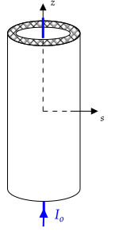

# Amperes' Law 

A long cylindrical shell carries a unfirom current on its surface of density $K_o$ as shown.

In cylindrical coordinates, the magnetic field has the general form

$$\mathbf{B}=B_s(s,\phi,z)\hat{\mathbf{s}}+B_{\phi}(s,\phi,z)\hat{\boldsymbol{\phi}}+B_z(s,\phi,z)\hat{\mathbf{z}}$$

Amperes' law can be used to easily compute $B_\phi(s)$ (for all $s$!). The more difficult part is justifying

* $B_s(s,\phi,z)=0$
* $B_z(s,\phi,z)=0$
* $B_{\phi}$ does not depend on $\phi$ and $z$

1. Provide justifications.

2.  It is generally easy to use Ampere's law to to find _one component_ of the magnetic field for cases when Ampere's law applies. The explanation for why Ampere's law applies and what symmetry arguments are needed to show that the the other components of the field are zero are often not understood. This leads to attempts to use Ampere's law when it does not apply and only a vague understanding of the derivation of the magnetic boundary conditions.

    Find two textbooks that describe the use of Ampere's law (on any problem, but the problems described must be identical). Compare their justifications and give your opinion on whether the symmetry arguments we addressed sufficiently. It will be best of everyone does not choose the two obvious textbooks of Jackson and Griffiths.

# Long Cylindrical Shell Containing Magnetizable Material

A long thick cylindrical shell with inner radius $R_i$ and outer radius $R_o$ has a magnetic susceptibility of $\chi_m$ and is initially unmagnetized. The cylinder is centered on the origin and aligned with the $z$--axis.

There is a long wire that carries current $I_o$ that runs along the $z$--axis in the $+z$ direction.

The total field is given by $\mathbf{B}=\mathbf{B}\_{ext} + \mathbf{B}_{b}$, where $\mathbf{B}_b$ is the field due to $\mathbf{K}_b$ and $\mathbf{J}_b$ that are induced by the external magnetic field due to the current--carrying wire. 

1. Use an analog of Approach 1. in [HW 7.3.1](#7.3.1) to show that $\mathbf{B}=(1+\chi_m)\mathbf{B}\_{ext}$ inside the cylinder. That is, start with $\oint \mathbf{H}\bfcdot d\mathbf{l}=I_{f\thickspace encl}$.
2. Use an analog of Approach 3. in [HW 7.3.1](#7.3.1) to show that $\mathbf{B}=(1+\chi_m)\mathbf{B}\_{ext}$ inside the cylinder. That is, use $\mathbf{M}=(\chi_m/(1+\chi_m))\mathbf{B}/\mu_o$, the equations for $\mathbf{K}\_b$, $\mathbf{J}\_b$, and $\oint\mathbf{B}\bfcdot d\mathbf{l}=\mu_oI_{encl}$.

# Sphere with uniform $\mathbf{M}$ 

In Example 6.1 of Griffiths, 4rd edition, direct integration is used to find $\mathbf{A}$ and $\mathbf{B}$ for a uniformly magnetized sphere: $\mathbf{M}=M_o\hat{\mathbf{z}}$. The approach is to compute $\mathbf{J}_b$ and $\mathbf{K}_b$ using $\mathbf{J}_b=\boldsymbol{\nabla}\times \mathbf{M}$ and $\mathbf{K}_b=\mathbf{M}\times\hat{\mathbf{n}}$ and

$$\mathbf{A}(\mathbf{r})=\frac{\mu_o}{4\pi}\int\frac{\mathbf{K}_b}{|\mathbf{r}-\mathbf{r}'|}da'+\frac{\mu_o}{4\pi}\int\frac{\mathbf{J}_b}{|\mathbf{r}-\mathbf{r}'|}d\tau'$$

to compute $\mathbf{A}(\mathbf{r})$. Then $\mathbf{B}=\boldsymbol{\nabla}\times\mathbf{A}$ is used to find $\mathbf{B}$. 

Chapter 5.10 of Jackson contains a related solution.

In this problem, the boundary value method will be used. 

The Maxwell macroscopic equations for the magnetic field are 

$$\boldsymbol{\nabla}\boldsymbol{\cdot}\mathbf{B}=0\quad\text{and}\quad \boldsymbol{\nabla}\times\mathbf{H}=\mathbf{J}_f$$

where $\mathbf{J}_f$ is the free current. Using $\boldsymbol{\nabla}\boldsymbol{\cdot}\mathbf{B}=0$ and the defining relationship for $\mathbf{H}$, which is $\mathbf{B}=\mu_o(\mathbf{H}+\mathbf{M})$, we can write

$$\boldsymbol{\nabla}\boldsymbol{\cdot}\mathbf{H}=-\boldsymbol{\nabla}\boldsymbol{\cdot}\mathbf{M}$$

When $\mathbf{J}_f=0$, $\boldsymbol{\nabla}\times\mathbf{H}=0$ and thus one can write $\mathbf{H}$ as the gradient of a scalar function $\psi_m$

$$\mathbf{H}=-\boldsymbol{\nabla}\psi_m$$

Substitution into $\boldsymbol{\nabla}\boldsymbol{\cdot}\mathbf{H}=-\boldsymbol{\nabla}\boldsymbol{\cdot}\mathbf{M}$ gives

$$\nabla^2\psi_m=\boldsymbol{\nabla}\boldsymbol{\cdot}\mathbf{M}$$

For a uniformly magnetized sphere, $\boldsymbol{\nabla}\boldsymbol{\cdot}\mathbf{M}=0$ except at the surface of the sphere (because $M$ is discontinuous). Therefore, inside and outside the sphere

$$\nabla^2\psi_m=0$$

The problem has azimuthal symmetry, so we can write $\psi_m=\psi_m(r,\theta)$ using the general spherical coordinate solution to Laplace's equation for a problem with azimuthal symmetry:

$$\psi_m(r,\theta)=\sum_{l=0}^{\infty}\left(A_lr^l + B_lr^{-l-1}\right)P_l(\cos\theta)$$

Using one or more of the boundary conditions

1. $\psi_m$ finite for $r=0$
1. $\psi_m\rightarrow 0$ as $r\rightarrow\infty$
1. $\psi_m$ is continuous
1. $(\mathbf{B}_2-\mathbf{B_1})\boldsymbol{\cdot}\hat{\mathbf{n}}=0$

find $\mathbf{B}$ and then $\mathbf{A}$.