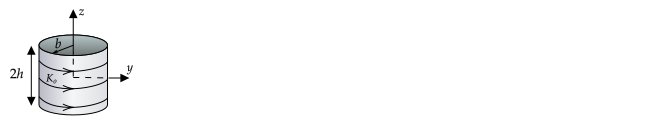

# HW 9

## Force on Current Loop 

The circular loop with radius $b$ lies in the $z=d$ plane ($d\gt 0$) and the $z$ axis passes through its center. There is a current $I$ in the loop in the direction shown in the following figure.

A magnetic dipole at the origin creates a magnetic field of

$$\mathbf{B}=\frac{\mu_o}{4\pi}\frac{m_o}{r^3}\left(2\cos\theta\hat{\mathbf{r}}+\sin\theta\hat{\boldsymbol{\theta}}\right)$$

1\. Use eqn 5.12 in Jackson 3rd ed. ($\mathbf{F}=\int \mathbf{J}(\mathbf{x})\times \mathbf{B}(\mathbf{x})$) to find the force on the loop in cartesian coordinates.

2\. Find the force on the loop in cartesian coordinates using eqn 5.69 of Jackson 3rd ed. ($\mathbf{F}=\boldsymbol{\nabla}(\mathbf{m}\cdot\mathbf{B})$).

3\. Write your answer to 1. as a power series in terms of powers of $b/d$ (assume $b/d\ll 1)$.

**Solution**

There were several common errors. 

1. Some reported a force that depended on $r$ and $\theta$ either explicity or implicitly because their unit vectors appeared in their answer. It does not make sense for the force on an object to depend on a coordinate. It should depend on the parameters given in the problem. In addition, the force depended on a coordinate, we would write $\mathbf{F}(\mathbf{x})=\int \mathbf{J}\times \mathbf{B}d^3x'$, which we don't - see the previous problem.
1. When computing the gradient of a function that involved $r$, $r$ was treated as a constant. More on this in the solution.
1. The wrong delta function representation of $\mathbf{J}$. You know that you need to get $\int \mathbf{I}\times \mathbf{B} dl$ after evaluating the delta function in the volume integral given, so this could have been used as a check that you had the correct delta function representation of $\mathbf{J}$.

1\.

$$\mathbf{F}=\int \mathbf{J}(\mathbf{x})\times \mathbf{B}(\mathbf{x})\thinspace d^3x$$

Many students had questions about representing $\mathbf{J}$ with a delta function. As a guide, recall that you know the result after application of the delta function in $\mathbf{J}$ should be

$$\mathbf{F}=\int \mathbf{I}\times \thinspace d\mathbf{l}$$

where $\mathbf{B}$ is evaluated at the locations of the differential elements $dl$, and $dl\thinspace d\phi$ for this problem. It is easier to do this in cylindrical coordinates, but most attempted modifying Jackson's equation for a current loop of radius $a$ in the $x$-$y$ plane and centered on the origin:

$$J_{\phi}=I\sin\theta\thinspace\delta(\cos\theta)\frac{\delta (r-a)}{a}$$

where

$$\mathbf{J}=J_{\phi}(-\sin\phi\thinspace\hat{\mathbf{x}}+\cos\phi\thinspace\hat{\mathbf{y}})$$

By delta function identity #5 on page 26, $J_{\phi}$ above is equivalent to 

$$J_{\phi}=I\delta(\theta-\pi/2)\frac{\delta (r-a)}{a}$$

You can (correctly) guess and that show that for this problem, replacing $\pi/2$ with $\theta_o$ and $a$ with $r_o$,  where $\tan\theta_o=b/d$ and $r_o=\sqrt{d^2+b^2}$ will result the volume integral reducing to the line interal.

----

_Note_

Several students asked how to derive Jackson's equation or the guessed modified equation, so I'll derive it here. A student also mentioned that they found [a post on StackExchange](https://physics.stackexchange.com/questions/128732/describing-a-circular-current-loop-as-delta-functions), but it didn't quite help. We need to find

$$\mathbf{J} = J(r,\theta)(-\sin\phi\thinspace\hat{\mathbf{x}}+\cos\phi\thinspace\hat{\mathbf{y}})$$

where $J(r,\theta)$ has the property that it is zero except for $(r,\theta)$ on the loop. $\delta(r-r_o)$ is zero except on the surface of a sphere of radius $r_o$ and $\delta(\theta-\theta_o)$ is zero except on the surface of a cone with apex angle $\theta_o$. The product of these two delta functions (corresponding to the intersection of these two surfaces) is non-zero only at positions on the loop. As in charge distribution problems, we need to find a constant $C$ in

$$J(r,\theta)=C\delta(r-r_o)\delta(\theta-\theta_o)$$

where $\tan\theta_o=b/d$ and $r_o=\sqrt{d^2+b^2}$. To determine $C$, note that integrating $J$ over all space is equivalent to multiplying the current by the length of the wire it flows through.

$$2\pi b I = \int J(\mathbf{x})\thinspace d^3x=C\int \delta(r-r_o)\delta(\theta-\theta_o)\sin\theta\thinspace r^2\thinspace dr\thinspace d\theta\thinspace d\phi$$

$$2\pi b I = C2\pi\sin\theta_o r_o^2\Rightarrow C = \frac{bI}{r_o^2\sin\theta_o }$$

$$J(r,\theta)=\frac{I b}{\sin\theta_o r_o^2}\delta(r-r_o)\delta(\theta-\theta_o)=\frac{I}{r_o}\delta(r-r_o)\delta(\theta-\theta_o)$$

When $\theta_o=\pi/2$, $r_o=b$ we recover Jackson's equation.

----

$$
\begin{align}
\mathbf{F} & = \int \mathbf{J}(\mathbf{x})\times \mathbf{B}(\mathbf{x})\,d^3x\\
& = \int  J(r,\theta)(-\sin\phi\,\hat{\mathbf{x}}+\cos\phi\,\hat{\mathbf{y}})\times \mathbf{B}(r,\theta)\,r^2\sin\theta\,d\theta\,d\phi\\
& = \int  \frac{I}{r_o}\delta(r-r_o)\delta(\theta-\theta_o)(-\sin\phi\,\hat{\mathbf{x}}+\cos\phi\,\hat{\mathbf{y}})\times \mathbf{B}(r,\theta)\,r^2\sin\theta\,d\theta\,d\phi\\
& = \int I (-\sin\phi\,\hat{\mathbf{x}}+\cos\phi\,\hat{\mathbf{y}})\times \mathbf{B}(r_o,\theta_o)\,r_o\sin\theta_o\,d\phi\\
& = \int I (-\sin\phi\,\hat{\mathbf{x}}+\cos\phi\,\hat{\mathbf{y}})\times \mathbf{B}(r_o,\theta_o)\,b\,d\phi\\
& = \int I (-\sin\phi\,\hat{\mathbf{x}}+\cos\phi\,\hat{\mathbf{y}})\times \mathbf{B}(r_o,\theta_o)\,dl
\end{align}
$$

This last equation is how I checked that I had the correct delta function. If I had used $\mathbf{F}=\int \mathbf{I}\times d\mathbf{l}$, this would be the result.

$$
\begin{align}
(-\sin\phi\thinspace\hat{\mathbf{x}}+\cos\phi\thinspace\hat{\mathbf{y}})\times \mathbf{B}(r_o,\theta_o) & =\hat{\boldsymbol{\phi}}\times \frac{\mu_o}{4\pi}\frac{m_o}{r^3}\left(2\cos\theta\hat{\mathbf{r}}+\sin\theta\hat{\boldsymbol{\theta}}\right)\\
& = \frac{\mu_oI}{4\pi}\frac{m_o}{r^3}(2\cos\theta\hat{\boldsymbol{\phi}}\times\hat{\mathbf{r}}+\sin\theta\hat{\boldsymbol{\phi}}\times\hat{\boldsymbol{\theta}})\\
& = \frac{\mu_oI}{4\pi}\frac{m_o}{r^3}(2\cos\theta\hat{\boldsymbol{\theta}}-\sin\theta\hat{\mathbf{r}})\end{align}
$$

Prior to integration, non-cartesian vectors must be converted to cartesian. Use the spherical-to-cartesian transformation matrix

$$\begin{bmatrix}{\hat{\boldsymbol{r}}} \\ {\hat{\boldsymbol{\theta }}} \\ {\hat{\boldsymbol{\phi }}}\end{bmatrix} = \begin{bmatrix}\sin \theta\cos \phi & \sin\theta \sin\phi & \cos\theta \\ \cos\theta \cos\phi & \cos\theta \sin\phi & -\sin\theta \\ -\sin\phi & \cos\phi & 0 \end{bmatrix} \begin{bmatrix}{\hat{\mathbf{x}}} \\ {\hat{\mathbf{y}}} \\{\hat{\mathbf{z}}}\end{bmatrix}$$

to write the spherical unit vectors $\hat{\boldsymbol{\theta}}$ and $\hat{\mathbf{r}}$ using cartesian unit vectors and then integrate with respect to $d\phi$. The result is

$$\mathbf{F}=-\frac{3}{2}\frac{\mu_om_oIdb^2}{(b^2+d^2)^{5/2}}\hat{\mathbf{z}}$$

----

_Note_

One can get equivalent results by converting $\mathbf{B}_{ext}$ into cartesian using the above matrix and doing the cross product with $\mathbf{J}$ written with cartesian unit vectors. The components of $B_{ext}$ in cartesian coordinates, with $r=\sqrt{x^2+y^2+z^2}$, are

$$B_x=\frac{\mu_oI\pi a^2}{4\pi}\frac{3xz}{(x^2+y^2+z^2)^{5/2}}=\frac{\mu_oI\pi a^2}{4\pi}\frac{3xz}{r^5}$$

$$B_y=\frac{\mu_oI\pi a^2}{4\pi}\frac{3yz}{r^5}$$

$$B_z=\frac{\mu_oI\pi a^2}{4\pi}\frac{3z^2-r^2}{r^5}$$

----

----

_Checking answer_

Compute the horizontal, $B_s$, and vertical, $B_z$, magnetic field at all points on the loop. Then compute the horizontal and vertical forces created by these two fields individually. $B_s$ results in a vertical force on a differential element $dl$ of $-IdlB_s\hat{\mathbf{z}}$. $B_z$ results in a horizontal force of $IdlB_z\hat{\mathbf{s}}$.  The horizontal force averages to zero. The total vertical force is obtained by using $dl=bd\phi$ and integrating

$$\int_0^{2\pi}-IB_sbd\phi\hat{\mathbf{z}}$$

The magnitude of horizontal field is $B_s=\sqrt{B_x^2+B_y^2}$ and $B_x$ and $B_y$ were found in a previous problem. Neither depend on $\phi$. The result is

$$B_s(x,y)=\sqrt{B_x^2+B_y^2}=\frac{\mu_o}{4\pi}\frac{3m_oz}{r^5}\sqrt{x^2+y^2}$$

On the loop, $z=d$, $x^2+y^2=b^2$, and $r^2=b^2+d^2$. Putting this all together gives a net force of

$$\mathbf{F}=-\frac{3}{2}\frac{\mu_om_oIdb^2}{(b^2+d^2)^{5/2}}\hat{\mathbf{z}}$$

----

2\.

$$\mathbf{m}=Ib^2\hat{\mathbf{z}}$$

$$\mathbf{m}\cdot\mathbf{B}=Ib^2B_z$$

From the note in the solution to 1.,

$$B_z=\frac{\mu_oI\pi a^2}{4\pi}\frac{3z^2-r^2}{r^5}$$

The formula 

$$\mathbf{F}=\boldsymbol{\nabla}(\mathbf{m}\cdot\mathbf{B})$$

was derived by expanding $\mathbf{B}$ about around a point near a current loop and under the assumption that the change in $\mathbf{B}$ was small over the area of the loop and so the result must be evaluated at a point near the current loop, for which I use $(x,y,z)=(0,0,d)$. (Jackson says $\mathbf{B}$ is expanded about a "suitable origin" but does not elaborate on what constitutes suitableness. By default, it makes the most sense to expand about the center of the current distribution, but if the field changes more rapidly on one part of the current distribution, one may get a more accurate answer if the expansion is performed where the field changes the most. However, if the answer strongly depends on the origin, probably this approximate formula should not be used.)

$$\mathbf{F}=\left[\hat{\mathbf{x}}\frac{\partial B_z}{\partial x}+\hat{\mathbf{y}}\frac{\partial B_z}{\partial y}+\hat{\mathbf{z}}\frac{\partial B_z}{\partial z}\right]_{(x,y,z)=(0,0,d)}$$

The result is

$$\mathbf{F}=-\frac{3}{2}\frac{\mu_om_oIb^2}{d^4}\hat{\mathbf{z}}$$

If interested, try evaluating the gradient of $B_z$ about a different location, say $0,b,z_o$ - you should get the same result to first order in a $b/d$  expansion. However, there will be a net force in the $y$-direction, which does not match the exact result. Therefore this choice of origin seems not "suitable". But to know it was not suitable, we had to know the exact result! As a result, I would argue that the approximate formula for an arbitrary current distribution is mostly useful for interpretation rather than calculation - $\mathbf{F}=\boldsymbol{\nabla}(\mathbf{m}\cdot\mathbf{B})$ means a gradient in its argument will result in a force.

The most common error students made was setting $r=b^2+d^2$ in

$$B_z=\frac{\mu_oI\pi a^2}{4\pi}\frac{3z^2-r^2}{r^5}$$

and not setting $z=d$. This is inconsistent because in setting $r=b^2+d^2$, $z$ was replaced with $d$. If $z$ was also replaced with $d$, $B_z$ would be constant and the computed force would be zero.

The force equation we are dealing with is based on the gradient of $\mathbf{B}$ and setting all variables to values, or worse, only some variables to values, in $\mathbf{B}$ will lead to an incorrect answer. One needs to substitute values for the variables after the derivatives are computed. (Think of finding the slope of $y=x^2$ at x=2. You don't first set $x=2$, giving $y=4$ and $dy/dx = 0$).

3.

The result from 1. was

$$\mathbf{F}=-\frac{3}{2}\frac{\mu_om_oIdb^2}{(b^2+d^2)^{5/2}}\hat{\mathbf{z}}$$

or, after factoring out a $d^5$ in the denominator,

$$\mathbf{F}=-\frac{3}{2}\frac{\mu_om_oIb^2}{d^4\left(1+\left(\frac{b}{d}\right)^2\right)^{5/2}}\hat{\mathbf{z}}\simeq -\frac{3}{2}\frac{\mu_om_oIb^2}{d^4}\hat{\mathbf{z}}\left(1-\frac{5}{2}\frac{b^2}{d^2}\right)$$

which matches the result from 3. in the limit that $b/d\rightarrow 0$, as expected because the relevant length scales that determine how much $\mathbf{B}$ changes over the loop are the distance of the loop from the dipole to the length scale of the loop.

## Surface Current on Cylinder 

A hollow and open-ended cylinder of height $2h$ and radius $b$ is centered on the origin and aligned with the $z$-axis. The curved surface of the cylinder has a surface current of $K_o\hat{\boldsymbol{\phi}}$.

1\. Find $\mathbf{B}(z)$ using the Biot--Savart formula

2\. Use the formula

$$\frac{1}{\sqrt{1-2ut+t^2}}=\sum_{l=0}^{\infty}P_l(u)t^l$$

to express $B_z(z)$ as a power series involving the Legendre polynomials, $P_l$, and $z^l$.

**Solution**

1\.

$$B_z(z) = \frac{\mu_oK_o}{2}\left[\frac{z+h}{\sqrt{b^2+(z+h)^2}}-\frac{z-h}{\sqrt{b^2+(z-h)^2}}\right]$$

_Checks_:

1. For $z=0$ and $h\ll b$, the equivalent system is a loop of current in the $x$--$y$ plane. We get $\mu_oK_oh/b=\mu_oI/2b$, where the total current is $I=K_o 2h$. This matches the answer of the simple problem of finding the magnetic field at the center of a current loop carrying a current $I$. Alterntatively, it is the result one finds using $z=0$ and $h\ll b$ in the starting equation of

    $$B_z(z) = \frac{\mu_oK_o}{2}\left[\frac{z+h}{\sqrt{b^2+(z+h)^2}}-\frac{z-h}{\sqrt{b^2+(z-h)^2}}\right]$$

2. For $h\gg b$, the systems approaches an infinite solenoid and the solution should be independent of $z$.

2\.

Define the first term as $B_z^+$. Expanding the square in the denominators gives
 
$$B_z^+(z) = \frac{\mu_oK_o}{2}\left[\frac{z+h}{\sqrt{b^2+h^2+2zh+z^2}}\right]$$

Factoring out $b^2+h^2$ gives

$$B_z^+(z) = \frac{\mu_oK_o}{2\sqrt{b^2+h^2}}\left[\frac{z+h}{\sqrt{1+2zh/(b^2+h^2)+z^2/(b^2+h^2)}}\right]$$

If we define $t=z/\sqrt{b^2+h^2}$, then

$$B_z^+(z) = \frac{\mu_oK_o}{2\sqrt{b^2+h^2}}\left[\frac{z+h}{\sqrt{1+2ht/\sqrt{b^2+h^2}+t^2}}\right]$$

Defining $u=-h/\sqrt{b^2+h^2}$ (note that this is related to the angle $\alpha$ from the $z$--axis to the rim of the cylinder: $\sin\alpha = h/\sqrt{b^2+h^2}$), we have

$$B_z^+(z) = \frac{\mu_oK_o}{2\sqrt{b^2+h^2}}\left[\frac{z+h}{\sqrt{1-2ut+t^2}}\right]$$

Using the given formula gives

$$B_z^+(z) = \frac{\mu_oK_o}{2\sqrt{b^2+h^2}}(z+h)\sum_{l=0}^{\infty}P_l(u)t^l$$

or

$$B_z^+(z) = \frac{\mu_oK_o}{2\sqrt{b^2+h^2}}(t\sqrt{b^2+h^2}+h)\sum_{l=0}^{\infty}P_l(u)t^l$$

$$B_z^+(z) = \frac{\mu_oK_o}{2}(t-u)\sum_{l=0}^{\infty}P_l(u)t^l$$

$B_z^-(z)$ is obtained by replacing $u$ with $-u$ in the expression for $B_z^-(z)$:

$$B_z(z)=B_z^+(z)-B_z^-(z) = \frac{\mu_oK_o}{2}\left[(t-u)\sum_{l=0}^{\infty}P_l(u)t^l-(t+u)\sum_{l=0}^{\infty}P_l(-u)t^l\right]$$

$$\frac{B_z(z)}{\mu_oK_o}= \frac{1}{2}\left[(t-u)\sum_{l=0}^{\infty}P_l(u)t^l-(t+u)\sum_{l=0}^{\infty}P_l(-u)t^l\right]$$

To simplify, we note that $P_l(-u)=P_l(u)$ for $l=0, 2, ...$ and $P_l(-u)=-P_l(u)$ for $l=1,3,...$. Using this gives

$$\frac{B_z(z)}{\mu_oK_o}= -u\sum_{l=0,2,...}^{\infty}P_l(u)t^l+\sum_{l=1,3,...}^{\infty}P_l(u)t^{l+1}$$

Shift index on second sum so sums over same $l$

$$\frac{B_z(z)}{\mu_oK_o}= -u\sum_{l=0,2,...}^{\infty}P_l(u)t^l+\sum_{l=0,2,...}^{\infty}P_{l+1}(u)t^{l+2}$$

Shift index on second sum so $t^l$ appears in both sums

$$\frac{B_z(z)}{\mu_oK_o}= -u\sum_{l=0,2,...}^{\infty}P_l(u)t^l+\sum_{l=2,4,...}^{\infty}P_{l-1}(u)t^{l}$$

Remove $l=0$ from first sum:

$$\frac{B_z(z)}{\mu_oK_o}=-u+ \sum_{l=2,4,..}^{\infty}-uP_l(u)t^l+\sum_{l=2,4,...}^{\infty}P_{l-1}(u)t^{l}$$

Combine sums:

$$\frac{B_z(z)}{\mu_oK_o}=-u+ \sum_{l=2,4,..}^{\infty}\big(P_{l-1}(u)-uP_l(u)\big)t^{l}$$

Replace $l$ with $2l+2$ so sum over $l=0,1,...$:

$$\frac{B_z(z)}{\mu_oK_o}=-u+ \sum_{l=0}^{\infty}\big(P_{2l+1}(u)-uP_{2l+2}(u)\big)t^{2l+2}$$

Rewrite using $t=z/\sqrt{b^2+h^2}$ and $u=-h/\sqrt{b^2+h^2}$ and define $\sin\alpha=-u$:

$$\frac{B_z(z)}{\mu_oK_o}=\sin\alpha + \sum_{l=0}^{\infty}\big(P_{2l+1}(-\sin\alpha)+\sin\alpha P_{2l+2}(-\sin\alpha)\big)t^{2l+2}$$

Use $P_l(-u)=P_l(u)$ for $l=0, 2, ...$ and $P_l(-u)=-P_l(u)$:

$$\boxed{\frac{B_z(z)}{\mu_oK_o}=\sin\alpha + \sum_{l=0}^{\infty}\big(\sin\alpha P_{2l+2}(\sin\alpha)-P_{2l+1}(\sin\alpha)\big)\left(\frac{z}{\sqrt{b^2+h^2}}\right)^{2l+2}}$$

Note that the answer only contains terms proportional to $z^2$, $z^4$, ....

With this magnetic field, one can obtain the solution for the magnetic field inside of cylinder.

Inside of the cylinder, $\nabla^2\Phi_m=0$ is satisfied. The problem has azimuthal symmetry and so the solutions must be of the form of 

$$\Phi_m(r,\theta)=\sum_{l=0}^{\infty}\left(A_lr^l + B_lr^{-l-1}\right)P_l(\cos\theta)$$

which has an associated magnetic field of $\mathbf{B}(r,\theta) = -\nabla\Phi_m$.

Using $\Phi_m(z)=\sum_{l=0}^{\infty}z^lA_l$ and

$$B_z(z)=-\frac{\partial \Phi_m(z)}{\partial z} = -\sum_{l=0}^{\infty}lz^{l-1}A_l$$

the azimuthal symmetry argument, one can find an expression for $\Phi(r,z)$ and then use

$$\mathbf{B}(r,\theta) = -\nabla\Phi_m$$

to arrive at an expression for $\mathbf{B}$ inside the cylinder. Technically the solution is valid for $r\lt b$ (required for Laplace's equation to be true), and $r\lt \sqrt{b^2+h^2}$ (required for the power series expansion). So the solution is valid inside the cylinder and inside a dome on both ends of the cylinder.

%one should arrive at, 

%$$A_1=-1$$

%$$A_2=0$$

%$$A_3=\frac{P_1(d)/d-P_2(d)}{3}$$

%$$A_4=0$$

%$$A_5=\frac{P_3(d)/d-P_4(d)}{5}$$

%$$...$$

%or

%$$P_l=\frac{P_{l-2}(d)/d-P_{l-1}(d)}{l}\quad l=3,5,...$$

%$$P_l=0\quad l=2,4,...$$

%Similar to electrostatic problems, the constant $A_o$ is arbitrary and cannot be fixed unless one is given $\Phi_m$ at a location in space.

_Alternative Method 2._

See http://dx.doi.org/10.1119/1.4906516, which uses a method that is similar to Method 1., but a general relationship was not derived.

_Alternative Method 3._

Use $J_{\phi}=I\sin(\theta'-\theta_o)\delta(r'-r_o)/r_o$ with $r_o=\sqrt{z^2+b^2}$ and $\tan\theta_o=b/z$ and follow the steps needed to arrive at Equation 5.44 of Jackson, which is the vector potential due to a ring in the $x-y$ plane and centered on the $z$-axis.  Your equation will be valid for a ring that is shifted by a distance $z$. Set $I=K_odz$ and integrate from $z=-L$ to $z=L$. One will need to use equation 5.47 and integration by parts.

## Reading

Read 5.6--5.12 of Jackson and Chapter 6 of Griffiths and be prepared to ask question during class. (Questions on Discord are also welcome).

