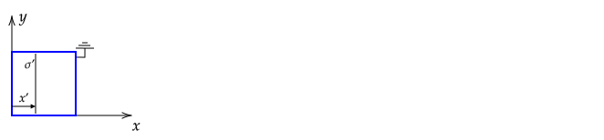
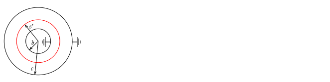

**PHYS 685 Midterm Exam**

Wednesday, March 23rd, 2022

90 minutes. 

Solve 3 of the 4 problems.

----

**Equations**

$$\nabla^2f(s,\phi,z)={1 \over s}{\partial \over \partial s}\left(s {\partial f \over \partial s}\right) + {1 \over s^2}{\partial^2 f \over \partial \phi^2}+ {\partial^2 f \over \partial z^2}$$

$$\nabla^2f(r,\theta,\phi)={ {1 \over r^{2}}{\partial  \over \partial r}\left(r^{2}{\partial f \over \partial r}\right)+{1 \over r^{2}\sin \theta }{\partial  \over \partial \theta }\left(\sin \theta {\partial f \over \partial \theta }\right)+{1 \over r^{2}\sin ^{2}\theta }{\partial ^{2}f \over \partial \phi ^{2}}}$$

$${\displaystyle {\begin{array}{r|r}n&P_{n}(x)\\\hline 0&1\\1&x\\2&{\tfrac {1}{2}}\left(3x^{2}-1\right)\\3&{\tfrac {1}{2}}\left(5x^{3}-3x\right)\\4&{\tfrac {1}{8}}\left(35x^{4}-30x^{2}+3\right) \end{array}}}$$

Power series expansions for $\delta \lt 1$.

$$\frac{1}{(1+\delta)^n} = 1 - n\delta + \frac{n(n+1)}{2!}\delta^2- \frac{n(n+1)(n+2)}{3!}\delta^3+...$$

$$\ln(1+\delta)=\delta + \frac{\delta^2}{2} + \frac{\delta^3}{3} + ...$$

$$e^\delta = 1 + \frac{\delta}{1!} + \frac{\delta^2}{2!} + ...$$

Green's theorem (second identity)

$$\int_{\mathcal{V}} \left(\phi\nabla^2\psi -\psi\nabla^2\phi\right)d^3x=\oint_{\mathcal{S}}\left(\phi\frac{\partial \psi}{\partial n}-\psi\frac{\partial \phi}{\partial n}\right) da$$

----

----

_Comments_:

I have a few regrets and made one mistake.

1. I should have reminded students to read the directions.
2. I should have reminded students that problem #4 was for a _cylinder_.
3. The sentence "Assume the potential at the origin is zero" in problem #1 should not have been there. In long cylinder problems where a charge density that varies with $\phi$ is given, one must be given the potential at the origin in order to obtain a full solution. In #1, the potential is already given. See the solutions for a description of why having a potential at the origin of zero is not possible.

Problem #3 was on HW #5. Several students solved the 1--D version of this problem, which was on HW #3. I put this problem on the exam to test your ability to quickly generate a solution for a 2--D cartesian problem using some of the techniques covered in class.

----

# Long Cylinder Held at Potential

A long cylinder of radius $b$ and centerline along the $z$--axis is held at potential $V_o\sin^2\phi$, where $\phi$ is the cylindrical coordinate angle. Assume that the potential at the origin is zero.

Find the potential **inside** of the cylinder.

**Solution**

As noted earlier, the statement "Assume that the potential at the origin is zero." should not be there. In the following, I solve the problem assuming the potential at the origin was not given.

The general solution to $\nabla^2\psi(s,\phi)=0$ is

$$\psi=A_o+\sum_{n=1}^\infty (A_n\cos n\phi+B_n\sin n\phi) s^n+a_o\ln s+\sum_{n=1}^\infty (a_n\cos n\phi+b_n \sin n\phi)s^{-n}$$

We can re--write $\sin^2\phi$ in terms of $\cos n\phi$ and $\sin n\phi$ using a trig identity, writing $\sin\phi$ in terms of complex exponentials, or by solving $\sin^2\phi = \sum_{n=0}^{\infty} (a'_n\sin n\phi + b'_n\cos n\phi)$ using Fourier's trick. The result is $\sin^2\phi = (1-\cos 2\phi)/2$. At the boundary, we must have $\psi(b,\phi)= V_o (1-\cos 2\phi)/2$.

We can solve this problem using superposition of A. a long cylinder held at $V_o/2$ and B. a long cylinder held at $V_o\cos 2\pi/2$. 

For A., the potential will be constant inside of the cylinder. (There is no $\phi$ or $z$ dependence, so charges will be uniformly distributed on the surface as a result of the cylinder being held at a fixed potential.) Inside of a uniformly charged cylinder, the electric field is zero (by Gauss's law), so the potential will be constant. Another way of doing this is to simply note that $\psi_A=V_o/2$ satisfies the boundary condition and Laplace's equation.

For B., the potential $\psi_B=(V_o/2)(s^2/b^2)\cos 2\phi$ satisfies the boundary condition and Laplace's equation inside of the cylinder. We can drop the $1/s^n$ and $\log s$ terms using the argument that the potential should be finite inside. The constant term is not needed to match the boundary condition, so it too can be dropped.

By superposition, then,

$$\psi=\psi_A + \psi_B=\frac{V_o}{2}(1+\frac{s^2}{b^2}\cos\phi)$$

----

The problem with setting the potential to zero at the origin is that this makes the problem much more complicated. Think of this boundary condition as being equivalent to holding the potential at zero on a small sphere centered on the origin. Charges will appear on the sphere such that near the origin, as the radius of the sphere approaches zero, the potential should approach that for a point charge, which is $kq/r$. For the boundary condition on the sphere, it is natural to use the spherical solution to Laplace's equation. However, at the outer boundary, the cylindrical solution to Laplace's equation is more natural.

A variation of this problem is to ask what happens if there is a grounded inner cylinder of radius $a$ and $a\rightarrow 0$ and the outer cylinder is at $V_o$. In this case, for $s$ near zero, the field should be proportional to $\ln s$ because the potential for $s\gt a$ due to the charges on the conductor is the same as that for a line of charge on the $z$ axis for $s\gt a$. But as $s\rightarrow 0$, $\ln s\rightarrow -\infty$, which makes it impossible to match the zero boundary condition. Said another way, the boundary value problem is to find $A_o$ and $B_o$ in

$\psi_A(s) = A_o + B_o\ln s$

subject to

1. $\psi_A(b)=V_o$
2. $\psi_B(a)=0$

From 1., $\psi_A(s) = B_o\ln s/b$. To satisfy 2., we need $0 = B_o\ln 0/b$, or $B_o=0$. With $B_o=0$, the solution is $\psi_A=0$, which does not satisify the boundary conditions.

# Line of Charge

A line of charge with a charge density of $\lambda$ is on the $z$-axis and extends from $z=-1$ to $z=1$. 

For $r\gt 1$, find the coefficients $A_l$ and $B_l$ for the potential expressed in the form

$$\psi(r,\theta)=\sum_{l=0}^{\infty}\left(A_lr^l + \frac{B_l}{r^{l+1}}\right)P_l(\cos\theta)$$

where $r$ and $\theta$ are the radial and polar angles in spherical coordinates.

**Solution**

First, we expect the leading order term to be $2k\lambda L/r$, which is the potential for a charge $2L\lambda$ at the origin, where $L$ is the length of the line ($L=1$ here).

$$\Phi(z) = k\int_{-1}^1\frac{\lambda dz'}{|z-z'|}$$

For $z\gt 1$, $|z-z'| = z-z'$. Using this and $u=z-z'$ gives

$$\Phi(z) = k\lambda \int_{z-1}^{z+1}\frac{du}{u}=k\lambda[\ln(z+1)-\ln(z-1)]$$

We need to write this in a form so that we can use a power series expansion. This can be done by re--writing

$$\Phi(z) = k\lambda[\ln z(1+1/z)-\ln z(1-1/z)]=k\lambda[\ln(1+1/z)-\ln(1-1/z)]$$

Using the expansion for $\delta \lt 1$

$$\ln(1+\delta)=\delta + \frac{\delta^2}{2} + \frac{\delta^3}{3} + ...$$

gives

$$\Phi(z) = k\lambda\left(2\frac{1}{z}+\frac{2}{3}\frac{1}{z^3} + \frac{2}{5}\frac{1}{z^5} + ...\right)$$

----

We could have also performed a power series expansion of $1/(z-z')$ and integrated it:

$$\Phi(z) = k\int_{-1}^1\frac{\lambda dz'}{z-z'}=\frac{k\lambda}{z}\int_{-1}^1\frac{1 dz'}{1-z'/z}$$

The integrand can be re--written using the binomial expansion

$$\Phi(z) = \frac{k\lambda}{z}\int_{-1}^1\left(1-\frac{z'}{z}+\frac{z'^2}{z^2}+...\right)dz'$$

Every other term in the integrand is an odd function, so thier integral is zero. Integration of the even terms gives

$$\Phi(z) = \frac{k\lambda}{z}\left(2-0+\frac{2}{3}\frac{1}{z^2}+...\right)$$

----

This potential must match the general solution

$$\psi(r,\theta)=\sum_{l=0}^{\infty}\left(A_lr^l + B_lr^{-l-1}\right)P_l(\cos\theta)$$

when $\theta=0$, which is

$$\psi(z)=\sum_{l=0}^{\infty}\left(A_lz^l + B_lz^{-l-1}\right)P_l(1)$$

To match $\Phi(z)$, we need $A_l=0$ because $\psi(z)$ does not have any $z^l$ terms. Given that $P_l(1)=1$, we have

$$\psi(z)= B_0 + B_1\frac{1}{z^2} + B_3\frac{1}{z^3} + B_4\frac{1}{z^5} + ...$$

By comparison with

$$\Phi(z) = 2k\lambda\frac{1}{z}+\frac{2k\lambda\}{3}\frac{1}{z^3} + \frac{2k\lambda\}{5}\frac{1}{z^5} + ...$$

we need

$$
B_l=
\begin{cases}
\frac{2k\lambda}{l+1} & \text{for }l = 0, 2, ...\\
0 & \text{otherwise}
\end{cases}
$$

And so the off--axis solution is

$$\psi(r,\theta) = \sum_{l=0,2,...}^{\infty}\frac{2k\lambda}{l+1}\frac{1}{r^{l+1}}P_{l}(\cos\theta)$$

or, using $n\equiv l/2$,

$$\psi(r,\theta) = \sum_{n=0}^{\infty}\frac{2k\lambda}{2n+1}\frac{1}{r^{2n+1}}P_{2n}(\cos\theta)$$

As practice, perform the expansion for $\Phi(z)$ on the $-z$ axis and show that you get the same result for the general solution.

# Long Duct

An infinitely long, hollow, and conducting duct is parallel to the $z$-axis and has sides bounded by $0\le x \le 1$ and $0\le y\le 1$. All sides are grounded. An infinitely long non-conducting sheet of charge with surface charge density $\sigma'$ is in the $x=x'$ plane between $y=0$ and $y=1$.

Find equations $\psi_l(x,y)$, the potential for $x\lt x'$, and $\psi_r(x,y)$, the potential for $x\gt x'$.

**Solution**

See [HW #5.2](hw.html#long-rectangular-duct-with-sheet-of-charge)

# 1--D Green Function for Cylindrical Geometry

A long non-conducting cylindrical shell of radius $s'$ and charge per length $\lambda'$ has its centerline along the $z$--axis.

A long conducting cylindrical shell of radius $b\lt s'$ and centerline along the $z$--axis is grounded.

A long conducting cylindrical shell of radius $c\gt s'$ and centerline along the $z$--axis is grounded.

The cross--section of this geometry is shown in the following figure.

1\. Find the potential as a function of the cylindrical radial distance $s$.

2\. Use Green's second identity to find the potential when there is no non--conducting shell (or equivalently, $\lambda'=0$), the inner conducting shell is held at potential $V_i$, and the outer conducting shell is held at potential $V_o$.

**Solution**

1\. The general solution to $\nabla^2\psi(s)=0$ is $\psi(s)=A+B\ln s$ or, equivalently, $\psi(s)=A'\ln(s/B')$. Laplace's equation is satisfied in the inner ($i$) and outer ($o$) regions, so we seek solutions to

$\psi_i=A_i\ln s/B_i$

$\psi_o=A_o\ln s/B_o$

given the boundary conditions

1. $\psi_i(b)=0$
2. $\psi_o(c)=0$
3. $\psi_i(s')=\psi_o(s')$
4. $[-\partial \psi_o/\partial s + \partial \psi_i/\partial s]_{s=s'} = \sigma'/\epsilon_o$

We are given the charge per length (the length must be the length of the tube -- if not, one could not solve). The total charge on the surface of the charged cylinder is $\lambda' L$. The total charge in terms of a $\sigma$ is $\sigma' 2\pi s' L$, so $\sigma' = \lambda'/2\pi s'$.

The result is

$$\psi_i(s)=\frac{\lambda'}{2\pi\epsilon_o}\frac{\ln (s'/c)}{\ln (b/c)}\ln (s/b)$$

$$\psi_o(s)=\frac{\lambda'}{2\pi\epsilon_o}\frac{\ln (s'/b)}{\ln (b/c)}\ln (s/c)$$

By inspection, these satify the first three boundary conditions and with a straightforward calculation can be shown to satisfy the fourth boundary condition.

2\. The expected answer is $\Phi(s)=V_o\ln (s/b)/\ln (c/b)$, which can be worked out by solving $\Phi(s)=A+B\ln(s)$ subject to $\Phi(b)=0$ and $\Phi(c)=V_o$.

Green's second identity is

$$\int_{\mathcal{V}} \left(\Phi\nabla^2\psi -\psi\nabla^2\Phi\right)d^3x=\oint_{\mathcal{S}}\left(\Phi\frac{\partial \psi}{\partial n}-\psi\frac{\partial \Phi}{\partial n}\right) da$$

Let $\mathcal{V}$ be the empty volume between the conductors. The second integral on the RHS is zero because $\psi=0$ on the surface of $\mathcal{V}$ (spherical shells of radius $b$ and $c$). The first surface integral on the RHS reduces to a single integral over the surface of a sphere of radius $c$, on which $\Phi=V_o$. The RHS is then

$$-V_o\int_0^{2\pi}\int_0^L \frac{d\psi_o}{ds}\bigg|_{s=c}  dz d\phi$$

where $n=-z$ was used. The charge denstiy in the $\psi$ system is $q\delta(\mathbf{x}-\mathbf{x}')$, where $q=\lambda' L$, so the first integral on the RHS is $-q\Phi(s')$. The second term on the RHS is zero because the charge denstiy in the $\Phi$ system is zero. This leaves

$$-\frac{\lambda'L}{\epsilon_o}\Phi(s')=-\int_0^{2\pi}\int_0^L \frac{d\psi_o}{ds}\bigg|_{s=c}  c dz d\phi$$

Using

$$\frac{d\psi_o}{ds}\bigg|_{s=c}=\frac{\lambda'}{2\pi\epsilon_o}\frac{\ln (s'/b)}{\ln (b/c)}\frac{1}{c}$$

and simplifying gives

$\Phi(s')=V_o\ln (s'/b)/\ln (c/b)$

Given that $s'$ can vary between $b$ and $c$, we can replace it with $s$ and so

 $\Phi(s)=V_o\ln (s/b)/\ln (c/b)$
